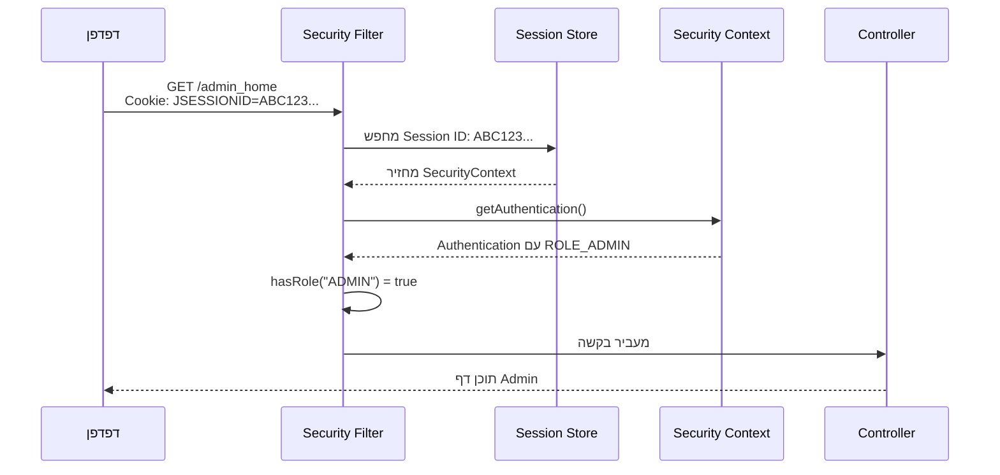
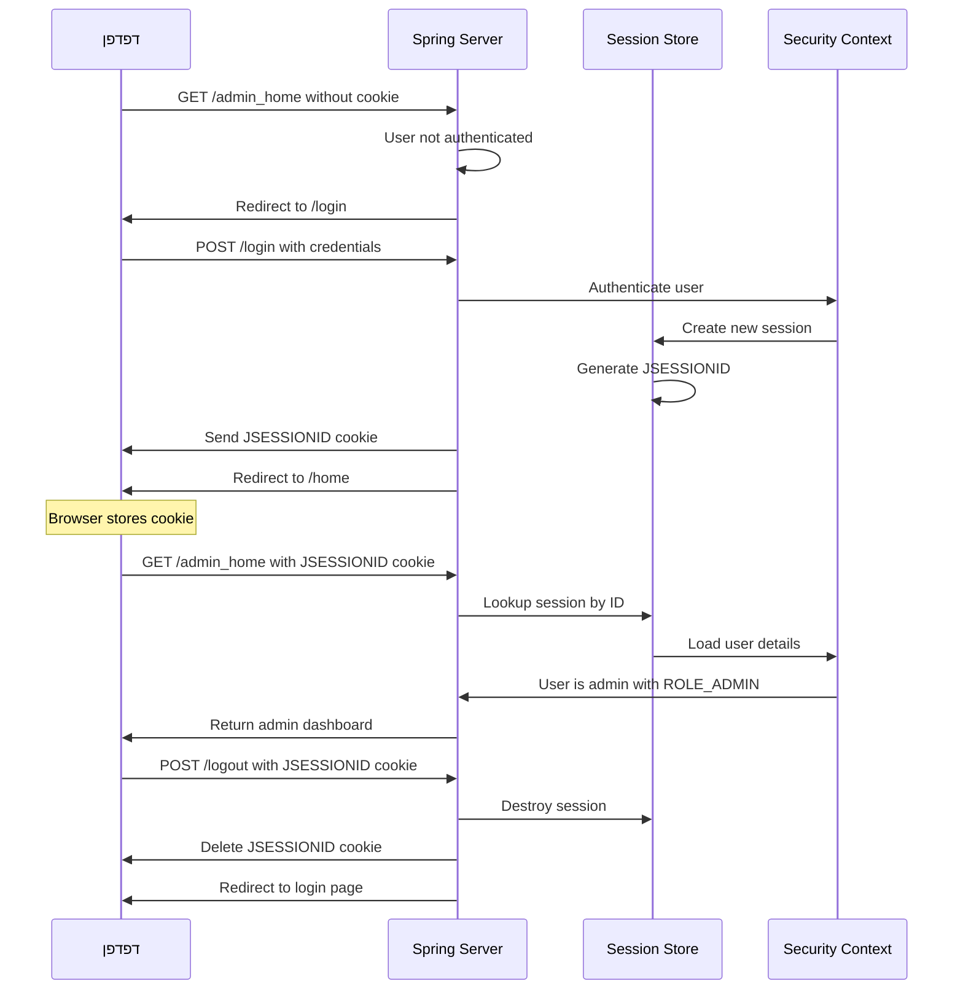
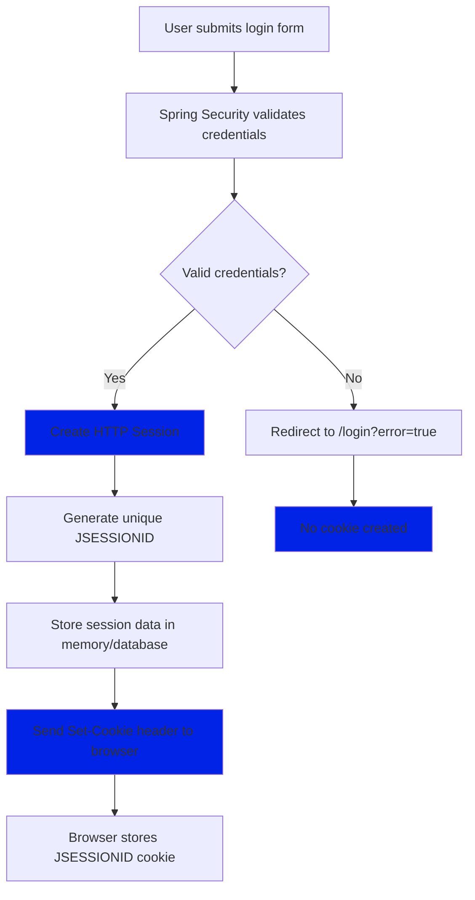
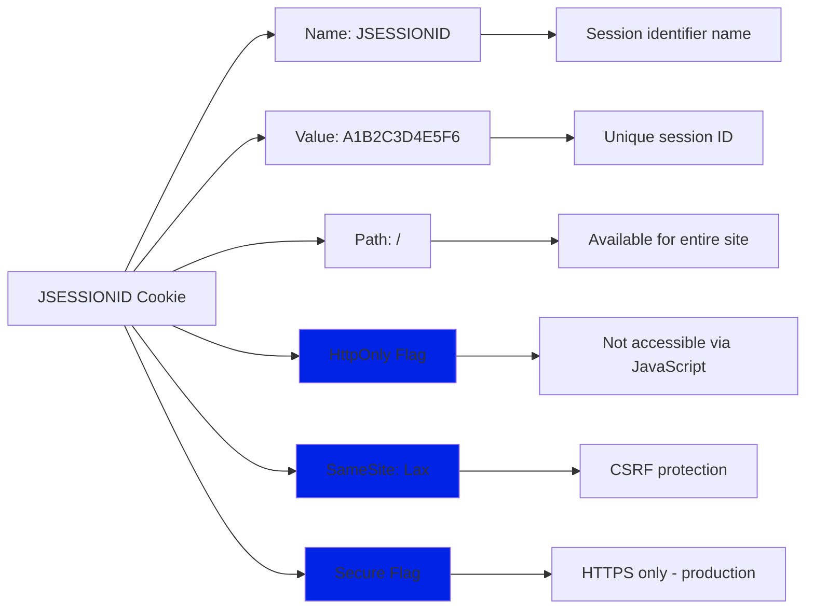
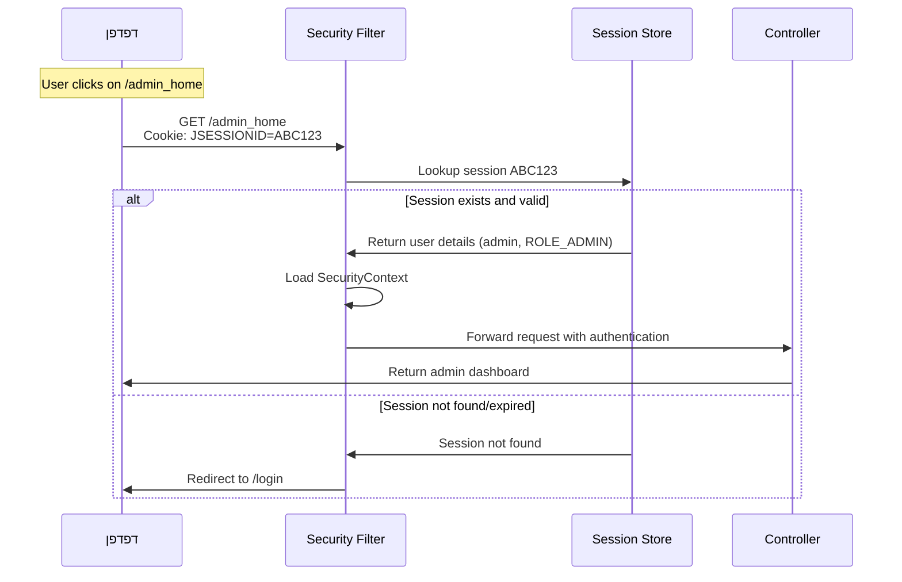
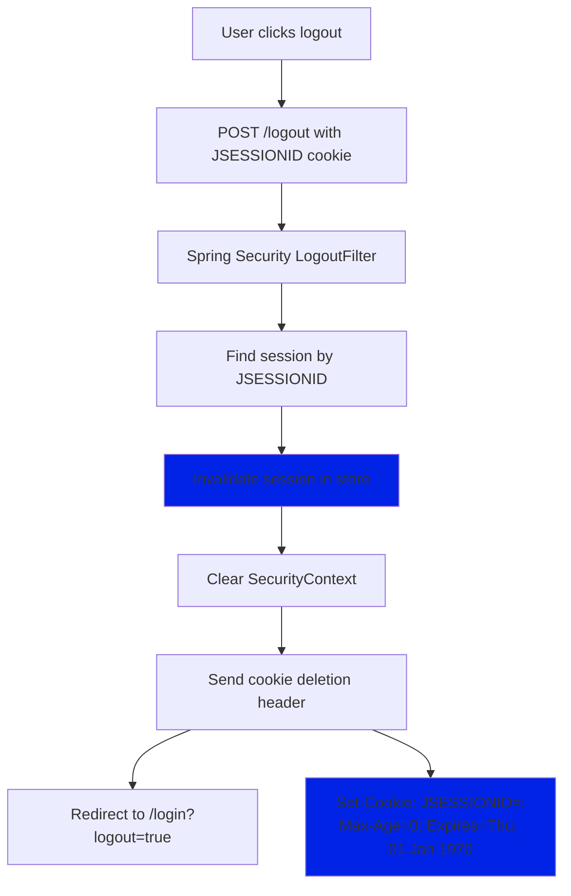
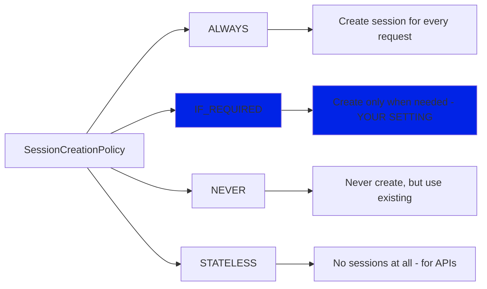
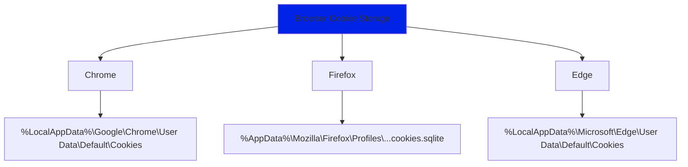
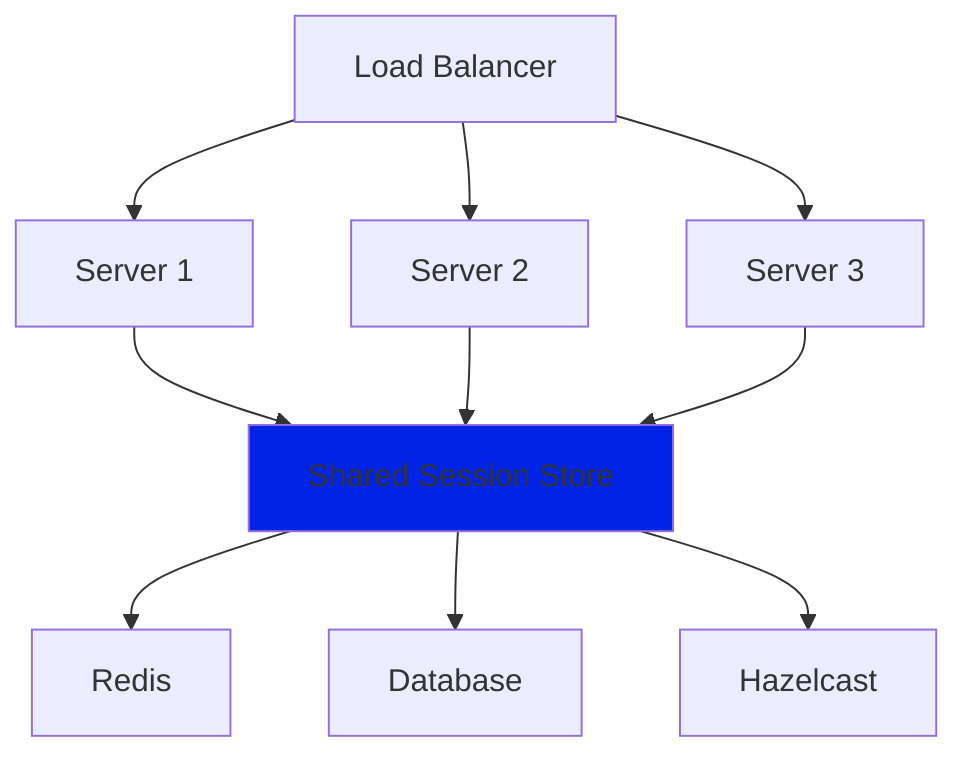

# Cookies ואבטחה באפליקציות Spring Security

<div dir="rtl">

## מה זה Cookie ומדוע זה חיוני לאבטחה?

Cookie הוא קובץ טקסט קטן שהשרת שולח לדפדפן, והדפדפן שומר אותו ושולח אותו חזרה בכל בקשה. במערכת ספרינג סקיורטי, cookies משמשים בעיקר לשמירת מידע על הסשן של המשתמש המחובר.

**ה-cookie המרכזי במערכת: JSESSIONID**

זה מזהה הסשן ש-Spring Security יוצר כדי לזכור שמשתמש כבר התחבר ואין צורך לבקש ממנו להתחבר שוב בכל בקשה.

**חשוב לזכור: ה-Cookie עצמו לא מכיל את ה-ROLE!**

## איך באמת עובד שמירת התפקיד

### מה שה-Cookie מכיל vs מה שהשרת שומר

```mermaid
graph TD
    A[JSESSIONID Cookie] --> B["Value: ABC123XYZ789"]
    B --> C["רק מזהה ייחודי - לא מידע!"]
    
    D[Server Memory/Database] --> E[Session Store]
    E --> F["Session ID: ABC123XYZ789"]
    F --> G[SecurityContext]
    G --> H[Authentication Object]
    H --> I[Principal: admin]
    H --> J[Authorities: ROLE_ADMIN, ROLE_USER]
    
    style A fill:#0123e6
    style D fill:#123567
```

</div>



<div dir="rtl">

### זרימת בדיקת הרשאות

כשמשתמש מנסה לגשת ל-`admin_home/`:

</div>



<div dir="rtl">

### מה נשמר בפועל בזיכרון השרת
 מה שנשמר ב-Session Store (`זיכרון השרת`):
</div>

```java

Map<String, SecurityContext> sessionStore = {
    "ABC123XYZ789" -> SecurityContext {
        authentication: {
            principal: "admin",
            credentials: "[PROTECTED]",
            authorities: [
                SimpleGrantedAuthority("ROLE_ADMIN"),
                SimpleGrantedAuthority("ROLE_USER")
            ],
            authenticated: true
        }
    }
}
```

<div dir="rtl">

### איך זה נוצר בעת Login

</div>

```java
// CustomUserDetailsService.java
public UserDetails loadUserByUsername(String username) {
    User user = userRepository.findById(username).orElseThrow(...);
    
    // כאן נוצרים ה-Authorities
    Collection<GrantedAuthority> authorities = user.getRoles().stream()
        .map(role -> new SimpleGrantedAuthority("ROLE_" + role.getName()))
        .collect(Collectors.toList());
    
    // Spring Security stores this in SecurityContext
    return new org.springframework.security.core.userdetails.User(
        user.getUsername(),
        user.getPassword(),
        authorities  // this is stored in the server, not in the Cookie!
    );
}
```

<div dir="rtl">

### הוכחה - ה-Cookie

</div>

```javascript
// בדפדפן - Console
document.cookie
// תוצאה: "JSESSIONID=1FBCDB2E8D6FCB9CAF503C712407921B"

// אין כאן ROLE_ADMIN או מידע נוסף!
// רק מזהה Session
```

<div dir="rtl">

### למה זה יותר בטוח?

**אם התפקידים היו ב-Cookie:**

</div>

```javascript
// רע - אם היה ככה:
document.cookie = "roles=ROLE_ADMIN,ROLE_USER"; 

// משתמש יכול לשנות ב-Console:
document.cookie = "roles=ROLE_ADMIN,ROLE_SUPER_ADMIN";
// ואז לקבל הרשאות שלא מגיעות לו!
```

<div dir="rtl">

**עם Session-based (הטוב):**

</div>

```javascript
// טוב - מה שקורה בפועל:
document.cookie = "JSESSIONID=ABC123"; 

// משתמש יכול לנסות לשנות:
document.cookie = "JSESSIONID=XYZ789";
// אבל השרת פשוט לא ימצא session עם ID הזה
// ויחזיר 401 Unauthorized
```

<div dir="rtl">

### איפה בדיוק נשמר ה-SecurityContext?

**ב-Spring Boot (ברירת מחדל):**

</div>

```java
// בזיכרון השרת
ConcurrentHashMap<String, SecurityContext> sessions;

// כל Session ID מצביע על SecurityContext
sessions.put("ABC123XYZ789", securityContext);
```

<div dir="rtl">

**אם רוצים שמירה מתמשכת:**

</div>

```properties
# application.properties
spring.session.store-type=jdbc
# או
spring.session.store-type=redis
```

<div dir="rtl">

### בדיקה מעשית - איך לראות את זה

**1. הדפס Session Info:**

</div>

```java
@GetMapping("/debug-session")
public ResponseEntity<?> debugSession(HttpServletRequest request) {
    HttpSession session = request.getSession();
    SecurityContext context = SecurityContextHolder.getContext();
    
    Map<String, Object> info = new HashMap<>();
    info.put("sessionId", session.getId());
    info.put("principal", context.getAuthentication().getName());
    info.put("authorities", context.getAuthentication().getAuthorities());
    
    return ResponseEntity.ok(info);
}
```

<div dir="rtl">

**2. בדוק ב-Browser DevTools:**

</div>

```javascript
// Network tab:
// Request Headers:
Cookie: JSESSIONID=1FBCDB2E8D6FCB9CAF503C712407921B

// Response JSON:
{
  "sessionId": "1FBCDB2E8D6FCB9CAF503C712407921B",
  "principal": "admin", 
  "authorities": ["ROLE_ADMIN"]
}
```

<div dir="rtl">

## מחזור חיי Cookie במערכת

</div>



<div dir="rtl">

## איך Spring Security מגדיר Cookies במערכת

ב-SecurityConfig, זה הקטע שמטפל בcookies:

</div>

```java
.logout(logout -> logout
    .logoutUrl("/logout")
    .logoutSuccessUrl("/login?logout=true")
    .deleteCookies("JSESSIONID")  // Delete the session cookie on logout
    .permitAll())
.sessionManagement(session -> 
    session.sessionCreationPolicy(SessionCreationPolicy.IF_REQUIRED))
```

<div dir="rtl">

### מה קורה כשמשתמש מתחבר:

</div>



<div dir="rtl">

## מבנה Cookie מפורט

כשהשרת שולח cookie לדפדפן, זה נראה כך:

</div>

```http
Set-Cookie: JSESSIONID=A1B2C3D4E5F6; Path=/; HttpOnly; SameSite=Lax
```

<div dir="rtl">

### פירוק המרכיבים:

</div>



<div dir="rtl">

LAX הוא ערך עבור התכונה SameSite של עוגיות (cookies) שעוזר להגן מפני התקפות CSRF.
כאשר SameSite מוגדר ל-LAX, העוגייה נשלחת רק בבקשות "בטוחות" מאתרים חיצוניים (כמו GET), אבל לא בבקשות שמשנות נתונים (כמו POST) - וזה מונע מתוקפים לבצע פעולות לא רצויות בשם המשתמש מאתרים אחרים.

ה-Secure flag הוא תכונה של עוגיות שמבטיחה שהעוגייה תישלח רק על חיבורים מוצפנים (HTTPS), לא על HTTP רגיל.
זה מונע מתוקפים לגנוב את העוגייה באמצעות Man-in-the-Middle attacks ברשתות לא מאובטחות (כמו WiFi ציבורי), כי העוגייה פשוט לא תישלח אם החיבור לא מוצפן.
לרוב משתמשים בשילוב: SameSite=Lax; Secure לאבטחה מקסימלית.

## תכונות אבטחה של Cookies

### 1. HttpOnly Flag
**מטרה:** מונע גישה ל-cookie דרך JavaScript

</div>

```javascript
// This will NOT work if HttpOnly is set:
document.cookie; // Cannot read JSESSIONID
console.log(document.cookie); // JSESSIONID won't appear
```

<div dir="rtl">

**למה זה חשוב?** מונע התקפות XSS שמנסות לגנוב cookies.

### 2. Secure Flag
**מטרה:** Cookie נשלח רק דרך HTTPS

</div>

```http
# In production:
Set-Cookie: JSESSIONID=ABC123; Secure; HttpOnly

# Cookie will only be sent over HTTPS connections
```

<div dir="rtl">

### 3. SameSite Flag
**מטרה:** הגנה מפני CSRF attacks

</div>

```http
Set-Cookie: JSESSIONID=ABC123; SameSite=Lax; HttpOnly
```

<div dir="rtl">

**אפשרויות:**
- **Strict** - Cookie לא נשלח מאתרים חיצוניים
- **Lax** - Cookie נשלח רק בnavigation (GET requests)
- **None** - Cookie נשלח תמיד (דורש Secure)

## מה קורה בכל בקשה HTTP

</div>



<div dir="rtl">

## Logout וניקוי Cookies

כשמשתמש מתנתק, זה מה שקורה:

</div>

```java
.logout(logout -> logout
    .logoutUrl("/logout")
    .logoutSuccessUrl("/login?logout=true") 
    .deleteCookies("JSESSIONID")  // Explicitly delete the cookie
    .permitAll())
```

<div dir="rtl">

### תהליך הlogout:

</div>



<div dir="rtl">

## Session Management והגדרות

במערכת:

</div>

```java
.sessionManagement(session -> 
    session.sessionCreationPolicy(SessionCreationPolicy.IF_REQUIRED))
```

<div dir="rtl">

### אפשרויות Session Creation:

</div>



<div dir="rtl">

## אבטחת Cookies - התקפות נפוצות

### 1. Session Hijacking
**התקפה:** גניבת JSESSIONID ושימוש בו

**הגנה במערכת:**

</div>

```java
// Spring Security automatically implements:
// 1. Session fixation protection
// 2. Secure random session IDs
// 3. HttpOnly cookies
```

<div dir="rtl">

### 2. CSRF (Cross-Site Request Forgery)
**התקפה:** אתר זדוני שולח בקשות בשם המשתמש

**הגנה:**

</div>

```java
// In your SecurityConfig:
.csrf(AbstractHttpConfigurer::disable)  // Currently disabled

// For production, enable CSRF:
// .csrf(csrf -> csrf.csrfTokenRepository(CookieCsrfTokenRepository.withHttpOnlyFalse()))
```

<div dir="rtl">

### 3. XSS (Cross-Site Scripting)
**התקפה:** JavaScript זדוני שמנסה לקרוא cookies

**הגנה:** HttpOnly flag מונע גישה ל-cookies דרך JavaScript

## Cookie Storage במחשב

הדפדפן שומר את הcookies במיקומים שונים:

</div>



<div dir="rtl">

## דוגמאות מעשיות מהמערכת

### תרחיש 1: מנהל נכנס לראשונה

</div>

```http
1. GET /admin_home
   (No cookies)

2. Response: 302 Redirect to /login
   (No Set-Cookie header)

3. POST /login
   Content-Type: application/x-www-form-urlencoded
   username=admin&password=admin

4. Response: 302 Redirect to /home
   Set-Cookie: JSESSIONID=1A2B3C4D5E6F7G8H; Path=/; HttpOnly

5. GET /home
   Cookie: JSESSIONID=1A2B3C4D5E6F7G8H

6. Response: 200 OK
   (admin-home.html with user list)
```

<div dir="rtl">

### תרחיש 2: התנתקות

</div>

```http
1. POST /logout
   Cookie: JSESSIONID=1A2B3C4D5E6F7G8H

2. Response: 302 Redirect to /login?logout=true
   Set-Cookie: JSESSIONID=; Max-Age=0; Expires=Thu, 01 Jan 1970 00:00:00 GMT

3. GET /login?logout=true
   (No JSESSIONID cookie sent)

4. Response: 200 OK
   (login.html with logout message)
```

<div dir="rtl">

## הגדרות Cookie ברמת האפליקציה

אפשר להגדיר הגדרות נוספות ב-`application.properties`:

</div>

```properties
# Session timeout (30 minutes)
server.servlet.session.timeout=30m

# Cookie settings
server.servlet.session.cookie.name=JSESSIONID
server.servlet.session.cookie.http-only=true
server.servlet.session.cookie.secure=true
server.servlet.session.cookie.same-site=lax
server.servlet.session.cookie.path=/
```

<div dir="rtl">

## מעקב ו-debugging של Cookies

### בדפדפן (F12):
1. **Application/Storage tab** - רואים את כל הcookies
2. **Network tab** - רואים Set-Cookie headers
3. **Console** - בודקים JavaScript access

### בקוד:

</div>

```java
// In CustomUserDetailsService - you can add logging:
@Override
public UserDetails loadUserByUsername(String username) throws UsernameNotFoundException {
    logger.info("Loading user: {} for session", username);
    // ... existing code
}

// To see session creation:
@EventListener
public void onSessionCreated(HttpSessionCreatedEvent event) {
    logger.info("New session created: {}", event.getSession().getId());
}
```

<div dir="rtl">

## Session Persistence ו-Clustering

### Single Server (מערכת):
Sessions שמורים ב-memory של השרת

### Multiple Servers:
צריך shared session store:

</div>



<div dir="rtl">

## Best Practices לCookies באפליקציה

### 1. Production Settings

</div>

```java
// For production, add to SecurityConfig:
.sessionManagement(session -> session
    .sessionCreationPolicy(SessionCreationPolicy.IF_REQUIRED)
    .maximumSessions(1)  // One session per user
    .maxSessionsPreventsLogin(false)  // Kick out old sessions
    .sessionRegistry(sessionRegistry()))
```

<div dir="rtl">

### 2. Cookie Security Headers

</div>

```java
// Add security headers:
.headers(headers -> headers
    .httpStrictTransportSecurity(hstsConfig -> hstsConfig
        .maxAgeInSeconds(31536000)
        .includeSubdomains(true))
    .contentTypeOptions(withDefaults())
    .frameOptions(sameOrigin()))
```

<div dir="rtl">

### 3. Session Timeout Handling

</div>

```java
// Handle session expiration gracefully:
@EventListener
public void onSessionDestroyed(HttpSessionDestroyedEvent event) {
    logger.info("Session destroyed: {}", event.getSession().getId());
    // Clean up user-specific resources
}
```

<div dir="rtl">

## סיכום הפרדת האחריות

**Cookie (בדפדפן):**
- רק Session ID
- נשלח בכל בקשה
- לא מכיל מידע רגיש

**Server Memory (בשרת):**
- SecurityContext מלא
- תפקידים והרשאות
- מוגן מפני שינוי

**היתרון:**
- משתמש לא יכול לזייף הרשאות
- שרת שולט לחלוטין במי יכול מה
- אם Session נפרץ - רק Session ID חשוף, לא המידע

זה למה Session-based authentication נחשב בטוח - המידע הקריטי נשאר בשרת!

## תפקיד Cookies במערכת

1. **אימות מתמשך** - משתמש לא צריך להתחבר בכל בקשה
2. **שמירת מצב** - מי המשתמש ומה התפקיד שלו
3. **אבטחה** - מונע גישה לא מורשית למידע רגיש
4. **חוויית משתמש** - ניווט חלק באתר

הcookies במערכת הם הגשר שמחבר בין הדפדפן לשרת, ומאפשרים למשתמשים לעבוד עם האפליקציה בצורה חלקה ובטוחה.

כל זה קורה מאחורי הקלעים - המשתמש פשוט רואה שהוא נשאר מחובר ויכול לגשת לדפים השונים ללא צורך בהתחברות חוזרת.

</div>