# Spring Security Filter Chain - מדריך מפורט

<div dir="rtl">

## מה זה Filter Chain?

ה-Filter Chain של Spring Security הוא רצף של filters שכל בקשת HTTP עוברת דרכם לפני שהיא מגיעה לcontroller שלך. כל filter אחראי על חלק מסוים באבטחה - אימות, הרשאה, הגנות וכו'.

במערכת שלך, כאשר משתמש ניגש ל-`/register` או `/role`, הבקשה עוברת דרך שרשרת של filters שבודקים: האם המשתמש מאומת? האם יש לו הרשאות? האם זו התקפה?

## ארכיטקטורת Filter Chain

</div>

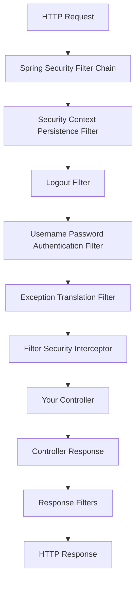

<div dir="rtl">

## Filter Chain במערכת שלך

בקובץ `SecurityConfig.java`, אתה מגדיר את ה-Filter Chain:

</div>

```java
@Bean
public SecurityFilterChain filterChain(HttpSecurity http) throws Exception {
    return http
        .csrf(AbstractHttpConfigurer::disable)
        .authorizeHttpRequests(auth -> auth
            .requestMatchers("role", "/register").hasRole("ADMIN")
            .anyRequest().authenticated())
        .sessionManagement(session ->
            session.sessionCreationPolicy(SessionCreationPolicy.IF_REQUIRED))
        .userDetailsService(userDetailsService)
        .formLogin(form -> form
            .loginProcessingUrl("/login")
            .defaultSuccessUrl("/home", true)
            .failureUrl("/login?error=true")
            .permitAll())
        .logout(logout -> logout
            .logoutUrl("/logout")
            .logoutSuccessUrl("/hello")
            .deleteCookies("JSESSIONID")
            .permitAll())
        .build();
}
```

<div dir="rtl">

## הfilters העיקריים במערכת שלך

</div>

```mermaid
graph LR
    A[SecurityContextPersistenceFilter] --> B[LogoutFilter]
    B --> C[UsernamePasswordAuthenticationFilter] 
    C --> D[ExceptionTranslationFilter]
    D --> E[FilterSecurityInterceptor]
    E --> F[UserController/RoleController]
    
%%    style A fill:#e3f2fd
%%    style B fill:#f3e5f5
%%    style C fill:#e8f5e8
%%    style D fill:#fff3e0
%%    style E fill:#ffebee
%%    style F fill:#e0f2f1
```

<div dir="rtl">

### 1. SecurityContextPersistenceFilter
**תפקיד:** שומר ומטען את פרטי האימות מהsession

**איך זה עובד במערכת שלך:**
- כשמשתמש מתחבר ב-`/login`, הfilter שומר את פרטי האימות בsession
- בבקשות הבאות, הוא מטען את הפרטים מהsession
- כך המשתמש לא צריך להתחבר שוב בכל בקשה

### 2. LogoutFilter
**תפקיד:** מטפל בהתנתקות

**התצורה שלך:**

</div>

```java
.logout(logout -> logout
    .logoutUrl("/logout")              // URL for logout
    .logoutSuccessUrl("/hello")        // Redirect after logout
    .deleteCookies("JSESSIONID")       // Clean session cookie
    .permitAll())
```

<div dir="rtl">

### 3. UsernamePasswordAuthenticationFilter
**תפקיד:** מטפל בהתחברות עם שם משתמש וסיסמה

**התצורה שלך:**

</div>

```java
.formLogin(form -> form
    .loginProcessingUrl("/login")       // Endpoint for login
    .defaultSuccessUrl("/home", true)   // Success redirect
    .failureUrl("/login?error=true")    // Failure redirect
    .permitAll())
```

<div dir="rtl">

### 4. FilterSecurityInterceptor
**תפקיד:** בודק הרשאות לכל endpoint

**הכללים שלך:**

</div>

```java
.authorizeHttpRequests(auth -> auth
    .requestMatchers("role", "/register").hasRole("ADMIN")  // Admin only
    .anyRequest().authenticated())                          // All others need authentication
```

<div dir="rtl">

## זרימת עבודה מלאה - דוגמה: יצירת תפקיד חדש

בואו נעקוב אחרי בקשה ל-`POST /role` עם תפקיד חדש:

</div>

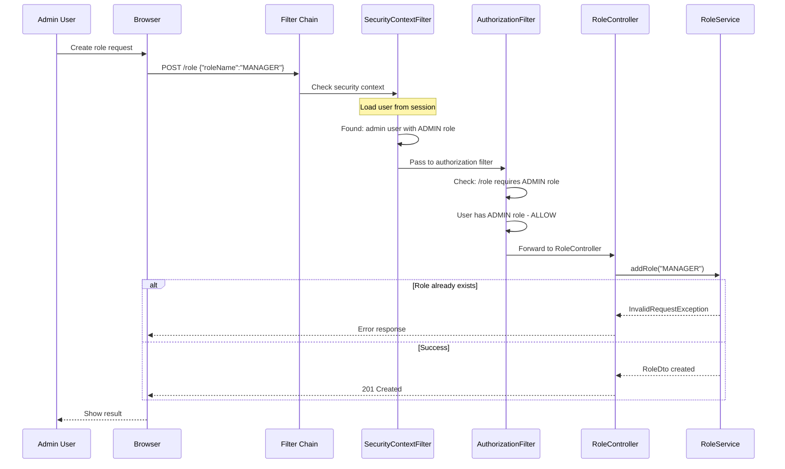

<div dir="rtl">

## איך הfilter מחליט מי יכול לגשת לאיפה?

### תהליך קבלת החלטה:

</div>

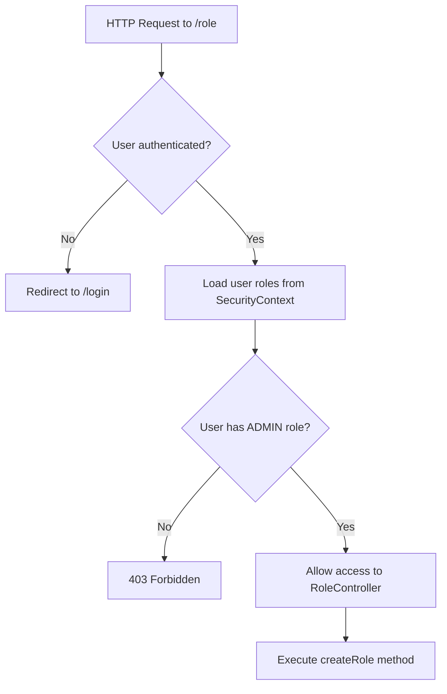

<div dir="rtl">

### מיפוי ההרשאות במערכת שלך:

</div>

```mermaid
graph LR
    A[/role] --> B[ADMIN role required]
    C[/register] --> B
    D[/hello] --> E[No authentication needed]
    F[/home] --> G[Any authenticated user]
    H[/status] --> G
    I[/logout] --> E
    J[/login] --> E
    
%%    style B fill:#ffcccc
%%    style E fill:#ccffcc
%%    style G fill:#ffffcc
```

<div dir="rtl">

## CustomUserDetailsService filter chain

ה-`CustomUserDetailsService` שלך מתחבר לfilter chain כך:

</div>

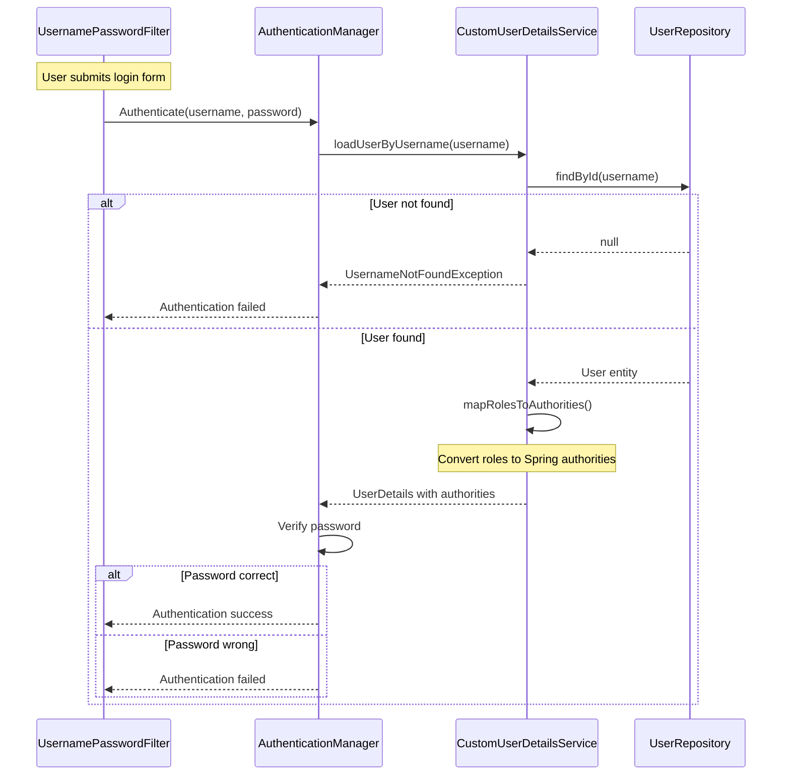

<div dir="rtl">

## המרת תפקידים ל-Spring Authorities

בשירות שלך:

</div>

```java
private Collection<? extends GrantedAuthority> mapRolesToAuthorities(List<Role> roles) {
    return roles.stream()
        // Add "ROLE_" prefix - required by Spring Security
        .map(role -> new SimpleGrantedAuthority("ROLE_" + role.getName()))
        .collect(Collectors.toList());
}
```

<div dir="rtl">

**למה הקידומת "ROLE_"?**
- Spring Security דורש את הקידומת הזו
- כשאתה כותב `.hasRole("ADMIN")`, Spring מחפש authority בשם "ROLE_ADMIN"
- לכן התפקיד "ADMIN" במסד הנתונים הופך ל-"ROLE_ADMIN" ב-Spring

## דוגמאות זרימה לפי endpoint שונים

### זרימה 1: משתמש רגיל מנסה ליצור תפקיד

</div>

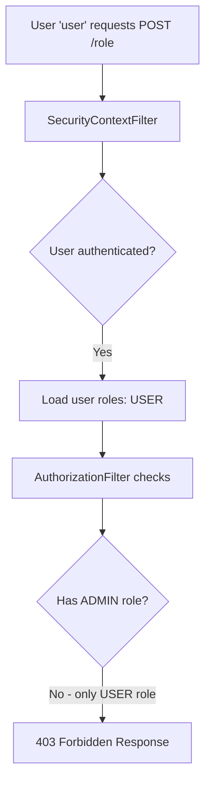

<div dir="rtl">

### זרימה 2: משתמש מנהל יוצר תפקיד בהצלחה

</div>

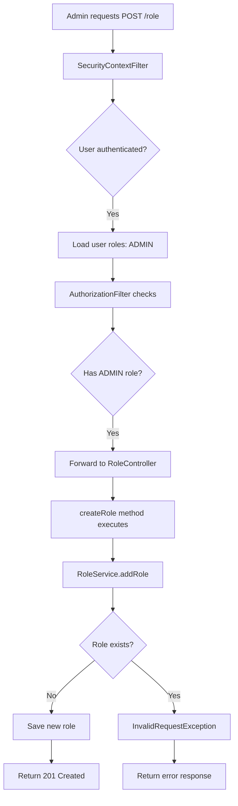

<div dir="rtl">

### זרימה 3: גישה לדף הסטטוס

</div>

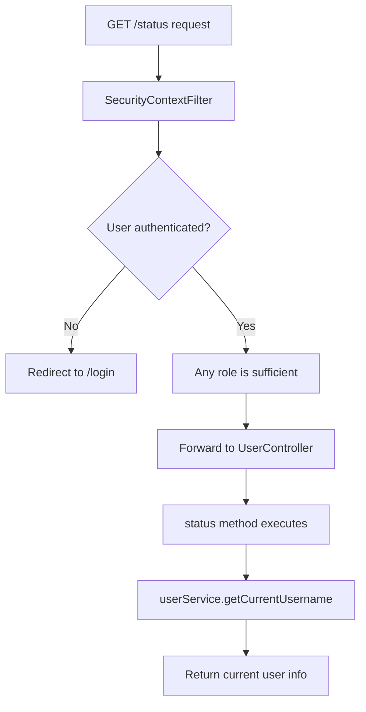

<div dir="rtl">

## Session Management והfilter chain

התצורה שלך:

</div>

```java
.sessionManagement(session ->
    session.sessionCreationPolicy(SessionCreationPolicy.IF_REQUIRED))
```

<div dir="rtl">

**משמעות:** Spring יוצר session רק כאשר נדרש (למשל, לאחר התחברות מוצלחת).

### מחזור חיי הsession:

</div>

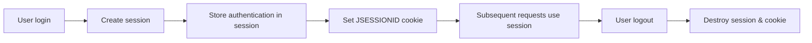

<div dir="rtl">

## הגנות שהfilter chain מספק

### 1. הגנת CSRF (מושבת במערכת שלך)

</div>

```java
.csrf(AbstractHttpConfigurer::disable)
```

<div dir="rtl">

**מדוע מושבת?**
- במערכת API או development environment לעיתים מושבתים CSRF
- בסביבת production מומלץ להפעיל

### 2. אבטחת Session
- Session fixation protection (ברירת מחדל)
- Session timeout (configurable)
- Cookie security (JSESSIONID)

### 3. Exception Handling
כשמשתמש מנסה לגשת לresource שאין לו הרשאה:

</div>

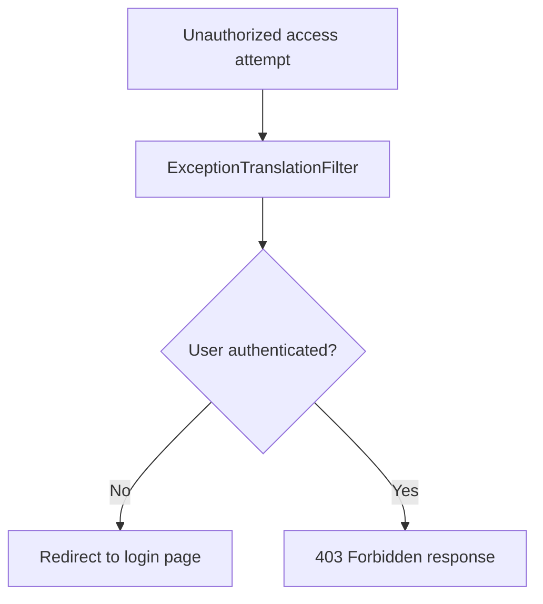

<div dir="rtl">

## DataInitializer והfilter chain

ה-`DataInitializer` שלך יוצר משתמשים שמתחברים לfilter chain:

</div>

```java
// Creates users that the filter chain will authenticate
if (!userRepository.existsByUsername("admin")) {
    User adminUser = new User();
    adminUser.setUsername("admin");
    adminUser.setPassword(passwordEncoder.encode("admin"));
    // This user will have ADMIN role - can access /role and /register
}

if (!userRepository.existsByUsername("user")) {
    User regularUser = new User();
    regularUser.setUsername("user"); 
    regularUser.setPassword(passwordEncoder.encode("user"));
    // This user will have USER role - cannot access /role or /register
}
```

<div dir="rtl">

## מה קורה כשמשתמש לא מאומת מנסה לגשת לendpoint מוגן?

</div>

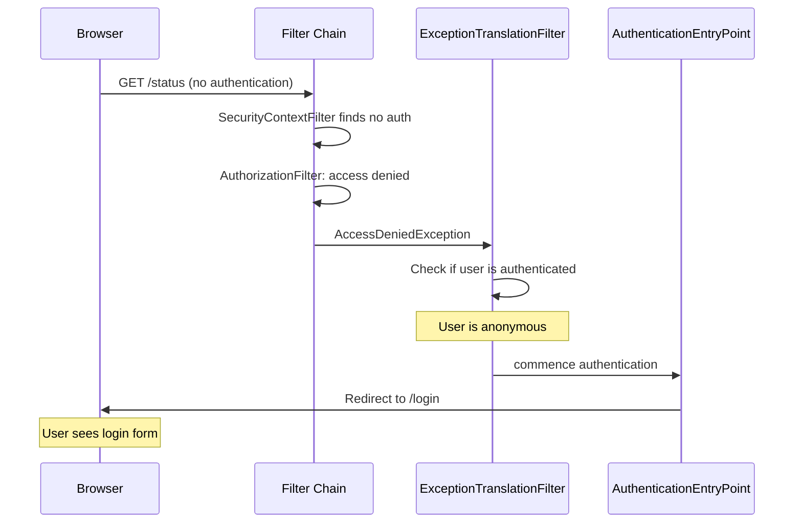

<div dir="rtl">

## סיכום - יתרונות הfilter chain

1. **מודולריות** - כל filter אחראי על חלק מסוים
2. **גמישות** - אפשר להוסיף/להסיר filters
3. **ביצועים** - filters רצים רק כשצריך
4. **בטיחות** - מספר שכבות הגנה
5. **תחזוקה** - קל לשנות הרשאות ללא שינוי בcontrollers

המערכת שלך מנצלת את כל היתרונות האלה - משתמש 'admin' יכול ליצור תפקידים ולהרשם משתמשים, בעוד משתמש רגיל יכול לגשת רק לendpoints בסיסיים.

</div>