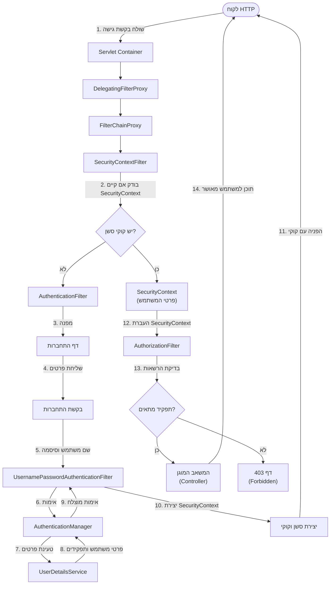
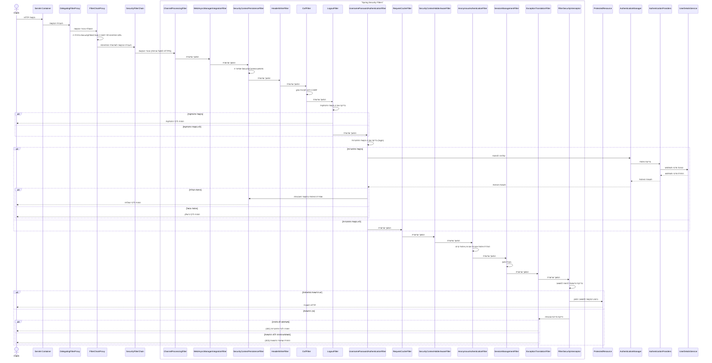

# מערכת האבטחה של Spring Security - תהליך התחברות וגישה מבוססת תפקידים

 תרשים המתאר את תהליך האבטחה ב-Spring Security, כולל התחברות, קוקי וגישה מבוססת תפקידים:

## הסבר התהליך

1. **בקשה ראשונית**: לקוח שולח בקשת HTTP לגישה למשאב מוגן

2. **בדיקת אימות**:
    - המערכת בודקת אם קיים קוקי סשן תקף
    - אם אין קוקי, המשתמש מופנה לדף התחברות

3. **תהליך התחברות**:
    - המשתמש מזין שם וסיסמה בטופס התחברות
    - `UsernamePasswordAuthenticationFilter` תופס את הבקשה
    - פרטי המשתמש נשלחים ל-`AuthenticationManager`
    - המנהל מבקש מ-`UserDetailsService` את פרטי המשתמש וההרשאות
    - מתבצעת אימות הסיסמה מול הסיסמה המאוחסנת

4. **יצירת סשן**:
    - לאחר אימות מוצלח, נוצר אובייקט `Authentication`
    - מוכנס לתוך `SecurityContext` חדש
    - נוצר קוקי סשן שנשלח ללקוח

5. **בדיקת הרשאות**:
    - בבקשות הבאות, `SecurityContext` נטען מהסשן
    - `AuthorizationFilter` בודק אם התפקידים של המשתמש מאפשרים גישה
    - אם יש הרשאה מתאימה, הבקשה מועברת למשאב
    - אם אין הרשאה, מוחזרת שגיאת 403

תרשים זה ממחיש את הזרימה הבסיסית של מערכת האבטחה ב-Spring Security, כולל תהליך ההתחברות, שמירת והעברת זהות המשתמש, ובדיקות ההרשאה לפי תפקידים.

