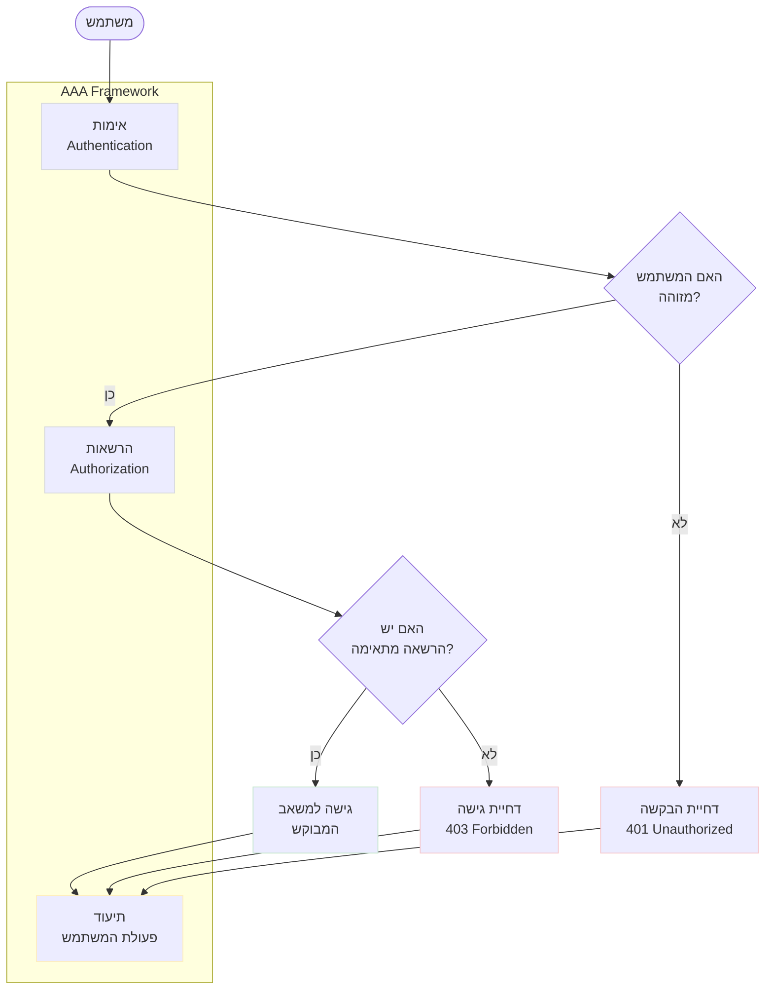
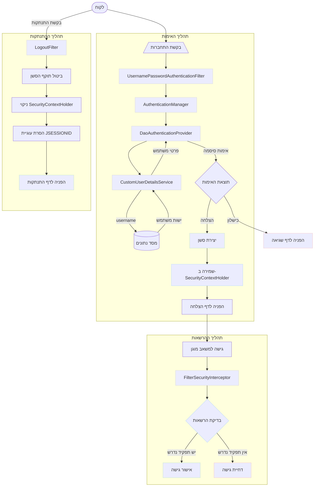
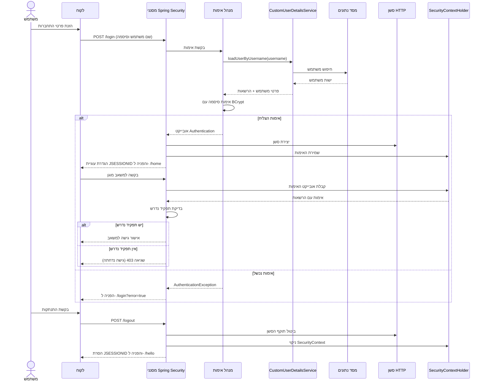
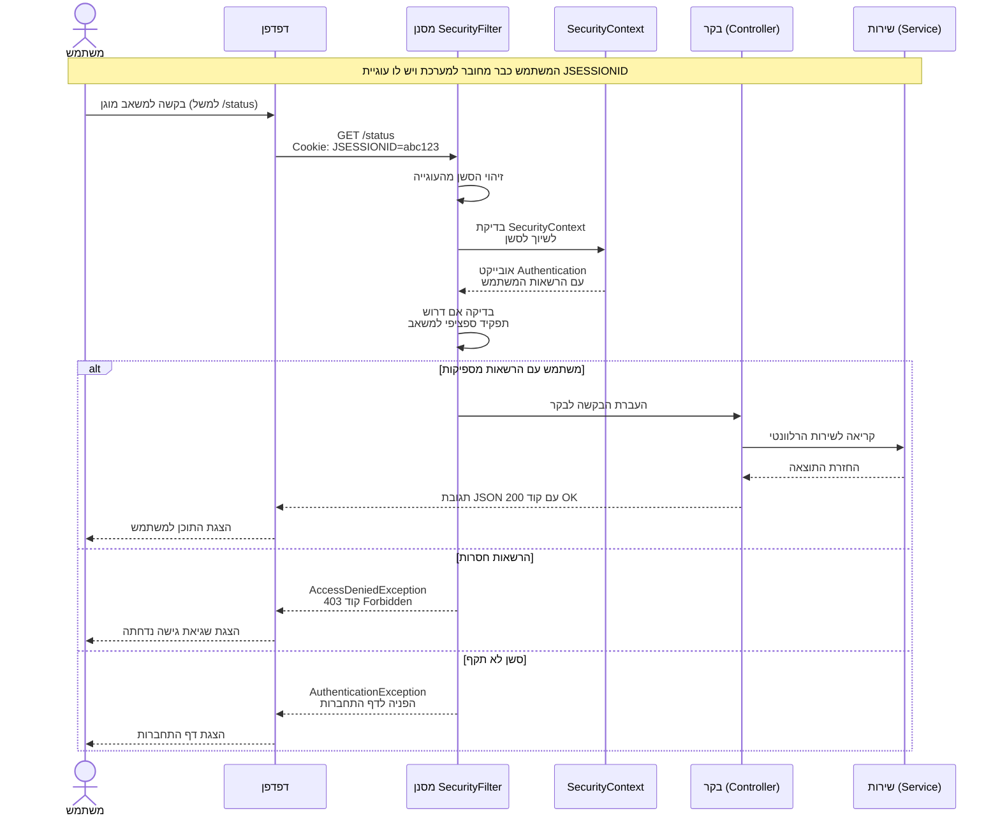

### AAA: Authentication, Authorization & Accounting

<div dir="rtl">

מערכת האבטחה שלנו מיישמת את עקרונות ה-AAA (Authentication, Authorization & Accounting), שהם עקרונות יסוד באבטחת מידע:

#### 1. אימות (Authentication)
מענה על השאלה: **"מי אתה?"**

תהליך האימות במערכת כולל:
- קבלת אישורי גישה (שם משתמש וסיסמה) מהמשתמש
- אימות הפרטים מול מסד הנתונים
- שימוש ב-`BCryptPasswordEncoder` להצפנה ואימות סיסמאות
- יצירת אובייקט `Authentication` המייצג את המשתמש המאומת
- שמירת מצב האימות בסשן באמצעות `SecurityContextHolder`

#### 2. הרשאות (Authorization)
מענה על השאלה: **"מה מותר לך לעשות?"**

תהליך ההרשאות במערכת כולל:
- הגדרת תפקידים ברורים במערכת (`ADMIN`, `USER`, וכו')
- מיפוי תפקידים לפעולות מותרות (למשל, רק `ADMIN` יכול ליצור תפקידים ומשתמשים)
- בדיקת הרשאות בזמן אמת באמצעות `FilterSecurityInterceptor`
- אכיפת הגבלות גישה ברמת נקודות הקצה (endpoints)
- מתן גישה רק למשאבים המותרים לפי התפקיד של המשתמש

#### 3. תיעוד (Accounting)
מענה על השאלה: **"מה עשית במערכת?"**

המערכת מבצעת תיעוד של פעולות באמצעות:
- שימוש ב-`@Slf4j` לתיעוד פעולות משמעותיות
- תיעוד ניסיונות התחברות (הצלחות וכשלונות)
- תיעוד פעולות רגישות כמו יצירת משתמשים ותפקידים
- תיעוד שגיאות אבטחה ומקרי דחיית גישה
- אפשרות להרחבה עתידית לתיעוד מפורט יותר של פעולות משתמשים

### תרשים AAA במערכת

</div>




<div dir="rtl">

מודל AAA מבטיח את שלמות המערכת על ידי:
1. **וידוא זהות המשתמש** לפני מתן גישה
2. **אכיפת הרשאות** בהתאם לתפקיד המשתמש
3. **תיעוד פעולות** לניטור, ביקורת ותחקור אירועים

יישום מלא של עקרונות ה-AAA מספק שכבת אבטחה מקיפה ועקבית לאורך כל המערכת.# Spring Security Project Overview

<div dir="rtl">

## סקירה כללית של הפרויקט

פרויקט זה הוא אפליקציית Spring Boot המיישמת מערכת אימות והרשאות באמצעות Spring Security. המערכת מנהלת משתמשים ותפקידים (roles), ומאפשרת הרשמה, התחברות, ובקרת גישה למשאבים מאובטחים.

## רכיבים עיקריים

הפרויקט מורכב מהרכיבים הבאים:

</div>

<div dir="ltr">

### Security Configuration

```java
@Configuration
@EnableWebSecurity
@RequiredArgsConstructor
public class SecurityConfig {
    // Configuration for Spring Security
    @Bean
    public SecurityFilterChain filterChain(HttpSecurity http) throws Exception {
        http
                .csrf(AbstractHttpConfigurer::disable)
                .authorizeHttpRequests(auth -> auth
                        .requestMatchers("role", "/register").hasRole("ADMIN")
                        .anyRequest().authenticated())
                .sessionManagement(session ->
                        session.sessionCreationPolicy(SessionCreationPolicy.IF_REQUIRED))
                .userDetailsService(userDetailsService)
                .formLogin(form -> form
                        .loginProcessingUrl("/login")
                        .defaultSuccessUrl("/home", true)
                        .failureUrl("/login?error=true")
                        .permitAll())
                .logout(logout -> logout
                        .logoutUrl("/logout")
                        .logoutSuccessUrl("/hello")
                        .deleteCookies("JSESSIONID")
                        .permitAll());

        return http.build();
    }
}
```

</div>

<div dir="rtl">

### מודל הנתונים

המערכת משתמשת בשני מודלים עיקריים:

1. **User** - מייצג משתמש במערכת
2. **Role** - מייצג תפקיד או הרשאה שיכולה להיות משויכת למשתמש

יש קשר Many-to-Many בין משתמשים לתפקידים, כלומר משתמש יכול להיות בעל מספר תפקידים, ותפקיד יכול להיות משויך למספר משתמשים.

### אתחול נתונים

המערכת כוללת מנגנון אתחול נתונים שיוצר משתמשים ותפקידים ברירת מחדל אם הם לא קיימים:

</div>

<div dir="ltr">

```java
@Configuration
@RequiredArgsConstructor
public class DataInitializer {
    @Bean
    public CommandLineRunner initData() {
        return args -> {
            // יצירת תפקידי ADMIN ו-USER
            // יצירת משתמש 'admin' עם סיסמה 'admin' ותפקיד ADMIN
            // יצירת משתמש 'user' עם סיסמה 'user' ותפקיד USER
        };
    }
}
```
</div>

<div dir="rtl">

מנגנון זה מבטיח שהמערכת תכלול משתמש מנהל ומשתמש רגיל גם בהפעלה הראשונה.

### בקרים (Controllers)

הפרויקט כולל את הבקרים הבאים:

</div>

<div dir="ltr">

#### User Controller
Handles user registration, profile management, and basic endpoints.

```java
@RestController
@RequiredArgsConstructor
public class UserController {
    private final UserService userService;

    @GetMapping("/hello")
    public ResponseEntity<StandardResponse> hello() { /* ... */ }

    @GetMapping({"/home", "/"})
    public ResponseEntity<StandardResponse> home() { /* ... */ }

    @GetMapping("/status")
    public ResponseEntity<StandardResponse> status() { /* ... */ }

    @PostMapping("/register")
    public ResponseEntity<StandardResponse> register(@Valid @RequestBody UserDto userDto) { /* ... */ }
}
```

#### Role Controller
Manages role creation and assignment.

```java
@RestController
@RequiredArgsConstructor
public class RoleController {
    private final RoleService roleService;

    @PostMapping("/role")
    public ResponseEntity<StandardResponse> createRole(@Valid @RequestBody RoleDto roleDto) { /* ... */ }
}
```

</div>

<div dir="rtl">

### שירותים (Services)

השירותים מטפלים בלוגיקה העסקית של האפליקציה:

1. **UserService** - מנהל רישום משתמשים והתמודדות עם פעולות הקשורות למשתמש
2. **RoleService** - מנהל יצירה ושיוך של תפקידים
3. **CustomUserDetailsService** - משמש את Spring Security לטעינת פרטי משתמש בתהליך האימות

### טיפול בחריגות

המערכת כוללת טיפול מקיף בחריגות שמחזיר תגובות JSON מובנות:

</div>

<div dir="ltr">

```java
@ControllerAdvice
public class GlobalExceptionHandler {
    @ExceptionHandler(NotExists.class)
    public ResponseEntity<StandardResponse> handleNotExists(NotExists ex, WebRequest request) { /* ... */ }

    @ExceptionHandler(AlreadyExists.class)
    public ResponseEntity<StandardResponse> handleAlreadyExists(AlreadyExists ex, WebRequest request) { /* ... */ }

    // Additional exception handlers...
}
```

</div>

<div dir="rtl">

## תרשים זרימה של מערכת האבטחה

להלן תרשים המציג את התהליך המלא של אימות והרשאות במערכת:

</div>

<div dir="ltr">



<div dir="rtl">
רכיבי אימות מרכזיים ב-Spring Security
להלן סקירה קצרה של שלושת רכיבי הליבה בתהליך האימות:

1. UsernamePasswordAuthenticationFilter

תופס בקשות התחברות לנתיב /login
מחלץ את שם המשתמש והסיסמה מהפרמטרים בבקשה
יוצר אובייקט UsernamePasswordAuthenticationToken לא מאומת
מעביר את האובייקט ל-AuthenticationManager לביצוע האימות
מטפל בהצלחה (הפניה לדף הצלחה) או כישלון (הפניה לדף שגיאה)

2. AuthenticationManager

ממשק מרכזי המתאם את תהליך האימות
מקבל אובייקט Authentication לא מאומת
מעביר אותו לספקי אימות (AuthenticationProvider) שונים לטיפול
מחזיר אובייקט Authentication מאומת עם ההרשאות או זורק חריגה

3. DaoAuthenticationProvider

מימוש ספציפי של AuthenticationProvider
משתמש ב-UserDetailsService לטעינת פרטי המשתמש ממסד הנתונים
בודק את הסיסמה שהוזנה מול הסיסמה המוצפנת באמצעות PasswordEncoder
בודק אם החשבון פעיל, לא חסום ולא פג תוקף
יוצר אובייקט Authentication עם הרשאות המשתמש במקרה של הצלחה


### תרשים רצף תהליך האימות וההרשאות

התרשים הבא מציג את רצף הפעולות בין הרכיבים השונים של המערכת:

</div>



<div dir="rtl">

## תזרים אימות והרשאות

1. **אתחול ראשוני**: בהפעלה ראשונה, המערכת מאתחלת משתמש מנהל ומשתמש רגיל
2. **התחברות**: משתמשים מתחברים באמצעות נקודת הקצה `/login` - מחייב פורמט `application/x-www-form-urlencoded`
3. **יצירת תפקידים**: רק משתמש עם תפקיד `ADMIN` יכול ליצור תפקידים חדשים באמצעות `/role`
4. **רישום משתמשים**: רק משתמש עם תפקיד `ADMIN` יכול לרשום משתמשים חדשים באמצעות `/register`
5. **גישה למשאבים**: כל המשאבים במערכת דורשים אימות של המשתמש
6. **התנתקות**: משתמשים יכולים להתנתק באמצעות נקודת הקצה `/logout`

### הסבר מפורט של תהליך האימות

כפי שמוצג בתרשים, תהליך האימות כולל את השלבים הבאים:

1. **שליחת פרטי התחברות** - הלקוח שולח את שם המשתמש והסיסמה בפורמט `application/x-www-form-urlencoded`
2. **עיבוד הבקשה** - `UsernamePasswordAuthenticationFilter` מעבד את הבקשה ויוצר אובייקט אימות ראשוני
3. **אימות המשתמש** - `AuthenticationManager` מעביר את בקשת האימות ל-`DaoAuthenticationProvider`
4. **טעינת פרטי המשתמש** - `CustomUserDetailsService` טוען את פרטי המשתמש ממסד הנתונים
5. **אימות הסיסמה** - `DaoAuthenticationProvider` מאמת את הסיסמה באמצעות `BCryptPasswordEncoder`
6. **יצירת סשן** - במקרה של הצלחה, נוצר סשן ואובייקט האימות נשמר ב-`SecurityContextHolder`
7. **הפניה לדף הבית** - המשתמש מופנה לדף הבית (`/home`)

### הסבר מפורט של תהליך ההרשאות

לאחר האימות, כל בקשה למשאב מוגן עוברת את תהליך ההרשאות:

1. **בקשה למשאב** - הלקוח שולח בקשה למשאב מוגן
2. **בדיקת אימות** - המערכת בודקת אם המשתמש מאומת
3. **בדיקת הרשאות** - `FilterSecurityInterceptor` בודק אם למשתמש יש את התפקיד הנדרש
4. **קבלת החלטה** - אם יש למשתמש את התפקיד הנדרש, ניתנת גישה; אחרת, הגישה נדחית

### תהליך פנייה לאחר התחברות (עם Cookie)

תרשים הזרימה הבא מראה את התהליך המדויק של בקשה למשאב מוגן כאשר המשתמש כבר מחובר ויש לו עוגיית JSESSIONID:

</div>

<div dir="ltr">



</div>

<div dir="rtl">

במהלך התהליך הזה:

1. **שליחת העוגייה** - הדפדפן שולח את עוגיית ה-JSESSIONID באופן אוטומטי עם כל בקשה לשרת
2. **שחזור הסשן** - השרת משתמש בעוגייה כדי לשחזר את פרטי הסשן של המשתמש
3. **שחזור מידע האימות** - ה-`SecurityContextPersistenceFilter` משחזר את אובייקט ה-`Authentication` מהסשן ומציב אותו ב-`SecurityContextHolder`
4. **בדיקת הרשאות** - המערכת בודקת אם למשתמש יש את ההרשאות הנדרשות לגישה למשאב
5. **עיבוד הבקשה** - אם יש למשתמש את ההרשאות המתאימות, הבקשה מועברת לבקר המתאים לעיבוד
6. **שליחת תגובה** - הבקר מחזיר תגובה עם ערך סטטוס מתאים (200 להצלחה, 403 לגישה נדחתה, או הפניה לדף התחברות אם הסשן אינו תקף)

## בדיקת האפליקציה

ניתן לבדוק את האפליקציה באמצעות IntelliJ HTTP Client, Postman או כל כלי API אחר. עבור בקשות התחברות, חשוב להשתמש בפורמט `application/x-www-form-urlencoded` ולא ב-JSON.

דוגמאות לבקשות:

</div>

<div dir="ltr">

```http
### Login as admin (required for creating roles and users)
POST http://localhost:8080/login
Content-Type: application/x-www-form-urlencoded

username=admin&password=admin

### Create a role (requires ADMIN role)
POST http://localhost:8080/role
Content-Type: application/json
Cookie: JSESSIONID=your_admin_session_id_here

{
  "roleName": "MANAGER"
}

### Register a new user (requires ADMIN role)
POST http://localhost:8080/register
Content-Type: application/json
Cookie: JSESSIONID=your_admin_session_id_here

{
  "username": "manager1",
  "password": "password123",
  "roles": ["MANAGER"]
}

### Login as the new user
POST http://localhost:8080/login
Content-Type: application/x-www-form-urlencoded

username=manager1&password=password123

### Access protected resource
GET http://localhost:8080/status
Cookie: JSESSIONID=your_session_id_here
```
</div>

<div dir="rtl">


פרויקט זה מדגים שימוש יעיל ב-Spring Security לבניית מערכת אימות והרשאות מלאה עם הפרדת תפקידים. השימוש במנגנון אתחול נתונים מאפשר הפעלה מיידית של המערכת עם משתמשים ותפקידים מוגדרים מראש. המערכת אוכפת אבטחה חזקה כך שרק משתמשים עם תפקיד מנהל יכולים ליצור תפקידים ומשתמשים חדשים.

תרשימי הזרימה מדגימים את האופן שבו בקשות עוברות דרך שכבות האבטחה השונות וכיצד מתבצעים תהליכי האימות, ההרשאות וההתנתקות במערכת. החלק שעוסק בתהליך פנייה עם Cookie מדגים כיצד המערכת מטפלת בבקשות חוזרות ממשתמש מאומת, תוך שימוש יעיל בסשן ועוגיות.

מבנה הפרויקט עוקב אחר עקרונות ה-MVC ומפריד בין השכבות השונות של האפליקציה תוך שמירה על אבטחה חזקה ומודל תפקידים גמיש.

</div>