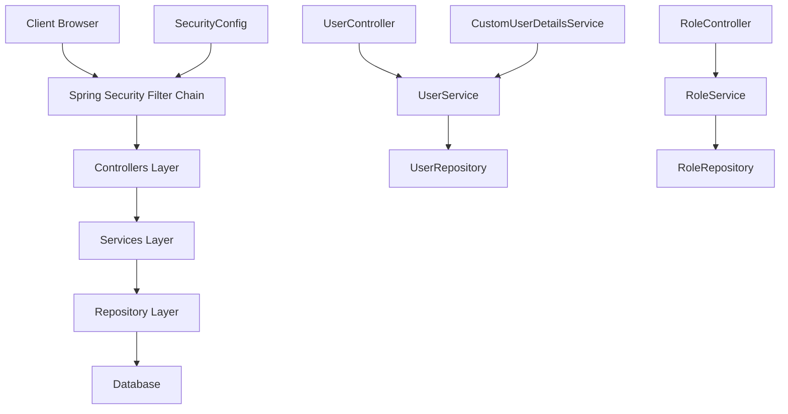
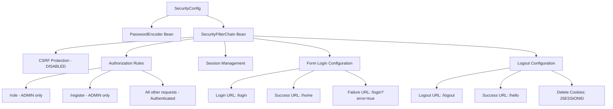
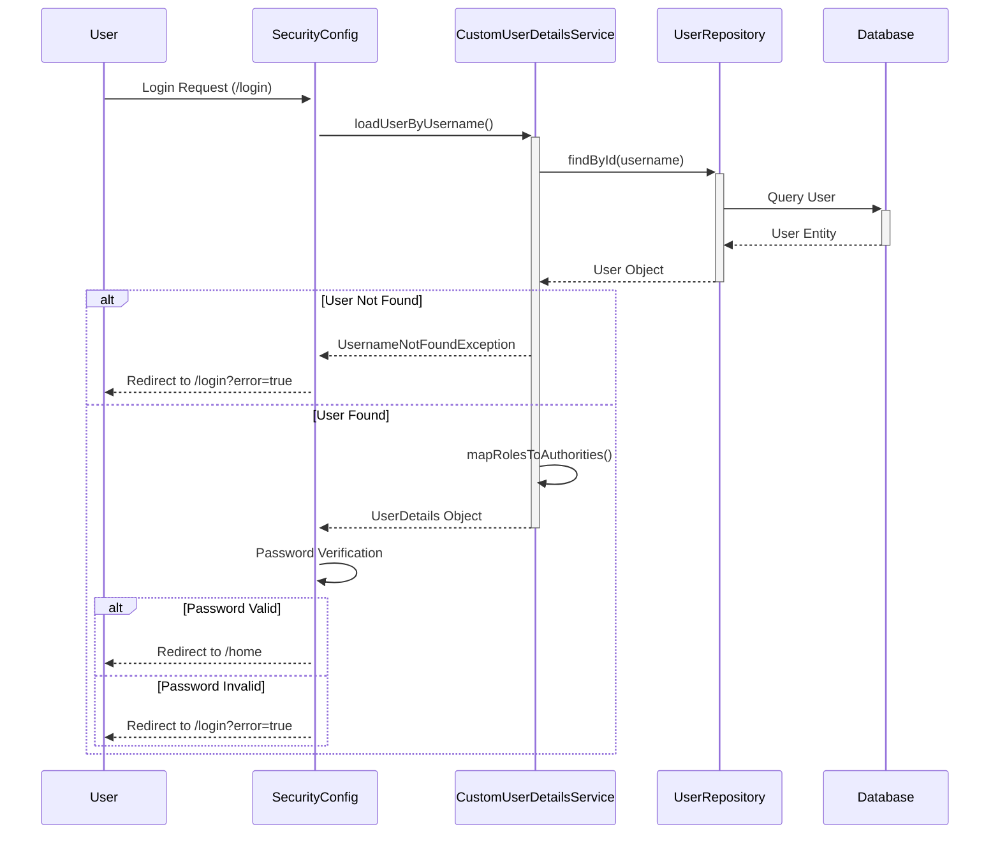
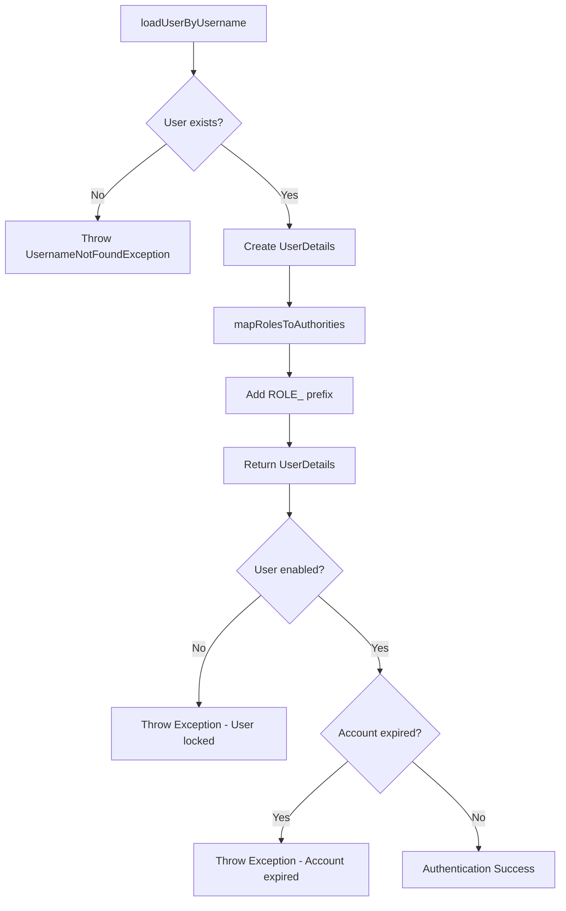
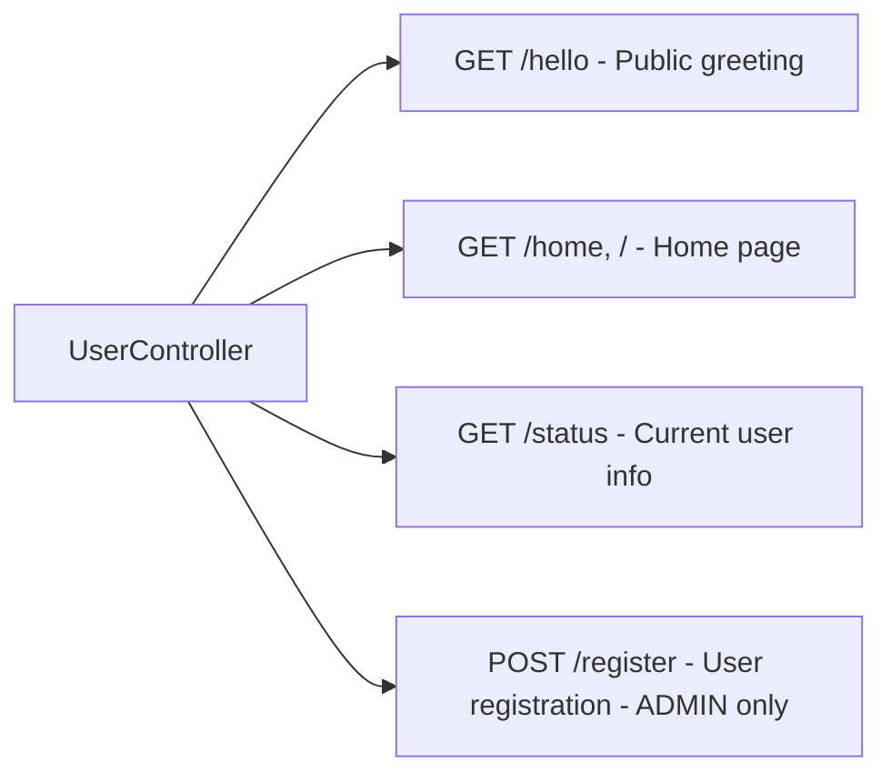
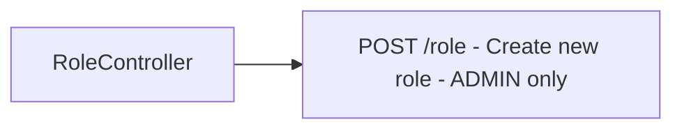
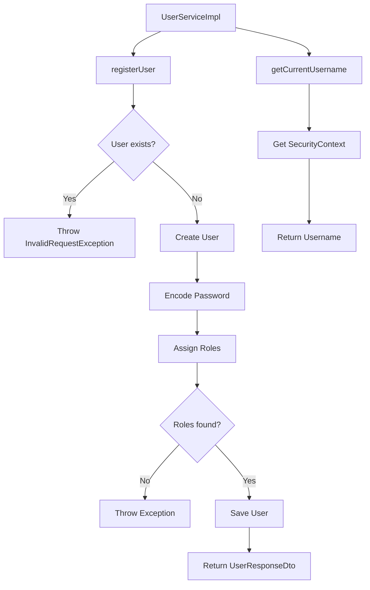
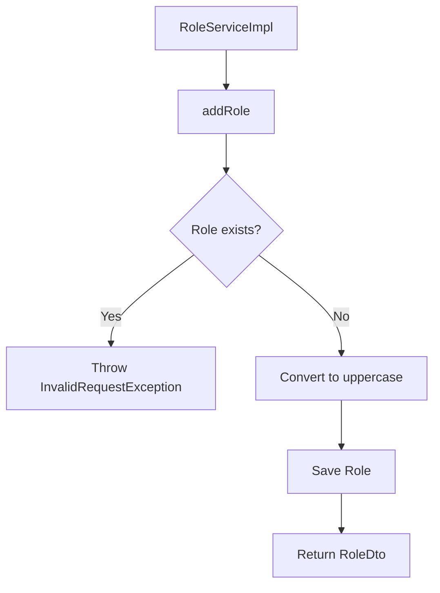
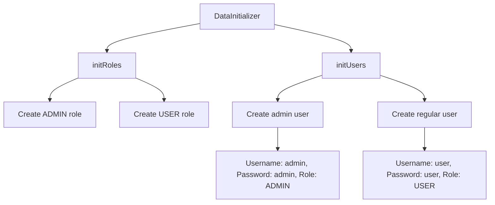
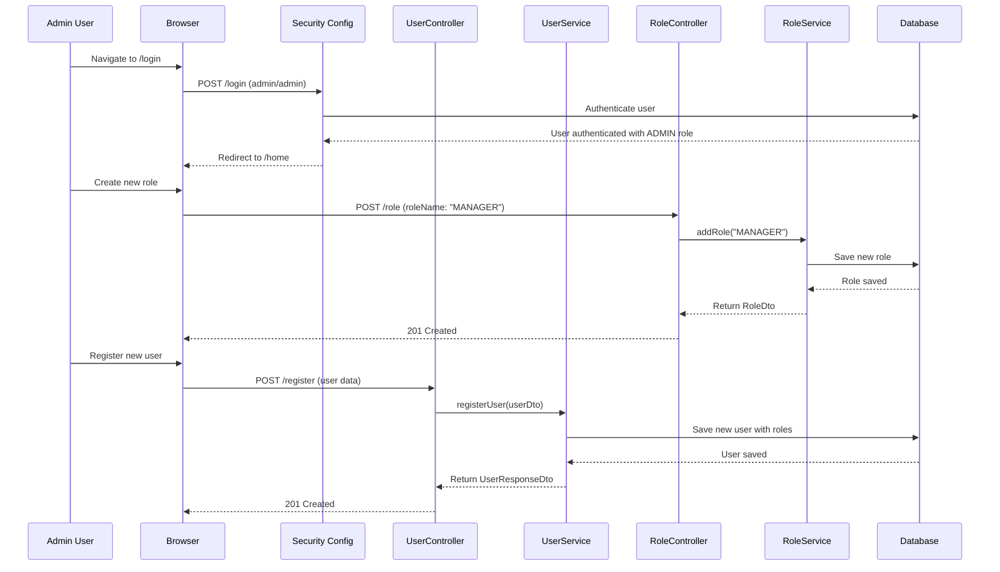

# מדריך Spring Security - מערכת ניהול משתמשים ותפקידים

<div dir="rtl">

## סקירה כללית של המערכת

המערכת בנויה על Spring Boot עם Spring Security ומממשת מערכת אימות בסיסית עם ניהול תפקידים. המערכת כוללת שני תפקידים עיקריים: ADMIN ו-USER, כאשר למנהלים יש הרשאות מיוחדות ליצירת תפקידים ורישום משתמשים חדשים.

## מבנה כללי של האפליקציה

</div>



<div dir="rtl">

## תצורת האבטחה - SecurityConfig

הקובץ `SecurityConfig` הוא הלב של מערכת האבטחה. בואו נבין את כל רכיביו:

### מבנה תצורת האבטחה

</div>



<div dir="rtl">

### הסבר מפורט על רכיבי האבטחה

#### 1. מקודד סיסמאות (PasswordEncoder)
הקוד משתמש ב-`BCryptPasswordEncoder` עם חוזק 12 במקום ברירת המחדל 10. זה מספק אבטחה טובה יותר:

</div>

```java
@Bean
public static PasswordEncoder passwordEncoder() {
    return new BCryptPasswordEncoder(12);
}
```

<div dir="rtl">

#### 2. כללי הרשאות (Authorization Rules)
המערכת מגדירה שלושה רמות הרשאה:
- `role/` ו-`register/` - דורשים תפקיד ADMIN
- כל שאר הבקשות - דורשות אימות בלבד

#### 3. ניהול סשן (Session Management)
הוגדר ל-`IF_REQUIRED` - יוצר סשן רק כאשר צריך.

#### 4. תצורת התחברות (Form Login)
- נקודת קצה לכניסה: `login/`
- הפניה בהצלחה: `home/`
- הפניה בכישלון: `login?error=true/`

## זרימת תהליך האימות

</div>



<div dir="rtl">

## שירות פרטי לטעינת פרטי משתמש - CustomUserDetailsService

השירות הזה אחראי על טעינת פרטי המשתמש מהמסד נתונים וממיר אותם לפורמט שSpring Security מבין:

### תהליך טעינת משתמש

</div>



<div dir="rtl">

### המרת תפקידים לרשויות

"השירות ממיר תפקידים לרשויות על ידי הוספת הקידומת "_ROLE":

</div>

```java
private Collection<? extends GrantedAuthority> mapRolesToAuthorities(List<Role> roles) {
    return roles.stream()
        .map(role -> new SimpleGrantedAuthority("ROLE_" + role.getName()))
        .collect(Collectors.toList());
}
```

<div dir="rtl">

## בקרים (Controllers)

### UserController - בקר המשתמשים

הבקר מספק מספר נקודות קצה:

</div>



<div dir="rtl">

#### נקודות קצה מפורטות:

1. **`hello/`** - מחזיר ברכה פשוטה
2. **`home/`, `/`** - עמוד הבית לאחר התחברות מוצלחת
3. **`status/`** - מציג את שם המשתמש הנוכחי
4. **`register/`** - רישום משתמש חדש (ADMIN בלבד)

### RoleController - בקר התפקידים

</div>



<div dir="rtl">

הבקר מאפשר יצירת תפקידים חדשים במערכת, אך רק למשתמשים עם תפקיד ADMIN.

## שירותים (Services)

### UserService - שירות המשתמשים

</div>



<div dir="rtl">

#### תהליך רישום משתמש:
1. בדיקה אם המשתמש כבר קיים
2. יצירת אובייקט משתמש חדש
3. הצפנת הסיסמה
4. הקצאת תפקידים
5. שמירה במסד הנתונים

### RoleService - שירות התפקידים

</div>



<div dir="rtl">

## אתחול נתונים - DataInitializer

המחלקה הזו מאתחלת את המסד נתונים עם נתונים בסיסיים:

</div>



<div dir="rtl">

### משתמשי ברירת מחדל:
- **admin/admin** - משתמש עם הרשאות מנהל
- **user/user** - משתמש רגיל

## זרימת עבודה מלאה

</div>



<div dir="rtl">

## נקודות חשובות לאבטחה

### 1. הצפנת סיסמאות
המערכת משתמשת ב-BCrypt עם חוזק 12, שמספק רמת אבטחה גבוהה.

### 2. הפרדת תפקידים
- ADMIN - יכול ליצור תפקידים ולרשום משתמשים
- USER - גישה בסיסית למערכת

### 3. הגנת CSRF
מושבת בשלב זה, אך בסביבת ייצור יש לשקול הפעלה.

### 4. ניהול סשנים
המערכת יוצרת סשן רק כאשר נדרש, מה שחוסך משאבים.

### 5. בדיקות תקינות
המערכת בודקת שהמשתמש קיים, פעיל ולא פג תוקפו.


המערכת מספקת בסיס איתן לאימות ואישור במערכת Spring. היא כוללת:
- מנגנון אימות מובנה
- ניהול תפקידים מתקדם
- הגנה על נקודות קצה רגישות
- אתחול אוטומטי של נתונים בסיסיים

המבנה מאפשר הרחבה קלה והוספת תכונות אבטחה נוספות בעתיד.

</div>