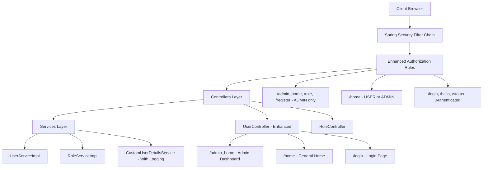
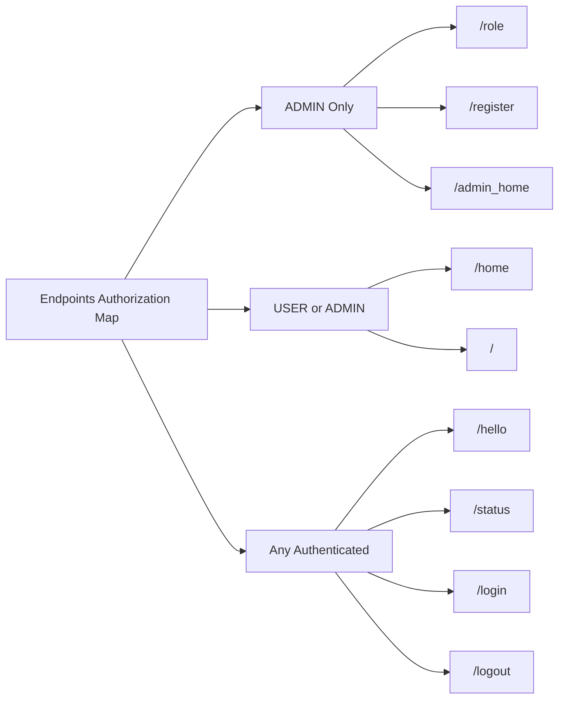
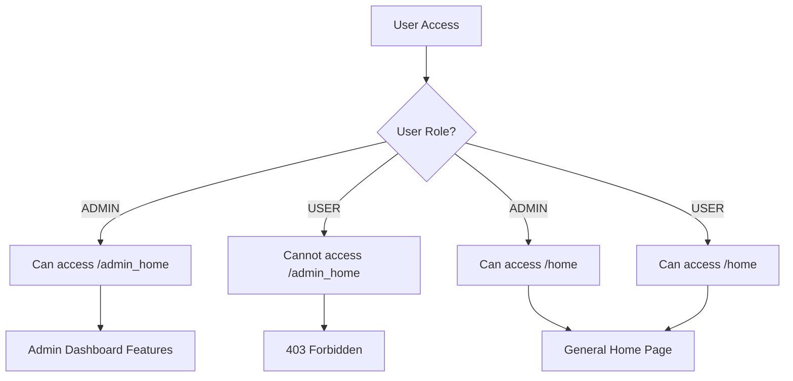
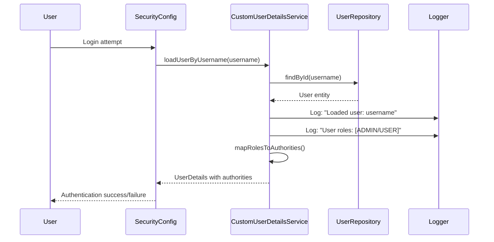
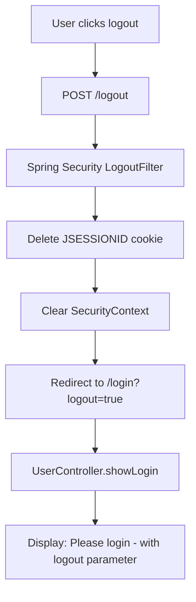
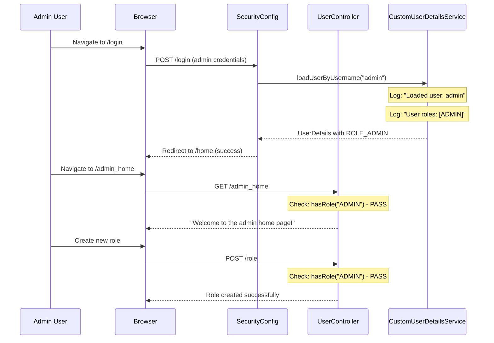
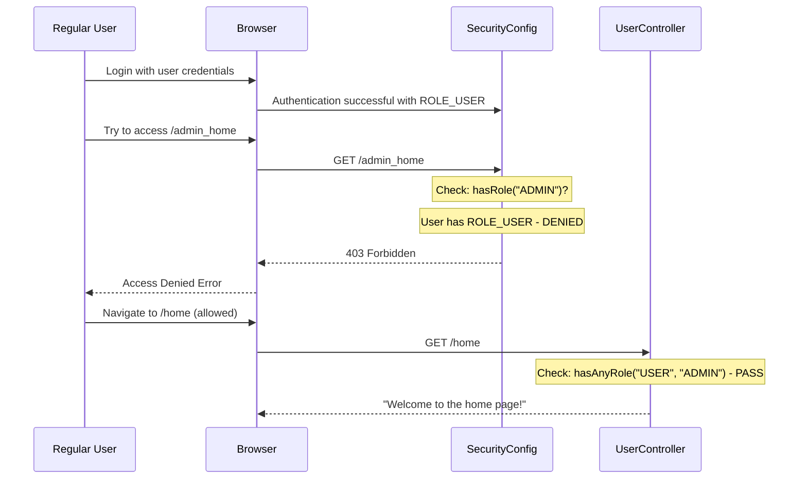
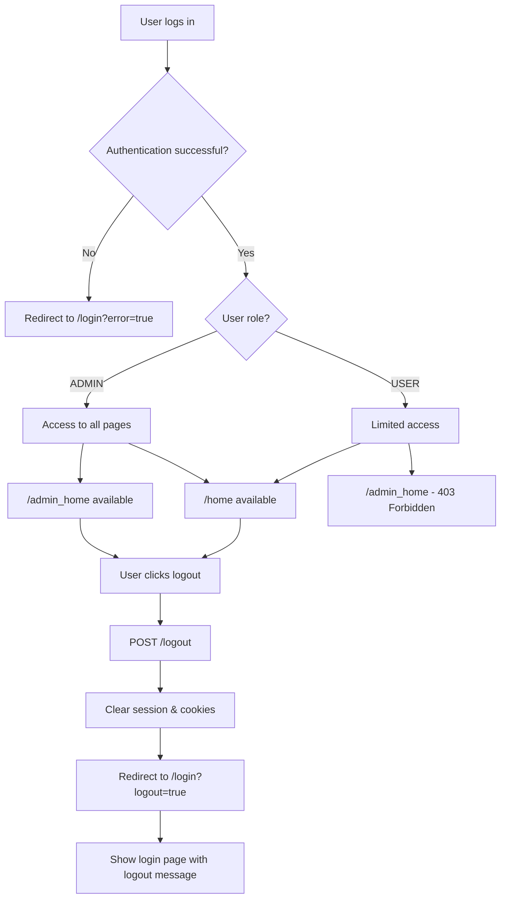
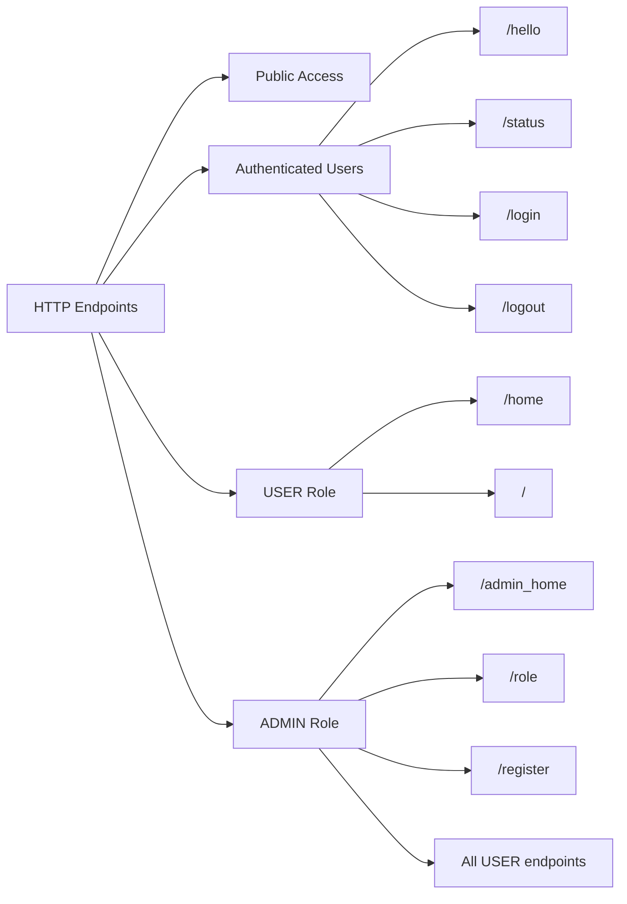
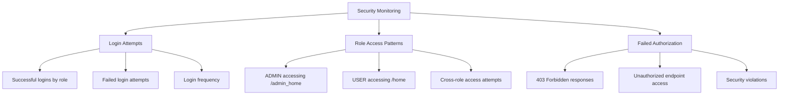

<div dir="rtl">

# Stage 4 - מערכת אבטחה מתקדמת עם הפרדת תפקידים

## סקירה כללית - מה השתנה ב-Stage 4?

ב-Stage 4 המערכת מתקדמת יותר עם הפרדה ברורה בין סוגי משתמשים ודפים ייעודיים. השיפורים העיקריים:

- **הפרדת דפי בית** - דף נפרד למנהלים (`admin_home/`)
- **הרשאות מדורגות** - הבחנה בין endpoints שצריכים USER ו-ADMIN
- **ניהול התחברות משופר** - דף login מותאם וlogout עם הודעות
- **לוגים מפורטים** - מעקב אחר פעילות המשתמשים

## ארכיטקטורת המערכת המשופרת

</div>



<div dir="rtl">

## הרשאות מתקדמות ב-SecurityConfig

המערכת עכשיו מגדירה שלוש רמות הרשאה ברורות:

</div>

```java
.authorizeHttpRequests(auth -> auth
    .requestMatchers("/role", "/register", "/admin_home").hasRole("ADMIN") // Admin only
    .requestMatchers("/home").hasAnyRole("USER", "ADMIN") // User or Admin  
    .anyRequest().authenticated()) // All others need authentication
```

<div dir="rtl">

### מפת ההרשאות החדשה:

</div>



<div dir="rtl">

## Controllers משופרים

### UserController עם Endpoints חדשים

הוספו שני endpoints חשובים:

</div>

```java
@GetMapping("/admin_home")
public ResponseEntity<StandardResponse> adminHome() {
    StandardResponse response = new StandardResponse("success", "Welcome to the admin home page!", null);
    return ResponseEntity.ok(response);
}

@GetMapping("/login")
public ResponseEntity<StandardResponse> showLogin() {
    StandardResponse response = new StandardResponse("success", "Please login", null);
    return ResponseEntity.ok(response);
}
```

<div dir="rtl">

### זרימת הניווט החדשה:

</div>



<div dir="rtl">

## CustomUserDetailsService עם לוגים

השירות עכשיו כולל לוגים מפורטים למעקב:

</div>

```java
@Override
@Transactional
public UserDetails loadUserByUsername(String username) throws UsernameNotFoundException {
    Optional<User> userOptional = userRepository.findById(username);
    User user = userOptional.orElse(null);
    if (user == null) {
        throw new UsernameNotFoundException("Invalid username.");
    }

    logger.info("Loaded user: {}", user.getUsername());
    logger.info("User roles: {}", user.getRoles());

    return new org.springframework.security.core.userdetails.User(
            user.getUsername(),
            user.getPassword(),
            mapRolesToAuthorities(user.getRoles())
    );
}
```

<div dir="rtl">

### זרימת אימות עם לוגים:

</div>



<div dir="rtl">

## ניהול Logout משופר

הlogout עכשיו מפנה לדף login עם הודעה:

</div>

```java
.logout(logout -> logout
    .logoutUrl("/logout")
    .logoutSuccessUrl("/login?logout=true")  // Improved logout messaging
    .deleteCookies("JSESSIONID")
    .permitAll())
```

<div dir="rtl">

### זרימת Logout משופרת:

</div>



<div dir="rtl">

## תרחישי שימוש מפורטים

### תרחיש 1: מנהל נכנס למערכת

</div>



<div dir="rtl">

### תרחיש 2: משתמש רגיל מנסה לגשת לדף מנהל

</div>



<div dir="rtl">

### תרחיש 3: זרימה מלאה עם Logout

</div>



<div dir="rtl">

## השיפורים ב-UserServiceImpl

שונה מ-`existsByUsername` ל-`existsById` לעקביות:

</div>

```java
public UserResponseDto registerUser(UserDto userDto) {
    // Check if user already exists - improved method
    if (userRepository.existsById(userDto.getUsername())) {
        throw new InvalidRequestException("User already exists: " + userDto.getUsername());
    }
    // ... rest of method
}
```

<div dir="rtl">

## מיפוי נקודות הקצה המלא

</div>



<div dir="rtl">

## מטריקות אבטחה ומעקב

עם הלוגים החדשים, אפשר לעקוב אחר:

</div>

```java
// In CustomUserDetailsService
logger.info("Loaded user: {}", user.getUsername());
logger.info("User roles: {}", user.getRoles());

// What you'll see in logs:
// INFO - Loaded user: admin
// INFO - User roles: [Role(id=1, name=ADMIN)]
// INFO - Loaded user: user  
// INFO - User roles: [Role(id=2, name=USER)]
```

<div dir="rtl">

### דשבורד מעקב (התיאורטי):

</div>



<div dir="rtl">

## Best Practices שהמערכת מיישמת

### 1. Principle of Least Privilege
כל משתמש מקבל רק את ההרשאות המינימליות הנדרשות:
- USER - גישה לדפי בית בסיסיים
- ADMIN - גישה מלאה לניהול + כל הרשאות USER

### 2. Clear Separation of Concerns
הפרדה ברורה בין:
- דפי ניהול (`admin_home/`)
- דפי משתמש רגיל (`home/`)
- פעולות ניהול (`role`, `/register/`)

### 3. Comprehensive Logging
מעקב מלא אחר פעילות אבטחה

### 4. Graceful Error Handling
הודעות ברורות למשתמש (login, logout, errors)

## הרצת המערכת - משתמשי ברירת מחדל

המערכת מגיעה עם שני משתמשים:

</div>

```java
// From DataInitializer (assumed similar to Stage 3)
// admin / admin - ROLE_ADMIN
// user / user - ROLE_USER
```

<div dir="rtl">

### מסלולי בדיקה מומלצים:

1. **התחברות כ-admin:**
    - גישה ל-`admin_home/` (מותר)
    - יצירת תפקיד ב-`role/` (מותר)
    - רישום משתמש ב-`register/` (מותר)

2. **התחברות כ-user:**
    - גישה ל-`home/` (מותר)
    - ניסיון גישה ל-`admin_home` (403 Forbidden)
    - ניסיון יצירת תפקיד (403 Forbidden)

3. **בדיקת logout:**
    - logout מכל משתמש
    - וידוא הפניה ל-`login?logout=true/`

## סיכום השיפורים ב-Stage 4

המערכת עכשיו מספקת:
- **הרשאות מדורגות** עם הפרדה ברורה
- **ניהול משתמשים מתקדם** עם דפים ייעודיים
- **מעקב ולוגים** לפעילות אבטחה
- **חוויית משתמש משופרת** עם הודעות ברורות
- **אבטחה רובסטית** עם בדיקות הרשאה מחמירות

זה מהווה בסיס איתן למערכת אבטחה ארגונית שאפשר להרחיב ולפתח הלאה.

</div>