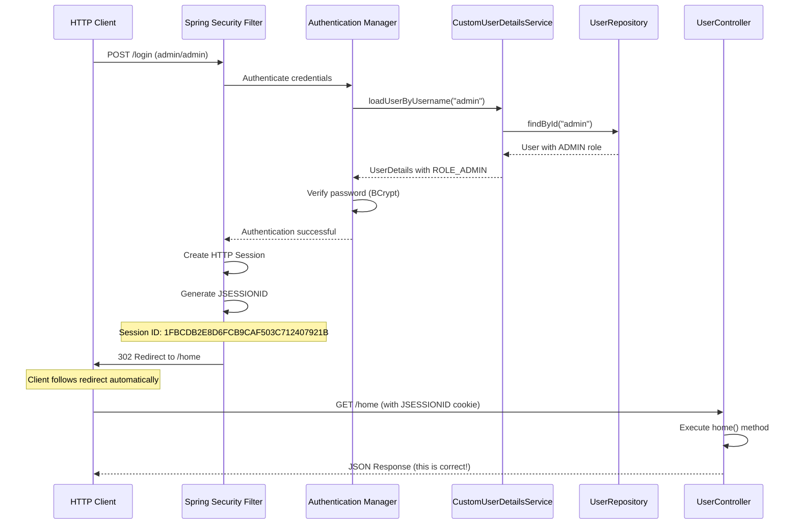
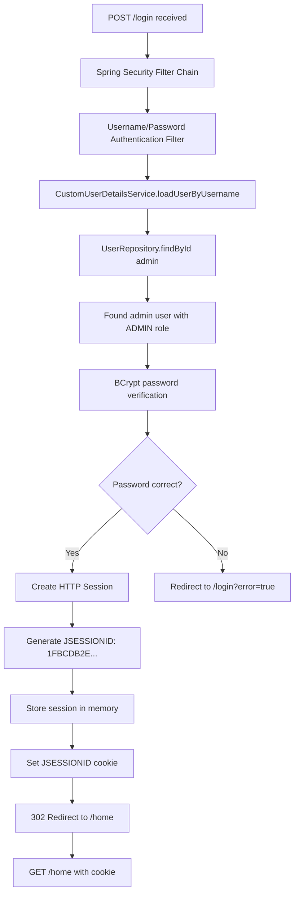

# הסבר זרימת הלוגין - Stage 4

<div dir="rtl">

## ניתוח הבקשה ב-Stage 4

נשלחה בקשת login ל-Stage 4 של המערכת.

## השלב הראשון: בקשת הלוגין

</div>

```http
POST http://localhost:8080/login
Content-Type: application/x-www-form-urlencoded

username=admin&password=admin
```

<div dir="rtl">

**מה נשלח:**
- **Method:** POST (כנדרש לפעולות אימות)
- **URL:** `/login` (נקודת הקצה לאימות במערכת)
- **Content-Type:** `application/x-www-form-urlencoded` (פורמט HTML form רגיל)
- **Body:** שם משתמש וסיסמה של המנהל

## מה קרה בשרת - זרימה מפורטת

</div>



<div dir="rtl">

## למה קיבלנו JSON?

ב-Stage 4, הUserController מוגדר כ-`RestController`:

</div>

```java
@RestController  // Returns JSON, not HTML
@RequiredArgsConstructor
public class UserController {
    
    @GetMapping({"/home", "/"})
    public ResponseEntity<StandardResponse> home() {
        StandardResponse response = new StandardResponse("success", "Welcome to the home page!", null);
        return ResponseEntity.ok(response);  // Returns JSON!
    }
}
```

<div dir="rtl">

**זה בדיוק מה שצריך לקרות ב-Stage 4!**

## ההבדל בין השלבים

</div>

| Stage | Controller Type | Response Type | מטרה |
|--------|--------|--------|--------|
| **Stage 4** | `@RestController` | JSON | API endpoints |
| **Stage 5** | `@Controller` + `@RestController` | HTML + JSON | Full web app |


<div dir="rtl">

## ניתוח הSession Cookie

</div>

```
localhost	/	JSESSIONID	1FBCDB2E8D6FCB9CAF503C712407921B	-1
```

<div dir="rtl">

**פירוק הCookie:**
- **Domain:** `localhost` - זמין רק למחשב המקומי
- **Path:** `/` - זמין לכל המסלולים באתר
- **Name:** `JSESSIONID` - שם סטנדרטי של Spring Session
- **Value:** `1FBCDB2E8D6FCB9CAF503C712407921B` - מזהה הsession הייחודי שנוצר
- **Expiry:** `-1` - Session cookie (נמחק כשסוגרים הדפדפן)

## מה שקרה בפועל

```mermaid
graph TD
    A[POST /login with admin/admin] --> B[Spring Security Authentication]
    B --> C[CustomUserDetailsService loads admin user]
    C --> D[Found admin with ROLE_ADMIN]
    D --> E[Password verified with BCrypt]
    E --> F[Create session: 1FBCDB2E...]
    F --> G[302 Redirect to /home - per SecurityConfig]
    G --> H[HTTP Client follows redirect]
    H --> I[GET /home with JSESSIONID cookie]
    I --> J[UserController.home method]
    J --> K[Return JSON: Welcome to home page]
    
    style F fill:#012345
    style K fill:#012345
```

</div>



<div dir="rtl">

## מה השרת עשה מאחורי הקלעים

</div>



<div dir="rtl">

## מה קורה בCustomUserDetailsService

כשהמערכת מאמתת את "admin", זה מה שקורה בקוד:

</div>

```java
@Override
@Transactional
public UserDetails loadUserByUsername(String username) throws UsernameNotFoundException {
    Optional<User> userOptional = userRepository.findById(username);
    User user = userOptional.orElse(null);
    if (user == null) {
        throw new UsernameNotFoundException("Invalid username.");
    }

    logger.info("Loaded user: {}", user.getUsername());      // ← זה יודפס בלוגים
    logger.info("User roles: {}", user.getRoles());          // ← וזה גם

    return new org.springframework.security.core.userdetails.User(
            user.getUsername(),           // admin
            user.getPassword(),           // $2a$10$... (BCrypt hash)
            mapRolesToAuthorities(user.getRoles())  // [ROLE_ADMIN]
    );
}
```

<div dir="rtl">

## בדיקה: האם באמת מחובר?

ננסה לגשת לendpoint שדורש הרשאות ADMIN:

</div>

```http
### Test admin access
GET {{host}}/admin_home
```

<div dir="rtl">

צריך לקבל:

</div>

```json
{
  "status": "success",
  "data": "Welcome to the admin home page!",
  "error": null
}
```

<div dir="rtl">

או לendpoint שמראה מי אתה:

</div>

```http
### Check current user
GET {{host}}/status
```

<div dir="rtl">

צריך לקבל:

</div>

```json
{
  "status": "success",
  "data": "You are logged in as User name: admin!",
  "error": null
}
```

<div dir="rtl">

## SecurityConfig מוגדר נכון

</div>

```java
.authorizeHttpRequests(auth -> auth
    .requestMatchers("/role", "/register", "/admin_home").hasRole("ADMIN")  // ✓ אתה ADMIN
    .requestMatchers("/home").hasAnyRole("USER", "ADMIN")                   // ✓ אתה ADMIN
    .anyRequest().authenticated())                                          // ✓ אתה מאומת

.formLogin(form -> form
    .loginProcessingUrl("/login")           // ✓ זה מה ששלחת
    .defaultSuccessUrl("/home", true)       // ✓ זה למה הופנית
    .failureUrl("/login?error=true")
    .permitAll())
```

<div dir="rtl">

## HTTP Headers בפירוט

</div>

```
X-Content-Type-Options: nosniff
X-XSS-Protection: 0
Cache-Control: no-cache, no-store, max-age=0, must-revalidate
Pragma: no-cache
Expires: 0
X-Frame-Options: DENY
```

<div dir="rtl">

**הסבר Headers:**

**Headers אבטחה:**
- `X-Content-Type-Options: nosniff` - מונע מהדפדפן לנחש content types
- `X-XSS-Protection: 0` - מכבה הגנת XSS של הדפדפן (Spring מטפל בזה)
- `X-Frame-Options: DENY` - מונע הטמעת הדף ב-iframe (הגנה מClickjacking)

**Headers Caching:**
- `Cache-Control: no-cache, no-store, max-age=0, must-revalidate` - אוסר caching לחלוטין
- `Pragma: no-cache` - תמיכה בדפדפנים ישנים
- `Expires: 0` - הדף פג תוקף מיד

**למה אין caching?** כי זה דף שדורש אימות - אסור לשמור אותו בcache!

## פעולות שאפשר לבצע עכשיו

### 1. לבדוק גישה למנהל:

</div>

```http
GET {{host}}/admin_home
```

<div dir="rtl">

### 2. ליצור תפקיד חדש (ADMIN בלבד):

</div>

```http
POST {{host}}/role
Content-Type: application/json

{
  "roleName": "MANAGER"
}
```

<div dir="rtl">

### 3. לרשום משתמש חדש (ADMIN בלבד):

</div>

```http
POST {{host}}/register
Content-Type: application/json

{
  "username": "newuser",
  "password": "password123",
  "roles": ["USER"]
}
```

<div dir="rtl">

### 4. לבדוק endpoint רגיל:

</div>

```http
GET {{host}}/hello
```

<div dir="rtl">

### 5. להתנתק:

</div>

```http
POST {{host}}/logout
```

<div dir="rtl">

## מה יקרה אחרי logout?

כשתריץ logout, השרת ימחק את הsession ויחזיר:

</div>

```http
HTTP/1.1 302 Found
Location: /login?logout=true
Set-Cookie: JSESSIONID=; Max-Age=0  // מחיקת הcookie
```

<div dir="rtl">

## בדיקת הרשאות - מה יקרה למשתמש רגיל?

אם תנסה להתחבר כ-"user/user":

</div>

```http
POST {{host}}/login
Content-Type: application/x-www-form-urlencoded

username=user&password=user
```

<div dir="rtl">

**משתמש רגיל יוכל:**
- `/home` - כן (hasAnyRole)
- `/hello` - כן (authenticated)
- `/status` - כן (authenticated)

**משתמש רגיל לא יוכל:**
- `/admin_home` - לא (403 Forbidden)
- `/role` - לא (403 Forbidden)
- `/register` - לא (403 Forbidden)

## סיכום

1. **התחברנו בהצלחה** כמנהל
2. **קיבלנו JSESSIONID** תקין
3. **Spring Security הפנה** ל-`/home`
4. **UserController החזיר JSON** כמו שמוגדר ב-`@RestController`
5. **Headers האבטחה** מוגדרים נכון

</div>