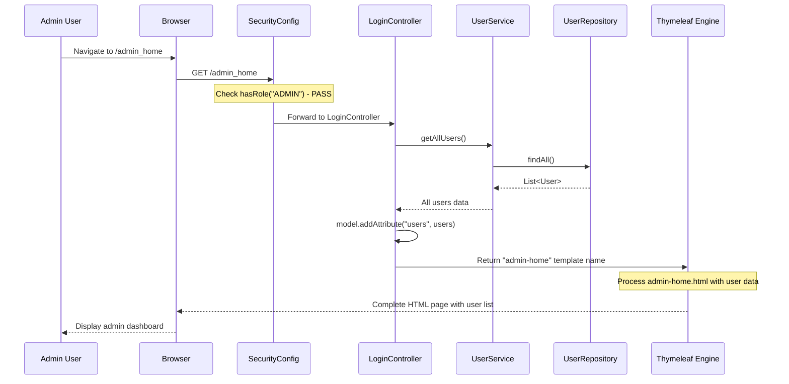
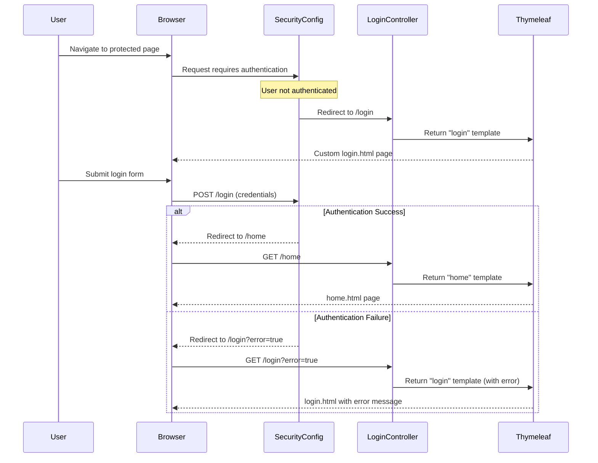

<div dir="rtl">

# Stage 5 - מעבר ל-MVC עם תבניות HTML וdashboard מנהל

## המהפכה ב-Stage 5

Stage 5 מסמן מעבר דרמטי מ-**API בלבד** ל-**אפליקציית web מלאה** עם ממשק משתמש. השינויים המרכזיים:

- **תבניות HTML** עם Thymeleaf במקום JSON responses
- **דף login מותאם** במקום דף Spring Security הסטנדרטי
- **Dashboard מנהל** עם רשימת משתמשים
- **תמיכה במשאבים סטטיים** (CSS, JS, תמונות)
- **הפרדה בין API ל-Views** - Controllers נפרדים

## ארכיטקטורת המערכת החדשה

```mermaid
graph TB
    A[Browser] --> B[Spring Security Filter Chain]
    B --> C[Enhanced Security Config]
    C --> D[Controllers Layer]

    D --> D1[LoginController - MVC Views]
    D --> D2[UserController - REST API]
    D --> D3[RoleController - REST API]

    D1 --> E1[Thymeleaf Templates]
    D2 --> E2[JSON Responses]
    D3 --> E2

    E1 --> F1[login.html]
    E1 --> F2[home.html]
    E1 --> F3[admin-home.html]

    G[Static Resources] --> H[CSS Files]
    G --> I[JavaScript Files]
    G --> J[Image Files]

    D1 --> K[UserService.getAllUsers]
    K --> L[User Dashboard Data]

    style D1 fill:#012345
    style E1 fill:#012345
    style G fill:#012345
    style K fill:#012345
```

</div>



<div dir="rtl">

## השינויים המרכזיים ב-SecurityConfig

### 1. תמיכה במשאבים סטטיים

</div>

```java
.authorizeHttpRequests(auth -> auth
    // NEW: Allow static resources for authenticated users
    .requestMatchers("/css/**", "/js/**", "/images/**").authenticated()
    
    .requestMatchers("/role", "/register", "/admin_home").hasRole("ADMIN")
    .requestMatchers("/home").hasAnyRole("USER", "ADMIN")
    .anyRequest().authenticated())
```

<div dir="rtl">

### 2. דף Login מותאם

</div>

```java
.formLogin(form -> form
    // NEW: Custom login page instead of Spring default
    .loginPage("/login")  
    
    .loginProcessingUrl("/login")      // Where form submits
    .defaultSuccessUrl("/home", true)  // After successful login
    .failureUrl("/login?error=true")   // After failed login
    .permitAll())
```

<div dir="rtl">

### 3. הסרת UserDetailsService מפורש

</div>

```java
// REMOVED: Spring finds it automatically
// .userDetailsService(userDetailsService);
```

<div dir="rtl">

## LoginController החדש - המוח של ה-MVC

הוספת Controller חדש שאחראי על תבניות HTML:

</div>

```java
@Controller  // NOT @RestController - returns view names, not JSON
@RequiredArgsConstructor
public class LoginController {

    private final UserService userService;

    @GetMapping("/login")
    public String login() {
        return "login";  // Returns login.html template
    }

    @GetMapping("/home") 
    public String home() {
        return "home";   // Returns home.html template
    }

    @GetMapping("/admin_home")
    public String showAdminHome(@Valid Model model) {
        List<User> users = userService.getAllUsers();  // NEW method
        model.addAttribute("users", users);            // Pass data to template
        return "admin-home";  // Returns admin-home.html template
    }
}
```

<div dir="rtl">

### ההבדל המרכזי: Controller vs RestController

</div>

```mermaid
graph LR
    A[@RestController] --> B[Return Objects]
    B --> C[Jackson Converts to JSON]
    C --> D[HTTP Response with JSON]
    
    E[@Controller] --> F[Return String]
    F --> G[Thymeleaf Processes Template]
    G --> H[HTTP Response with HTML]
    
    style A fill:#ffcccc
    style E fill:#ccffcc
```

<div dir="rtl">

## הפרדת האחריות - Controllers מותאמים

### LoginController - Views בלבד:

</div>

```java
// Handles HTML pages
@GetMapping("/login")     // -> login.html
@GetMapping("/home")      // -> home.html  
@GetMapping("/admin_home") // -> admin-home.html + user data
```

<div dir="rtl">

### UserController - API בלבד:

</div>

```java
// Handles JSON APIs
@GetMapping("/hello")     // -> JSON response
@GetMapping("/status")    // -> JSON response
@PostMapping("/register") // -> JSON response
```

<div dir="rtl">

## UserService משופר עם getAllUsers

הוספה חשובה לתמיכה בdashboard המנהל:

</div>

```java
@Service
@RequiredArgsConstructor  
public class UserServiceImpl implements UserService {
    
    private final UserRepository userRepository;
    
    /**
     * NEW in Stage5: Get all users for admin dashboard
     */
    public List<User> getAllUsers() {
        return userRepository.findAll();
    }
    
    // ... existing methods
}
```

<div dir="rtl">

## זרימת עבודה מלאה - Dashboard מנהל

</div>



<div dir="rtl">

## זרימת Login מותאמת

</div>



<div dir="rtl">

## מיפוי משאבים ונקודות קצה

```mermaid
graph TD
    A[HTTP Requests] --> B[Static Resources]
    A --> C[HTML Views]
    A --> D[JSON APIs]
    
    B --> B1["/css/** - Authenticated"]
    B --> B2["/js/** - Authenticated"] 
    B --> B3["/images/** - Authenticated"]
    
    C --> C1["/login - LoginController"]
    C --> C2["/home - LoginController"]
    C --> C3["/admin_home - LoginController - ADMIN only"]
    
    D --> D1["/hello - UserController"]
    D --> D2["/status - UserController"]
    D --> D3["/register - UserController - ADMIN only"]
    D --> D4["/role - RoleController - ADMIN only"]
    
    style B fill:#012345
    style C fill:#012345
    style D fill:#012345
```

</div>



<div dir="rtl">

## תבניות HTML וThymeleaf

המערכת עכשיו משתמשת בתבניות HTML שנמצאות ב-`src/main/resources/templates/`:

### 1. login.html
דף התחברות מותאם עם form HTML

### 2. home.html
דף בית כללי לכל המשתמשים

### 3. admin-home.html
Dashboard מנהל עם רשימת משתמשים:

</div>

```html
<!-- Example of how admin-home.html might look -->
<!DOCTYPE html>
<html xmlns:th="http://www.thymeleaf.org">
<head>
    <title>Admin Dashboard</title>
    <link rel="stylesheet" th:href="@{/css/admin.css}">
</head>
<body>
    <h1>Admin Dashboard</h1>
    
    <h2>All Users:</h2>
    <table>
        <tr>
            <th>Username</th>
            <th>Roles</th>
        </tr>
        <tr th:each="user : ${users}">
            <td th:text="${user.username}"></td>
            <td th:text="${user.roles}"></td>
        </tr>
    </table>
    
    <script th:src="@{/js/admin.js}"></script>
</body>
</html>
```

<div dir="rtl">

## תרחישי שימוש מעודכנים

### תרחיש 1: מנהל ניגש ל-Dashboard

```mermaid
graph TD
    A[Admin navigates to /admin_home] --> B{Authenticated?}
    B -->|No| C[Redirect to /login]
    B -->|Yes| D{Has ADMIN role?}
    
    D -->|No| E[403 Forbidden]
    D -->|Yes| F[LoginController.showAdminHome]
    
    F --> G[userService.getAllUsers]
    G --> H[Get all users from DB]
    H --> I[Add users to model]
    I --> J[Return admin-home template]
    J --> K[Thymeleaf renders HTML]
    K --> L[Browser displays dashboard with user list]
    
    style F fill:#012345
    style L fill:#012345
```

</div>



<div dir="rtl">

### תרחיש 2: משתמש ניגש למשאבים סטטיים

```mermaid
graph TD
    A[Request /css/style.css] --> B{Authenticated?}
    B -->|No| C[Redirect to /login]
    B -->|Yes| D[Serve static file]
    
    style D fill:#012345
```

</div>



<div dir="rtl">

## השוואה בין הגרסאות

| היבט | Stage 3-4 | Stage 5 |
|------|-----------|---------|
| **ממשק** | JSON בלבד | HTML + JSON |
| **Controllers** | @RestController | @Controller + @RestController |
| **Login Page** | Spring default | Custom HTML |
| **Admin Dashboard** | JSON response | HTML page עם נתונים |
| **Static Files** | לא נתמך | CSS/JS/Images |
| **Response Type** | JSON | HTML Templates |

## יתרונות המעבר ל-MVC

### 1. חוויית משתמש משופרת
- דפי HTML ידידותיים במקום JSON גולמי
- עיצוב מותאם עם CSS
- אינטראקטיביות עם JavaScript

### 2. הפרדת אחריות ברורה
- Views (HTML) נפרד מ-APIs (JSON)
- Controllers מותאמים לכל סוג

### 3. גמישות פיתוח
- Front-end developers יכולים לעבוד על HTML/CSS/JS
- Back-end developers על API endpoints

### 4. Dashboard מנהל פונקציונלי
- רשימת משתמשים בממשק ויזואלי
- בסיס להוספת פיצ'רים נוספים

## מבנה הפרויקט החדש

</div>

```
src/main/resources/
├── templates/
│   ├── login.html          # Custom login page
│   ├── home.html           # General home page  
│   └── admin-home.html     # Admin dashboard
├── static/
│   ├── css/               # Stylesheets
│   ├── js/                # JavaScript files
│   └── images/            # Images
└── application.properties
```

<div dir="rtl">

## סיכום השיפורים ב-Stage 5

המערכת עברה מ-**API מובנית** ל-**אפליקציית web מלאה**:

- **UI מלא** עם תבניות HTML וCSS
- **Dashboard מנהל** עם רשימת משתמשים
- **דף login מותאם** במקום ברירת המחדל
- **תמיכה במשאבים סטטיים**
- **הפרדה בין MVC ל-API**

זה מהווה בסיס מוצק לפיתוח אפליקציית web מקצועית עם ממשק משתמש מלא ופונקציונלי.

</div>