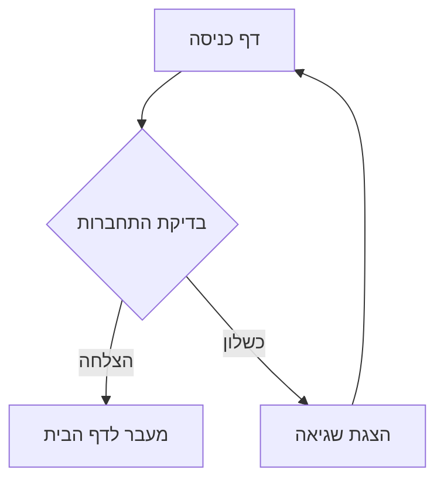
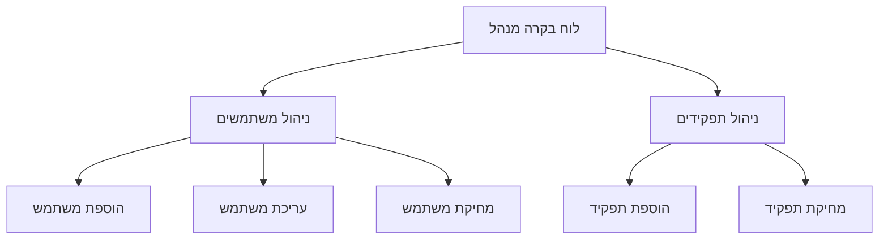
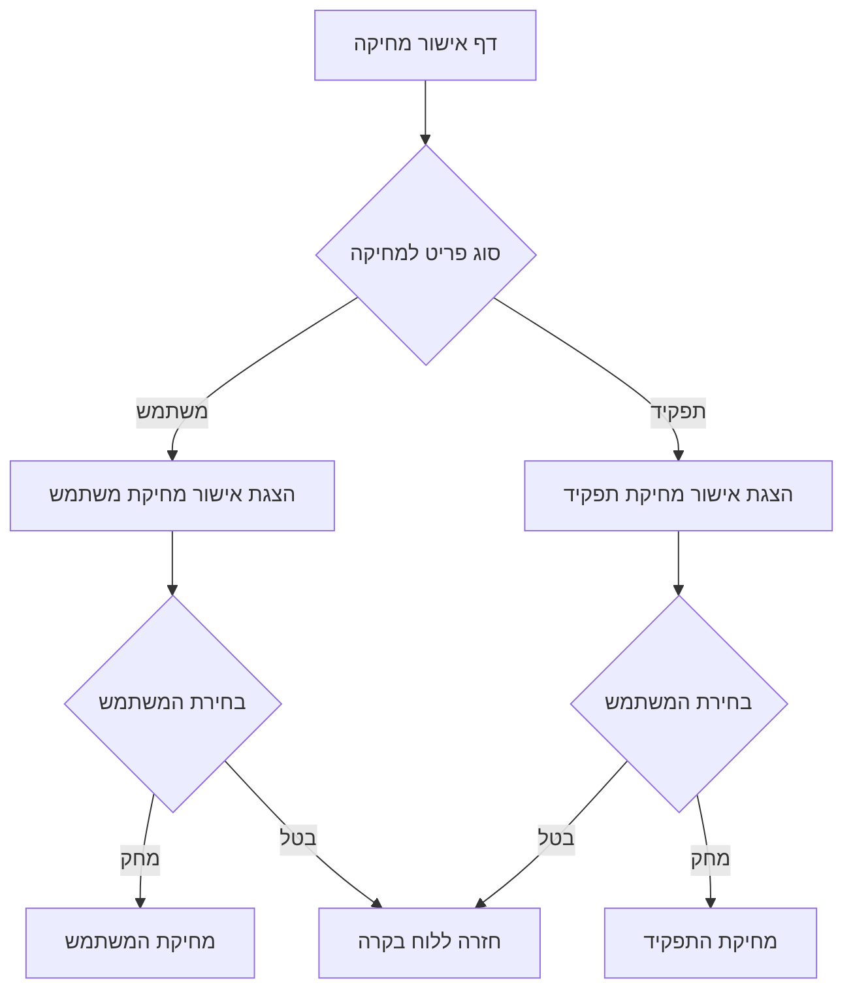
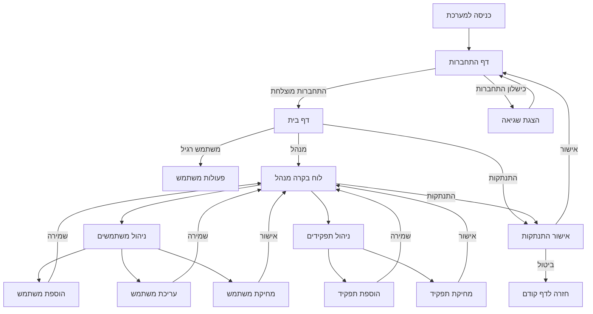

<div dir="rtl">

# תיעוד מפורט - פרויקט ניהול משתמשים ותפקידים


מסמך זה מתעד את מבנה ומרכיבי פרויקט ניהול המשתמשים והתפקידים, כולל קבצי ה-HTML, CSS ו-JavaScript המהווים את ממשק המשתמש של המערכת.


## תוכן עניינים


1. [מבנה הפרויקט](#מבנה-הפרויקט)
2. [דפי HTML](#דפי-html)
3. [קבצי CSS](#קבצי-css)
4. [קבצי JavaScript](#קבצי-javascript)
5. [תזרים המשתמש](#תזרים-המשתמש)
6. [פיתוח רספונסיבי](#פיתוח-רספונסיבי)
7. [תמיכה דו-לשונית](#תמיכה-דו-לשונית)


## מבנה הפרויקט


הפרויקט מאורגן בתיקיות הבאות:
</div>

```
project/
├── src/main/
│   ├── java/           # Java source code
│   │   └── org/example/stage6/
│   │       ├── controller/     # Controllers for handling HTTP requests
│   │       ├── dto/            # Data Transfer Objects
│   │       ├── entity/         # Database entities
│   │       ├── exception/      # Exception classes and handlers
│   │       ├── repository/     # Database access interfaces
│   │       ├── response/       # Response classes
│   │       └── service/        # Business logic services
│   └── resources/
│       ├── static/         # Static resources
│       │   ├── css/        # CSS files
│       │   └── js/         # JavaScript files
│       └── templates/      # Thymeleaf HTML templates
└── pom.xml                 # Maven configuration file
```
<div dir="rtl">

## דפי HTML


הפרויקט כולל את דפי ה-HTML הבאים, כולם מיושמים כתבניות Thymeleaf:


### login.html


דף הכניסה למערכת המאפשר התחברות משתמשים.
</div>




<div dir="rtl">


**מרכיבים עיקריים:**

- טופס כניסה עם שדות שם משתמש וסיסמה
- כפתור התחברות
- הודעת שגיאה במקרה של כניסה כושלת
- הגנת CSRF מובנית
</div>

### home.html

<div dir="rtl">

דף הבית המוצג לאחר התחברות מוצלחת.
</div>

```html
<!-- Basic structure of home.html -->
<div class="home-container">
    <!-- User information section -->
    <header>
        <h2 sec:authentication="name">Welcome, User!</h2>
        <h3>Your roles are: ...</h3>
    </header>

    <!-- Navigation section -->
    <section class="navigation">
        <!-- Admin button - only shown to users with ADMIN role -->
        <div class="button-container" sec:authorize="hasRole('ADMIN')">...</div>
        <!-- Logout button -->
        <button id="logoutBtn" class="logout-button">Logout</button>
    </section>

    <!-- Logout confirmation modal dialog -->
    <div id="logoutModal" class="modal">...</div>
</div>
```

### admin-home.html

<div dir="rtl">

לוח בקרה למנהל המאפשר ניהול משתמשים ותפקידים.
</div>



<div dir="rtl">

**מרכיבים עיקריים:**
- טבלת משתמשים עם כפתורי עריכה ומחיקה
- טבלת תפקידים עם כפתורי מחיקה
- טופס להוספת תפקיד חדש
- כפתורי ניווט לדפים אחרים
- דיאלוג אישור התנתקות
</div>

### add-user.html

<div dir="rtl">

דף להוספת משתמש חדש למערכת.
</div>

```html
<!-- Basic structure of add-user.html -->
<div class="container">
    <!-- Page heading -->
    <h1>הוספת משתמש חדש</h1>

    <!-- Error display section -->
    <div th:if="${error}" class="error-message" th:text="${error}">...</div>

    <!-- User form -->
    <form th:action="@{/admin/add-user}" method="post" th:object="${userDto}">
        <!-- Username field -->
        <div class="form-group">...</div>

        <!-- Password field -->
        <div class="form-group">...</div>

        <!-- Role selection -->
        <div class="form-group">
            <div class="checkbox-group">...</div>
        </div>

        <!-- Action buttons -->
        <div class="button-group">...</div>
    </form>
</div>
```
<div dir="rtl">

### add-role.html

דף להוספת תפקיד חדש למערכת.

**מרכיבים עיקריים:**
- שדה להזנת שם תפקיד
- רמז על המרת התפקיד לאותיות גדולות
- כפתורי שמירה וביטול


### edit-user.html

דף לעריכת משתמש קיים במערכת.

**מרכיבים עיקריים:**
- הצגת שם המשתמש (לא ניתן לשינוי)
- שדה לסיסמה חדשה (אופציונלי)
- בחירת תפקידים עם סימון התפקידים הקיימים
- כפתורי עדכון וביטול

### delete-confirmation.html

דף אישור מחיקה של משתמש או תפקיד.
</div>



<div dir="rtl">

**מרכיבים עיקריים:**
- הודעת אישור מחיקה דינמית (משתמש או תפקיד)
- כפתורי אישור וביטול
- טופס מחיקה מותאם לסוג הפריט

### logout.html

דף אישור התנתקות מהמערכת.


**מרכיבים עיקריים:**
- הודעת אישור התנתקות
- כפתור אישור התנתקות
- קישור לביטול וחזרה לדף הבית

## קבצי CSS

מערכת הסגנונות בנויה ממספר קבצי CSS המחולקים לפי תפקיד:

### modal.css

מגדיר את הסגנונות לחלונות דיאלוג קופצים (מודלים) ברחבי האפליקציה.
</div>

```css
/**
 * Basic structure of modal.css
 */

/* Modal overlay - covers the entire screen */
.modal {
    display: none;
    position: fixed;
    z-index: 1000;
    left: 0;
    top: 0;
    width: 100%;
    height: 100%;
    background-color: rgba(0, 0, 0, 0.4);
    transition: all 0.3s ease;
}

/* Modal content container */
.modal-content {
    background-color: #f8f8f8;
    margin: 15% auto;
    padding: 20px;
    border: 1px solid #888;
    width: 300px;
    border-radius: 5px;
    text-align: center;
    box-shadow: 0 4px 8px rgba(0, 0, 0, 0.2);
}

/* Buttons container */
.modal-buttons {
    margin-top: 20px;
    display: flex;
    justify-content: center;
}

/* Button styles */
.confirm-button {
    background-color: #e74c3c;
    color: white;
    /* ... */
}

.cancel-button {
    background-color: #95a5a6;
    color: white;
    /* ... */
}
```
<div dir="rtl">

### forms.css

מספק סגנונות אחידים לכל הטפסים במערכת.

**קלאסים עיקריים:**
- `.container` - המכיל הראשי של הטופס
- `.form-group` - יחידת שדה וכותרת
- `.error-message` - עיצוב הודעות שגיאה
- `.button-group` - עיצוב קבוצת כפתורים
- `.submit-button` / `.cancel-button` - עיצוב כפתורי פעולה

### admin-home.css

סגנונות ייעודיים ללוח הבקרה של מנהל.

**קלאסים עיקריים:**
- סגנונות לטבלאות ושורות
- `.role-badge` - תגיות לתפקידים
- `.edit-button` / `.delete-button` - כפתורי פעולה
- `.inline-form` - עיצוב טופס מקונן

### home.css

סגנונות לדף הבית.

**קלאסים עיקריים:**
- `.home-container` - מיכל ראשי לדף הבית
- `.admin-button` - כפתור למעבר ללוח בקרה
- `.logout-button` - כפתור התנתקות

### stylesheet.css

סגנונות לדף ההתחברות (login).

**קלאסים עיקריים:**
- `.login-container` - מיכל טופס התחברות
- `.input-group` - קבוצת שדות קלט
- `.login-button` - כפתור התחברות
- `.error` - הודעת שגיאת התחברות

### logout.css

סגנונות לדף אישור ההתנתקות.

**קלאסים עיקריים:**
- `.logout-container` - מיכל דף ההתנתקות
- סגנונות לכפתור התנתקות
- `.cancel-link` - קישור ביטול

## קבצי JavaScript


הפרויקט כולל קובץ JavaScript אחד:

### modal.js

מטפל בפונקציונליות של חלונות דיאלוג קופצים (מודלים).
</div>

```javascript
/**
 * Main responsibilities of modal.js:
 * 
 * 1. Register event listeners on page load
 * 2. Handle opening modals
 * 3. Handle closing modals
 * 4. Support closing by clicking outside the modal
 * 5. Support closing with the Escape key
 */

// Event listeners registered on document load
document.addEventListener('DOMContentLoaded', function() {
    const logoutBtn = document.getElementById('logoutBtn');
    if (logoutBtn) {
        logoutBtn.addEventListener('click', openLogoutModal);
    }

    const cancelBtn = document.getElementById('cancelBtn');
    if (cancelBtn) {
        cancelBtn.addEventListener('click', closeLogoutModal);
    }

    // Additional event listener code...
});

/**
 * Opens the logout confirmation modal
 */
function openLogoutModal() {
    const modal = document.getElementById("logoutModal");
    if (modal) {
        modal.style.display = "block";
        setTimeout(() => {
            modal.style.opacity = "1";
        }, 10);
    }
}

/**
 * Closes the logout confirmation modal
 */
function closeLogoutModal() {
    const modal = document.getElementById("logoutModal");
    if (modal) {
        modal.style.opacity = "0";
        setTimeout(() => {
            modal.style.display = "none";
        }, 300);
    }
}
```
<div dir="rtl">

## תזרים המשתמש


תרשים זרימה כללי של המערכת:
</div>


<div dir="rtl">

## פיתוח רספונסיבי


המערכת כוללת תמיכה בסיסית להתאמה למסכים שונים:


1. **שימוש ב-viewport meta tag** - מגדיר את רוחב התצוגה והמידה הראשונית:

</div>

```html
<!-- Sets the viewport width to device width with initial scale -->
<meta name="viewport" content="width=device-width, initial-scale=1.0">
```

<div dir="rtl">

2. **שימוש במידות יחסיות** - שימוש ב-% ו-max-width לרוחב אלמנטים.

3. **סגנון מותאם למסכים קטנים** - אפשרות להוסיף media queries להתאמה טובה יותר למסכים קטנים:
</div>

```css
/* Media query for screens smaller than 768px */
@media (max-width: 768px) {
    .container {
        padding: 10px;
    }
    
    /* Additional styles for small screens */
}
```

<div dir="rtl">

## תמיכה דו-לשונית


המערכת תומכת בשתי שפות עם כיווניות שונה:


1. **עברית (RTL)** - משמשת בממשק המנהל וחלק מהטפסים:

</div>

```html
<!-- Hebrew (RTL) document with Thymeleaf support -->
<html xmlns:th="http://www.thymeleaf.org" lang="he" dir="rtl">
```

<div dir="rtl">

2. **אנגלית (LTR)** - משמשת בדף ההתחברות ובדף הבית:
</div>

```html
<!-- English (LTR) document with Thymeleaf support -->
<html xmlns:th="http://www.thymeleaf.org" lang="en">
```

<div dir="rtl">

התאמות CSS מיוחדות לתמיכה ב-RTL:
</div>

```css
/* Right-align text in Hebrew pages */
th, td {
    text-align: right;
}

/* Adjust margin direction for Hebrew pages */
.role-badge {
    margin-left: 5px;
}

.home-button {
    float: left;
    margin-left: 10px;
}
```

<div dir="rtl">

שימוש בתבניות Thymeleaf מאפשר גמישות בהצגת תוכן בשפות שונות, ומאפשר הרחבה עתידית לתמיכה במספר רב יותר של שפות באמצעות קבצי משאבים.
</div>