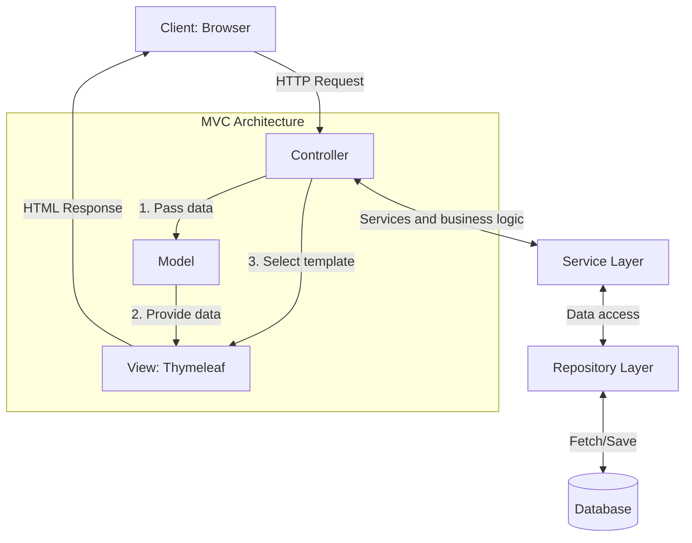
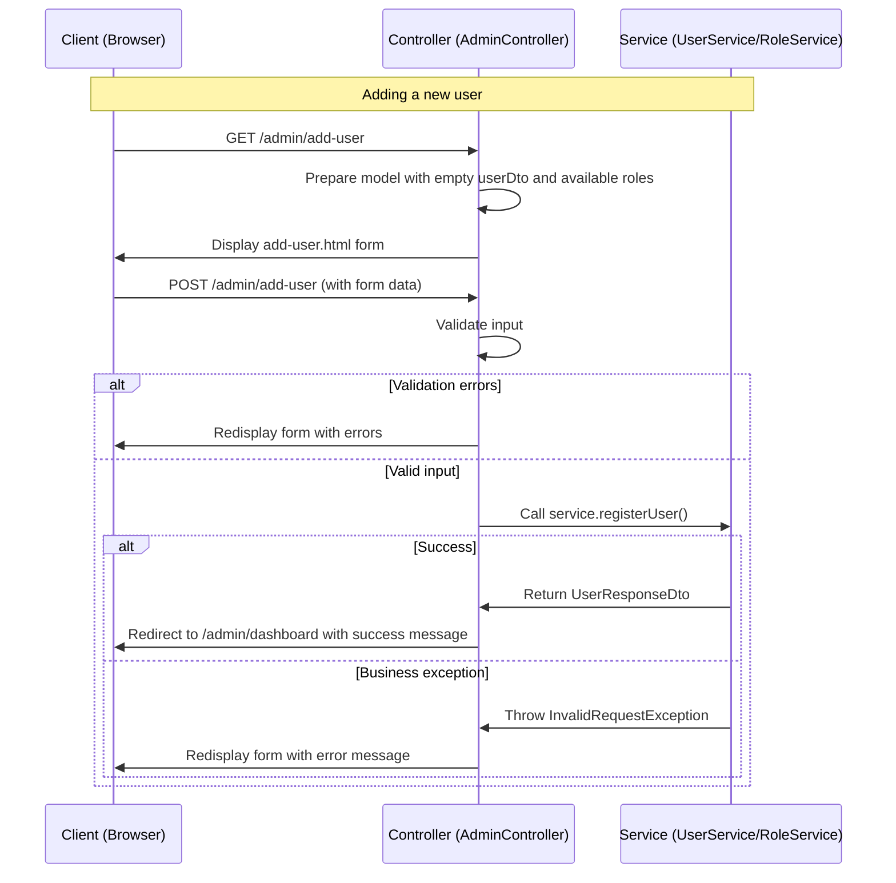
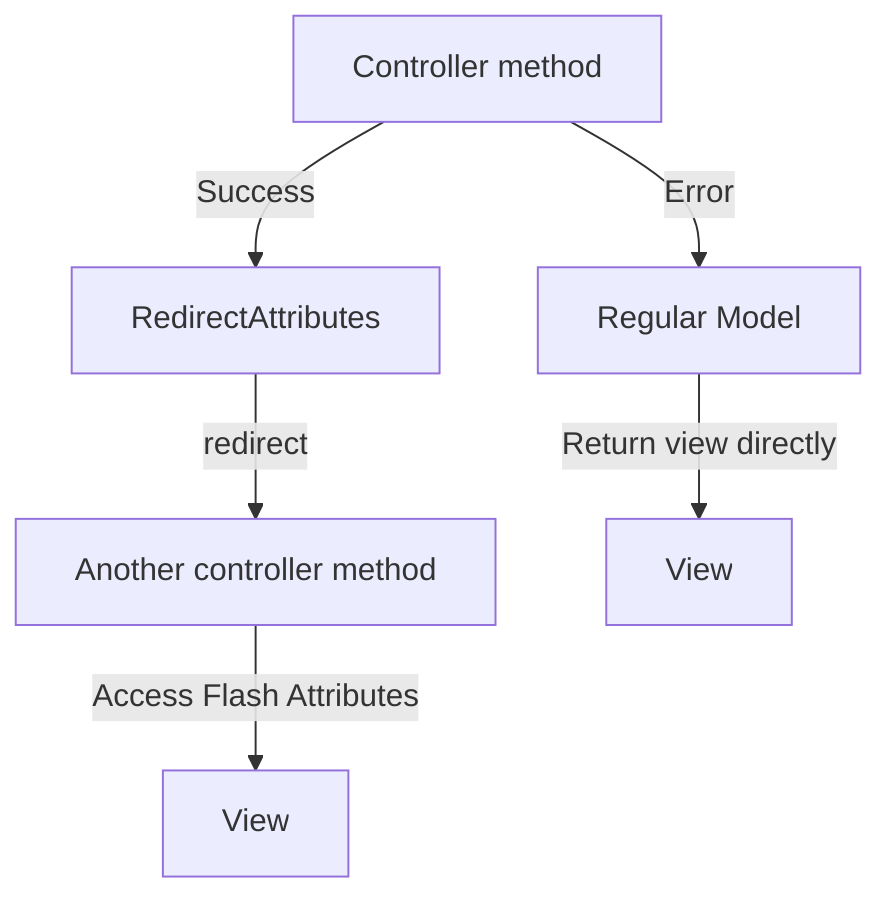
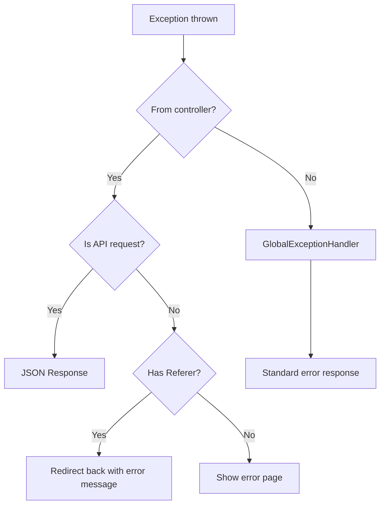
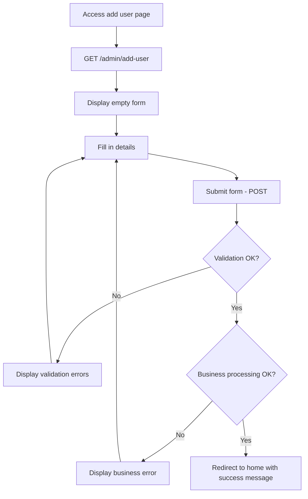
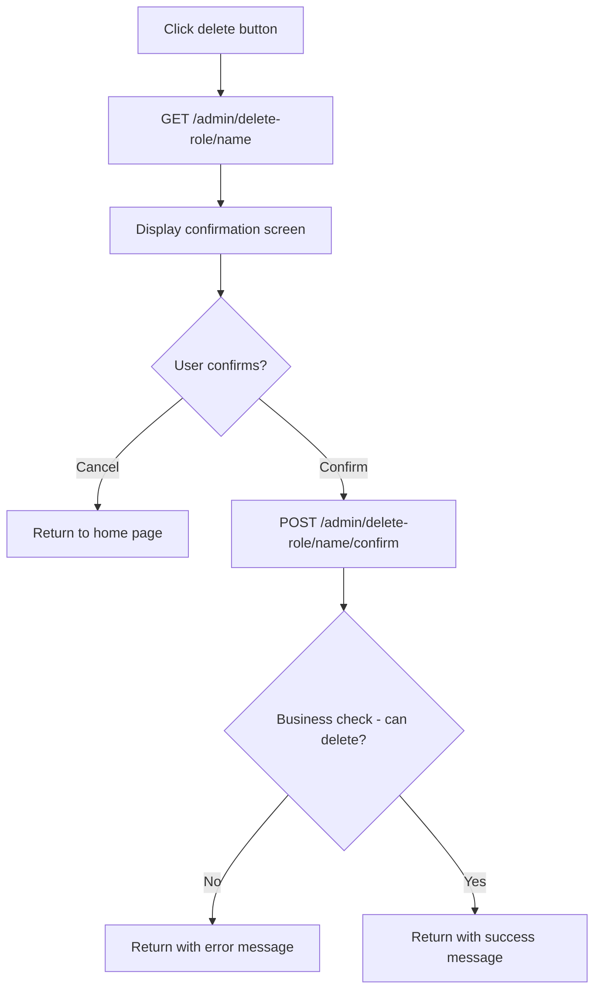

# <div dir="rtl">ארכיטקטורת MVC ומנגנון טיפול בשגיאות בפרויקט ניהול משתמשים</div>

<div dir="rtl">

## תוכן עניינים

1. [הקדמה](#הקדמה)
2. [ארכיטקטורת MVC בפרויקט](#ארכיטקטורת-mvc-בפרויקט)
3. [זוגות פעולות במחזור חיי הבקשה](#זוגות-פעולות-במחזור-חיי-הבקשה)
4. [תפקיד ה-Model בארכיטקטורה](#תפקיד-ה-model-בארכיטקטורה)
5. [מנגנון טיפול בשגיאות והפניות](#מנגנון-טיפול-בשגיאות-והפניות)
6. [שילוב עם תבניות HTML](#שילוב-עם-תבניות-html)
7. [תרשימי זרימה של תהליכים מרכזיים](#תרשימי-זרימה-של-תהליכים-מרכזיים)
8. [דוגמאות קוד מפורטות](#דוגמאות-קוד-מפורטות)
9. [סיכום ושיטות עבודה מומלצות](#סיכום-ושיטות-עבודה-מומלצות)

</div>

<div dir="rtl">

## הקדמה

פרויקט ניהול המשתמשים והתפקידים מיישם ארכיטקטורת MVC (Model-View-Controller) בשילוב עם מנגנוני טיפול בשגיאות ייחודיים. ארכיטקטורה זו מאפשרת הפרדה ברורה בין שכבות הלוגיקה השונות וכן מספקת חווית משתמש עשירה ואינטואיטיבית. מסמך זה מסביר את הרעיון והמימוש של זוגות פעולות, טיפול בשגיאות, שימוש ב-Model ואת האינטגרציה עם תבניות Thymeleaf.

</div>

<div dir="rtl">

## ארכיטקטורת MVC בפרויקט

### הפרדת תחומי אחריות

ארכיטקטורת MVC בפרויקט מבוססת על הפרדה ברורה בין שלושה מרכיבים עיקריים:

</div>



<div dir="rtl">

1. **בקר (Controller)**: מטפל בבקשות HTTP, מנתב אותן ללוגיקה העסקית המתאימה, ואחראי על בחירת התצוגה המתאימה.
2. **מודל (Model)**: מכיל את הנתונים שהבקר מעביר לתצוגה ומספק את המידע הדרוש לבניית המסך.
3. **תצוגה (View)**: תבניות Thymeleaf המשולבות בשרת שיוצרות את ה-HTML שנשלח ללקוח.

בנוסף לשלושת המרכיבים העיקריים של MVC, הפרויקט כולל:

4. **שכבת שירות (Service Layer)**: מכילה את הלוגיקה העסקית של המערכת.
5. **שכבת גישה לנתונים (Repository Layer)**: אחראית על התקשורת עם מסד הנתונים.

### שרשרת טיפול בבקשה

כל בקשת HTTP עוברת את השלבים הבאים:

1. בקשה מגיעה לבקר.
2. הבקר מעביר את הבקשה לשירות המתאים לטיפול.
3. השירות מבצע את הלוגיקה העסקית ומחזיר תוצאה.
4. הבקר בונה את ה-Model עם הנתונים שהתקבלו מהשירות.
5. הבקר בוחר את התצוגה (View) המתאימה.
6. ה-View משתמש בנתונים מה-Model כדי ליצור את ה-HTML שיוחזר ללקוח.

</div>

<div dir="rtl">

## זוגות פעולות במחזור חיי הבקשה

אחד המאפיינים המרכזיים של הפרויקט הוא שימוש בזוגות פעולות (Paired Actions) עבור כל פעולה משמעותית במערכת. זוגות אלו מורכבים בדרך כלל מ:

1. **פעולת GET** - להצגת טופס או מסך אישור
2. **פעולת POST** - לעיבוד הנתונים שהתקבלו מהטופס

### דוגמאות לזוגות פעולות

</div>



<div dir="rtl">

הטבלה הבאה מציגה את זוגות הפעולות העיקריים במערכת:

| פעולה | פעולת GET | פעולת POST |
|-------|-----------|------------|
| הוספת משתמש | `showAddUserForm()` - מציג טופס ריק | `addUser()` - מעבד את הטופס |
| עריכת משתמש | `showEditUserForm()` - מציג טופס עם נתונים קיימים | `editUser()` - מעבד את השינויים |
| מחיקת משתמש | `showDeleteUserConfirmation()` - מציג מסך אישור | `deleteUser()` - מבצע את המחיקה |
| הוספת תפקיד | `showAddRoleForm()` - מציג טופס ריק | `addRole()` - מעבד את הטופס |
| מחיקת תפקיד | `showDeleteRoleConfirmation()` - מציג מסך אישור | `deleteRole()` - מבצע את המחיקה |

### היתרונות בשימוש בזוגות פעולות

1. **הפרדת אחריות ברורה** - פעולה אחת להצגת הממשק, פעולה שנייה לעיבוד הנתונים.
2. **שיפור חווית המשתמש** - אפשרות לצפות בנתונים לפני אישור פעולות קריטיות.
3. **אבטחה משופרת** - אישור מפורש לפעולות רגישות כמו מחיקה.
4. **טיפול בשגיאות פשוט יותר** - מבנה אחיד לטיפול בשגיאות וליידוע המשתמש.

</div>

<div dir="rtl">

## תפקיד ה-Model בארכיטקטורה

ה-Model ב-Spring MVC הוא מיכל העברת נתונים בין הבקר לתצוגה. בפרויקט זה, ה-Model משמש למגוון מטרות:

### 1. העברת אובייקטים לטפסים

</div>

```java
// Example of preparing model for user addition form
@GetMapping("/add-user")
public String showAddUserForm(Model model) {
    model.addAttribute("userDto", new UserDto());  // Empty object for the form
    model.addAttribute("availableRoles", roleService.getAllRoles());  // List of roles to choose from
    return "add-user";
}
```

<div dir="rtl">

### 2. העברת נתונים מהבקר לתצוגה

</div>

```java
// Example of passing data to the dashboard
@GetMapping("/dashboard")
public String dashboard(Model model) {
    List<User> users = userService.getAllUsers();  // Fetch all users
    List<Role> roles = roleService.getAllRoles();  // Fetch all roles
    
    // Add data to the model
    model.addAttribute("users", users);
    model.addAttribute("roles", roles);
    
    return "admin-home";
}
```

<div dir="rtl">

### 3. שימוש ב-Model לטיפול בשגיאות

ה-Model משמש גם להעברת הודעות שגיאה וסטטוס בין הבקר לתצוגה:

</div>

```java
// Example of error handling using the model
try {
    userService.registerUser(userDto);
    redirectAttributes.addFlashAttribute("success", "User created successfully");
    return "redirect:/admin/dashboard";
} catch (InvalidRequestException e) {
    model.addAttribute("error", e.getMessage());  // Add error message to model
    model.addAttribute("availableRoles", roleService.getAllRoles());
    return "add-user";  // Return to form with error message
}
```

<div dir="rtl">

### 4. ההבדל בין Model רגיל ל-RedirectAttributes

הפרויקט עושה שימוש בשני סוגים של העברת נתונים:

1. **Model רגיל** - משמש כאשר מחזירים ישירות תבנית HTML (ללא redirect).
2. **RedirectAttributes** - משמש כאשר מבצעים הפניה (redirect) לכתובת אחרת. המידע נשמר ב-Flash attribute ומועבר לבקשה הבאה.



</div>

<div dir="rtl">

## מנגנון טיפול בשגיאות והפניות

הפרויקט משלב שני סוגים עיקריים של טיפול בשגיאות:

### 1. טיפול בשגיאות וולידציה

שגיאות וולידציה מטופלות באמצעות המנגנון הבנוי של Spring Validation:

</div>

```java
@PostMapping("/add-user")
public String addUser(@Valid @ModelAttribute UserDto userDto,  // @Valid triggers validation
                      BindingResult bindingResult,  // Validation results
                      RedirectAttributes redirectAttributes,
                      Model model) {

    if (bindingResult.hasErrors()) {  // Check for validation errors
        model.addAttribute("availableRoles", roleService.getAllRoles());
        return "add-user";  // Return to form with validation errors
    }
    
    // Continue request processing...
}
```

<div dir="rtl">

### 2. טיפול בשגיאות עסקיות (Business Exceptions)

שגיאות עסקיות (כמו ניסיון להוסיף משתמש שכבר קיים) מטופלות באמצעות מנגנון חריגות:

1. **בתוך הבקר** - שימוש ב-try/catch:

</div>

```java
try {
    userService.registerUser(userDto);
    redirectAttributes.addFlashAttribute("success", "User created successfully");
    return "redirect:/admin/dashboard";
} catch (InvalidRequestException e) {
    model.addAttribute("error", e.getMessage());
    model.addAttribute("availableRoles", roleService.getAllRoles());
    return "add-user";
}
```

<div dir="rtl">

2. **שימוש במטפלי חריגות גלובליים** - `AdminExceptionHandler` ו-`GlobalExceptionHandler`:

</div>



<div dir="rtl">

### 3. הבדלים בטיפול בהפניות (Redirects)

הפרויקט מנצל שני סוגי הפניות:

1. **הפניה ישירה לתבנית** - כאשר יש שגיאה, הבקר מחזיר ישירות את שם התבנית להצגה:

</div>

```java
// Direct template return after error
model.addAttribute("error", e.getMessage());
return "add-user";  // Direct display of add-user.html template
```

<div dir="rtl">

2. **הפניה באמצעות redirect** - כאשר הפעולה מצליחה, הבקר מבצע הפניה לכתובת אחרת:

</div>

```java
// Redirect after success
redirectAttributes.addFlashAttribute("success", "User created successfully");
return "redirect:/admin/dashboard";  // Redirect to another URL
```

<div dir="rtl">

### 4. היתרונות בגישת טיפול השגיאות המשולבת

1. **מניעת שכפול קוד** - מנגנון מרכזי לטיפול בשגיאות (Exception Handler).
2. **התאמה לסוג הבקשה** - טיפול שונה בבקשות API ובקשות דפדפן.
3. **שימור נתוני המשתמש** - שגיאות מוצגות מבלי לאבד את הנתונים שהוזנו.
4. **חווית משתמש עקבית** - מבנה אחיד להצגת שגיאות והודעות הצלחה.

</div>

<div dir="rtl">

## שילוב עם תבניות HTML

### 1. הצגת נתונים באמצעות Thymeleaf

Thymeleaf משתמש בנתונים שהועברו ב-Model להצגה בדפי HTML:

</div>

```html
<!-- Display user list in admin-home.html template -->
<tr th:each="user : ${users}">
    <td th:text="${user.getUsername()}">Username</td>
    <td>
        <span th:each="role : ${user.getRoles()}"
              th:text="${role.getName()}"
              class="role-badge">Role</span>
    </td>
    <td>
        <a th:href="@{'/admin/edit-user/' + ${user.getUsername()}}" class="edit-button">Edit</a>
        <a th:href="@{'/admin/delete-user/' + ${user.getUsername()}}" class="delete-button">Delete</a>
    </td>
</tr>
```

<div dir="rtl">

### 2. טפסים וקישור דו-כיווני

Thymeleaf מאפשר קישור דו-כיווני בין אובייקטים ב-Model לבין שדות טופס:

</div>

```html
<!-- User edit form in edit-user.html template -->
<form th:action="@{'/admin/edit-user/' + ${userDto.username}}" method="post" th:object="${userDto}">
    <input type="hidden" name="username" th:field="*{username}">

    <div class="form-group">
        <label>Username:</label>
        <div th:text="*{username}">Username</div>
    </div>

    <div class="form-group">
        <label for="password">New Password:</label>
        <input type="password" id="password" name="password" th:field="*{password}">
    </div>

    <div class="form-group">
        <label>Roles:</label>
        <div class="checkbox-group">
            <div th:each="role : ${availableRoles}" class="checkbox-item">
                <input type="checkbox" th:id="${'role-' + role.getName()}" 
                       name="roles" th:value="${role.getName()}"
                       th:checked="${#lists.contains(userRoles, role.getName())}">
                <label th:for="${'role-' + role.getName()}" 
                       th:text="${role.getName()}">Role</label>
            </div>
        </div>
    </div>

    <div class="button-group">
        <a th:href="@{/admin/dashboard}" class="cancel-button">Cancel</a>
        <button type="submit" class="submit-button">Update User</button>
    </div>
</form>
```

<div dir="rtl">

### 3. הצגת הודעות שגיאה והצלחה

הצגת הודעות שגיאה והצלחה מתבצעת באמצעות בדיקה של משתנים ב-Model:

</div>

```html
<!-- Display error/success messages -->
<div th:if="${error}" class="error-message" th:text="${error}">
    Error message
</div>

<div th:if="${success}" class="success-message" th:text="${success}">
    Success message
</div>
```

<div dir="rtl">

### 4. הצגת שגיאות וולידציה

שגיאות וולידציה (שנגרמות מאנוטציות כמו `@NotBlank` ו-`@Size`) מוצגות באמצעות `th:errors`:

</div>

```html
<div class="form-group">
    <label for="password">Password:</label>
    <input type="password" id="password" name="password" th:field="*{password}">
    <!-- Display validation error -->
    <div th:if="${#fields.hasErrors('password')}" class="error-message" 
         th:errors="*{password}">Password error</div>
</div>
```

<div dir="rtl">

## תרשימי זרימה של תהליכים מרכזיים

### תהליך הוספת משתמש

</div>



<div dir="rtl">

### תהליך מחיקת תפקיד

</div>



<div dir="rtl">

## דוגמאות קוד מפורטות

### 1. הוספת משתמש - זוג פעולות GET/POST

</div>

```java
// GET action - display form
@GetMapping("/add-user")
public String showAddUserForm(Model model) {
    model.addAttribute("userDto", new UserDto());  // Empty object for form
    model.addAttribute("availableRoles", roleService.getAllRoles());  // Role list
    return "add-user";  // HTML template name
}

// POST action - process form
@PostMapping("/add-user")
public String addUser(@Valid @ModelAttribute UserDto userDto,  // Data binding + validation
                      BindingResult bindingResult,  // Validation results
                      RedirectAttributes redirectAttributes,  // For passing data during redirect
                      Model model) {  // For passing data to view

    // Check validation errors
    if (bindingResult.hasErrors()) {
        model.addAttribute("availableRoles", roleService.getAllRoles());
        return "add-user";  // Return to form with errors
    }

    // Handle business errors
    try {
        userService.registerUser(userDto);  // Call service
        redirectAttributes.addFlashAttribute("success", "User created successfully");  // Success message
        return "redirect:/admin/dashboard";  // Redirect to home page
    } catch (InvalidRequestException e) {  // Catch business error
        model.addAttribute("error", e.getMessage());  // Add error message to model
        model.addAttribute("availableRoles", roleService.getAllRoles());
        return "add-user";  // Return to form with error message
    }
}
```

<div dir="rtl">

### 2. מנגנון טיפול בחריגות ממוקד (AdminExceptionHandler)

`AdminExceptionHandler` הוא מטפל חריגות מותאם שמיועד לטפל בשגיאות שמקורן בבקרים. הייחוד שלו הוא ביכולת להגיב באופן שונה לבקשות API ולבקשות דפדפן:

</div>

```java
@ControllerAdvice(basePackages = "org.example.stage6.controller")  // Limited to controllers package
@Order(Ordered.HIGHEST_PRECEDENCE)  // High priority in exception handling
public class AdminExceptionHandler {

    @ExceptionHandler(InvalidRequestException.class)
    public Object handleAdminInvalidRequest(InvalidRequestException ex, 
                                           WebRequest request, 
                                           RedirectAttributes redirectAttributes,
                                           Model model) {
        
        // Determine if it's an API request or browser request
        if (isApiRequest(request)) {
            // Handle API request - return JSON
            Map<String, String> details = new HashMap<>();
            details.put("type", "Admin Operation Error");
            details.put("message", ex.getMessage());
            
            StandardResponse response = new StandardResponse("error", null, details);
            return new ResponseEntity<>(response, HttpStatus.BAD_REQUEST);
        } else {
            // Handle browser request
            if (request.getHeader("Referer") != null) {
                // If there's a Referer, redirect back with error message
                redirectAttributes.addFlashAttribute("error", ex.getMessage());
                return "redirect:" + request.getHeader("Referer");
            } else {
                // Otherwise, show error page
                model.addAttribute("error", ex.getMessage());
                return "error";
            }
        }
    }
    
    // Check if it's an API request
    private boolean isApiRequest(WebRequest request) {
        String acceptHeader = request.getHeader("Accept");
        return acceptHeader != null && 
               (acceptHeader.contains("application/json") || 
                acceptHeader.contains("application/xml"));
    }
}
```

<div dir="rtl">

### 3. שילוב וולידציה, טיפול בשגיאות, והפניות בבקרים

הדוגמה הבאה מראה כיצד משולבים כל המרכיבים (וולידציה, טיפול בשגיאות, והפניות) בבקר:

</div>

```java
@PostMapping("/add-role")
public String addRole(@Valid @ModelAttribute RoleDto roleDto,  // Automatic validation
                      BindingResult bindingResult,  // Validation results
                      RedirectAttributes redirectAttributes,  // For data passing in redirect
                      Model model) {  // For data passing to view

    // Check validation errors
    if (bindingResult.hasErrors()) {
        return "add-role";  // Return to form with validation errors
    }

    try {
        // Attempt to create new role
        roleService.addRole(roleDto.getRoleName());

        // Success - add success message and redirect to home page
        redirectAttributes.addFlashAttribute("success", "Role created successfully");
        return "redirect:/admin/dashboard";

    } catch (InvalidRequestException e) {
        // Error - add error message and return to form
        model.addAttribute("error", e.getMessage());
        return "add-role";
    }
}
```

<div dir="rtl">

## סיכום ושיטות עבודה מומלצות

הארכיטקטורה שהוצגה במסמך זה מציגה גישה מקיפה ומובנית לפיתוח יישומי ווב באמצעות Spring MVC. להלן מספר נקודות מפתח וסיכום:

### 1. יתרונות הארכיטקטורה

1. **הפרדת אחריות ברורה** - הפרדה בין הצגת ממשק, עיבוד נתונים ולוגיקה עסקית.
2. **טיפול אחיד בשגיאות** - מנגנון מרכזי ואחיד לטיפול בשגיאות שונות.
3. **חווית משתמש משופרת** - הצגת מידע ושגיאות באופן ידידותי למשתמש.
4. **תחזוקתיות** - קוד נקי ומודולרי שקל יותר לתחזק ולהרחיב.

### 2. שיטות עבודה מומלצות

1. **שימוש בזוגות פעולות GET/POST** - הפרדה בין הצגת ממשק לעיבוד נתונים.
2. **וולידציה בשני שלבים** - וולידציה בצד לקוח (HTML5) ובצד שרת (Bean Validation).
3. **טיפול ייעודי בחריגות** - שימוש במטפלי חריגות ייעודיים למקרים שונים.
4. **שימוש מושכל ב-Model ו-RedirectAttributes** - בחירה נכונה בין העברת נתונים ישירות לבין שימוש בהפניות.

### 3. נקודות לשיפור עתידי

1. **הסרת הטיפול בחריגות מהבקרים** - העברת כל הטיפול בחריגות למטפלי החריגות הייעודיים.
2. **אוטומציה נוספת** - שימוש בספריות כמו MapStruct להמרה אוטומטית בין אובייקטי DTO לישויות.
3. **שיפור הטיפול בהודעות שגיאה** - שימוש במערכת הודעות מבוססת קבצי properties לתמיכה רב-לשונית.
4. **הרחבת וולידציה** - הוספת בדיקות וולידציה מותאמות אישית והפרדה בין וולידציה סטטית לדינמית.

</div>