<div dir="rtl">


# תיעוד פרויקט ניהול משתמשים ותפקידים - Stage6

פרויקט Stage6 הוא מערכת לניהול משתמשים ותפקידים המיישמת אבטחה מבוססת Spring Security. המערכת מאפשרת הוספה, עריכה ומחיקה של משתמשים ותפקידים, כולל מנגנון אותנטיקציה והרשאות.

## תוכן עניינים


1. [סקירה כללית](#סקירה-כללית)
2. [מבנה הפרויקט](#מבנה-הפרויקט)
3. [ארכיטקטורה](#ארכיטקטורה)
4. [אבטחה](#אבטחה)
5. [טיפול בחריגות](#טיפול-בחריגות)
6. [ממשק משתמש](#ממשק-משתמש)
7. [תהליכים עיקריים](#תהליכים-עיקריים)
8. [בדיקות](#בדיקות)
9. [התקנה והפעלה](#התקנה-והפעלה)


## סקירה כללית


מערכת Stage6 הינה מערכת אדמיניסטרטיבית לניהול משתמשים ותפקידים, המבוססת על טכנולוגיות Java Spring Boot. המערכת מאפשרת:

- אותנטיקציה והזדהות משתמשים
- ניהול תפקידים (הוספה, מחיקה)
- ניהול משתמשים (הוספה, עריכה, מחיקה)
- הקצאת תפקידים למשתמשים
- הרשאות גישה מבוססות תפקידים


## מבנה הפרויקט

הפרויקט מאורגן לפי ארכיטקטורת MVC (Model-View-Controller) עם הפרדה ברורה בין שכבות:</div>

</div>

```
org.example.stage6/
├── controller/    # Controllers for handling HTTP requests 
│   ├── AdminController.java      # User and role management
│   ├── LoginController.java      # Login and main navigation
│   └── RoleController.java       # API for role management
├── dto/           # Data Transfer Objects
│   ├── RoleDto.java              # Role model
│   └── UserDto.java              # User model
├── entity/        # Data models (JPA Entities)
│   ├── Role.java                 # Role entity
│   └── User.java                 # User entity
├── exception/     # Custom exception classes
│   ├── GlobalExceptionHandler.java  # Global exception handling
│   ├── AdminExceptionHandler.java   # Administrative exception handling
│   └── InvalidRequestException.java  # Invalid request exception
├── repository/    # Database access interfaces
│   ├── RoleRepository.java       # Role retrieval
│   └── UserRepository.java       # User retrieval
├── response/      # Standard response objects
│   └── StandardResponse.java     # Unified response structure
├── service/       # Business logic
│   ├── CustomUserDetailsService.java # Security user details service
│   ├── RoleService.java          # Role service interface
│   ├── RoleServiceImpl.java      # Role service implementation
│   ├── UserService.java          # User service interface
│   └── UserServiceImpl.java      # User service implementation
└── config/        # Configurations and settings
    └── SecurityConfig.java       # Security and authentication configurations
```

<div dir="rtl">

## ארכיטקטורה

תרשים הארכיטקטורה של המערכת:

</div>


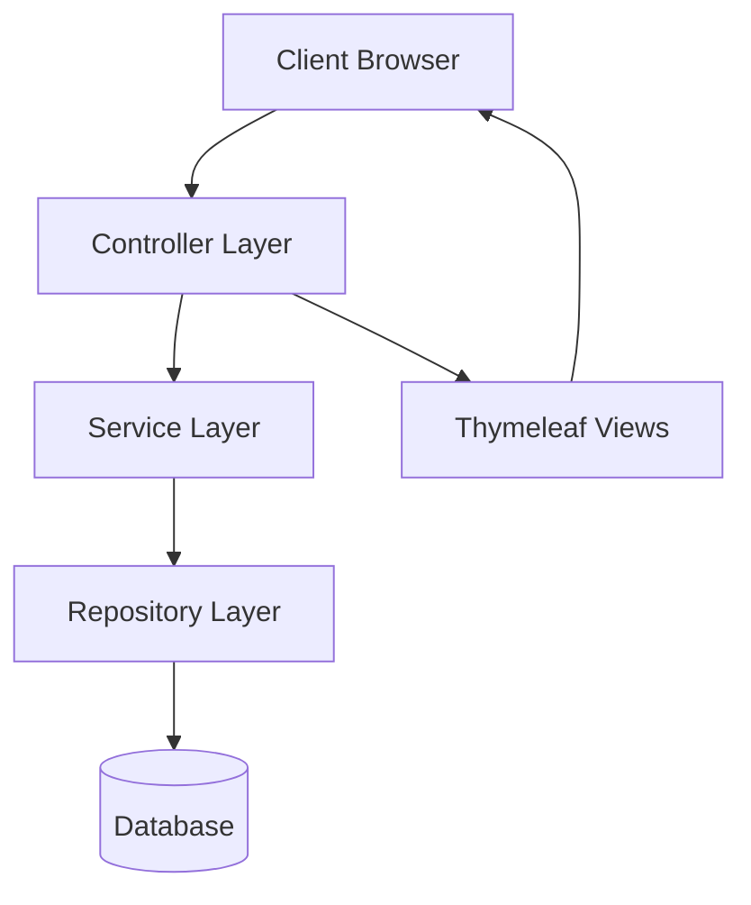

<div dir="rtl">

תרשים מחלקות עיקריות:

</div>

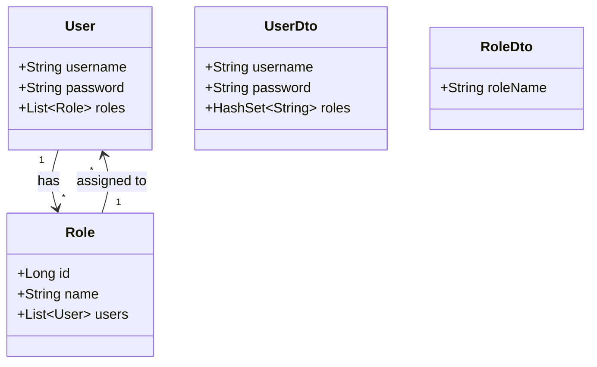

<div dir="rtl">

## אבטחה


המערכת מיישמת אבטחה מבוססת Spring Security עם מספר שכבות הגנה מפני תקיפות נפוצות:

</div>

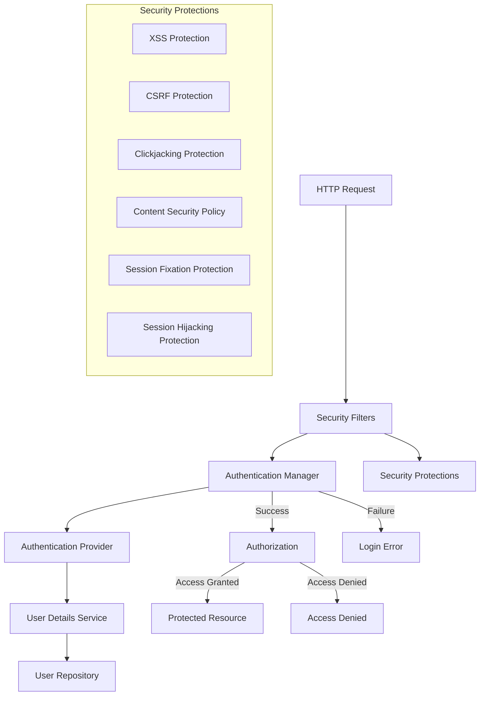

<div dir="rtl">

הגדרת אבטחה מקיפה כולל הגנות מפני התקפות נפוצות:

</div>

```java
@Bean
public SecurityFilterChain filterChain(HttpSecurity http) throws Exception {
    http
        // Protection against XSS, Clickjacking and CSP
        .headers(headers -> headers
            .contentSecurityPolicy(policy ->
                policy.policyDirectives("default-src 'self'; script-src 'self' 'unsafe-inline'; style-src 'self' 'unsafe-inline';"))
            .frameOptions(HeadersConfigurer.FrameOptionsConfig::sameOrigin)
        )
        
        // Protection against CSRF
        .csrf(csrf -> csrf
            .csrfTokenRepository(CookieCsrfTokenRepository.withHttpOnlyFalse()))
            
        // Access permission settings
        .authorizeHttpRequests(auth -> auth
            .requestMatchers("/css/**", "/js/**", "/images/**", "/static/**").permitAll()
            .requestMatchers("/login").permitAll()
            .requestMatchers("/role", "/register", "/admin_home").hasRole("ADMIN")
            .requestMatchers("/home").hasAnyRole("USER", "ADMIN")
            .anyRequest().authenticated()
        )
        
        // Login page configuration
        .formLogin(form -> form
            .loginPage("/login")
            .loginProcessingUrl("/login")
            .defaultSuccessUrl("/home", true)
            .failureUrl("/login?error=true")
            .permitAll()
        )
        
        // Logout configuration
        .logout(logout -> logout
            .logoutUrl("/logout")
            .logoutSuccessUrl("/login")
            .deleteCookies("JSESSIONID")
            .permitAll()
        )
        
        // Protection against Session Fixation and Session Hijacking
        .sessionManagement(session -> session
            .sessionCreationPolicy(SessionCreationPolicy.IF_REQUIRED)
            .sessionFixation(SessionManagementConfigurer.SessionFixationConfigurer::migrateSession)
            .maximumSessions(1)
            .expiredSessionStrategy(event -> 
                logger.warning("Session expired for user: " + event.getSessionInformation().getPrincipal()))
        );
    
    return http.build();
}
```

<div dir="rtl">

### הגנות אבטחה מרכזיות

1. **הגנה מפני XSS (Cross-Site Scripting)**
   - שימוש ב-Content Security Policy להגבלת מקורות תוכן
   - סניטיזציה אוטומטית של קלט ע"י Thymeleaf

2. **הגנה מפני CSRF (Cross-Site Request Forgery)**
   - שימוש ב-CookieCsrfTokenRepository
   - הטמעת CSRF tokens בטפסים

3. **הגנה מפני Clickjacking**
   - הגדרת מדיניות X-Frame-Options לאותו מקור בלבד

4. **הגנה מפני Session Fixation**
   - הגדרת החלפת מזהה session בעת התחברות

5. **הגנה מפני Session Hijacking**
   - הגבלה למקסימום סשן אחד למשתמש
   - ניטור וניהול תפוגת סשנים


## טיפול בחריגות</div>


המערכת מיישמת מנגנון טיפול גלובלי בחריגות שמאפשר הפרדה נקייה בין לוגיקת הבקר לבין לוגיקת טיפול בשגיאות. לאחר העדכון האחרון, המערכת מנצלת שני מטפלי חריגות נפרדים עם הפרדת אחריות ברורה:
</div>

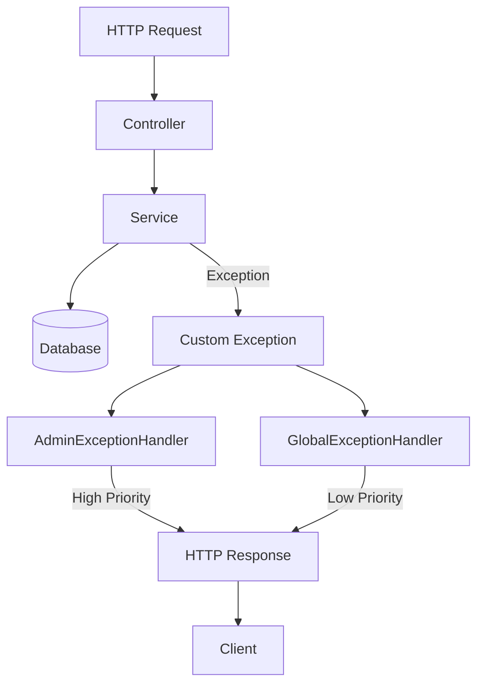

<div dir="rtl">

### מטפלי חריגות בארכיטקטורה החדשה

במערכת יש כעת שני מטפלי חריגות עם עדיפויות שונות:

1. **AdminExceptionHandler** - מטפל בחריגות אדמיניסטרטיביות (עדיפות גבוהה)
2. **GlobalExceptionHandler** - מטפל בחריגות כלליות (עדיפות נמוכה)

#### העדכון החדש - AdminExceptionHandler

המערכת עברה עדכון משמעותי בטיפול בחריגות עם הוספת `AdminExceptionHandler` אשר:
- מוגדר עם עדיפות גבוהה באמצעות `@Order(Ordered.HIGHEST_PRECEDENCE)`
- מתמקד בחריגות מתוך חבילת ה-controller
- מבחין בין בקשות API לבין בקשות דפדפן
- מטפל בחריגות אבטחה ספציפיות (`AccessDeniedException`)
</div>

```java
@ControllerAdvice(basePackages = "org.example.stage6.controller")
@Order(Ordered.HIGHEST_PRECEDENCE)
public class AdminExceptionHandler {

    /**
     * Handles InvalidRequestException specifically for admin operations.
     * This method will return either:
     * - A view with error data for web requests
     * - A standardized JSON response for API requests
     */
    @ExceptionHandler(InvalidRequestException.class)
    public Object handleAdminInvalidRequest(InvalidRequestException ex, 
                                           WebRequest request, 
                                           RedirectAttributes redirectAttributes,
                                           Model model) {
        
        // Check if it's an API request by examining the Accept header
        if (isApiRequest(request)) {
            // For API requests, return a JSON response with error details
            Map<String, String> details = new HashMap<>();
            details.put("type", "Admin Operation Error");
            details.put("message", ex.getMessage());
            
            StandardResponse response = new StandardResponse("error", null, details);
            return new ResponseEntity<>(response, HttpStatus.BAD_REQUEST);
        } else {
            // For web requests, prepare model attributes and return appropriate view
            if (request.getHeader("Referer") != null) {
                // If there's a referer header, redirect back with flash message
                redirectAttributes.addFlashAttribute("error", ex.getMessage());
                return "redirect:" + request.getHeader("Referer");
            } else {
                // Otherwise add to model and return error view
                model.addAttribute("error", ex.getMessage());
                return "error"; // Make sure this view template exists
            }
        }
    }
    
    /**
     * Helper method to determine if a request is an API request based on Accept header.
     */
    private boolean isApiRequest(WebRequest request) {
        String acceptHeader = request.getHeader("Accept");
        return acceptHeader != null && 
               (acceptHeader.contains("application/json") || 
                acceptHeader.contains("application/xml"));
    }
    
    /**
     * Handles access denied exceptions for admin operations.
     */
    @ExceptionHandler(org.springframework.security.access.AccessDeniedException.class)
    public String handleAccessDenied(Exception ex, Model model) {
        model.addAttribute("error", "You do not have permission to access this page");
        return "access-denied"; // Make sure this view template exists
    }
}
```

<div dir="rtl">

#### GlobalExceptionHandler המעודכן

ה-`GlobalExceptionHandler` עודכן כדי לשתף פעולה עם `AdminExceptionHandler`:
- הוגדר עם עדיפות נמוכה יותר דרך `@Order`
- ממשיך לטפל בחריגות כלליות
- מבין את היחס בהייררכיה של ההרשאות עם `AdminExceptionHandler`
</div>

```java
@ControllerAdvice
@Order // Default order - lower priority than HIGHEST_PRECEDENCE
public class GlobalExceptionHandler {

    @ExceptionHandler(NotExists.class)
    public ResponseEntity<StandardResponse> handleNotExists(NotExists ex, WebRequest request) {
        // Implementation as before
    }
    
    @ExceptionHandler(AlreadyExists.class)
    public ResponseEntity<StandardResponse> handleAlreadyExists(AlreadyExists ex, WebRequest request) {
        // Implementation as before
    }
    
    @ExceptionHandler(InvalidRequestException.class)
    public ResponseEntity<StandardResponse> handleInvalidRequest(InvalidRequestException ex, WebRequest request) {
        // This will only handle InvalidRequestException for non-admin controllers
        // since AdminExceptionHandler has higher precedence for admin controllers
        Map<String, String> details = new HashMap<>();
        details.put("type", "Invalid Request");
        details.put("message", ex.getMessage());
        
        StandardResponse response = new StandardResponse("error", null, details);
        return new ResponseEntity<>(response, HttpStatus.BAD_REQUEST);
    }
    
    // Other exception handlers...
}
```
<div dir="rtl">

# תוספת לתיעוד - טיפול בוולידציה ובשגיאות טפסים

## וולידציה וטיפול בשגיאות טפסים


מערכת Stage6 מיישמת מנגנון וולידציה מקיף לטפסים באמצעות שילוב של Bean Validation עם Thymeleaf. מנגנון זה מספק חווית משתמש משופרת על ידי הצגת הודעות שגיאה ברורות ומפורטות כאשר הקלט אינו עומד בדרישות.


### ארכיטקטורת וולידציה


תהליך הוולידציה מתבצע בשלושה שלבים עיקריים:
</div>

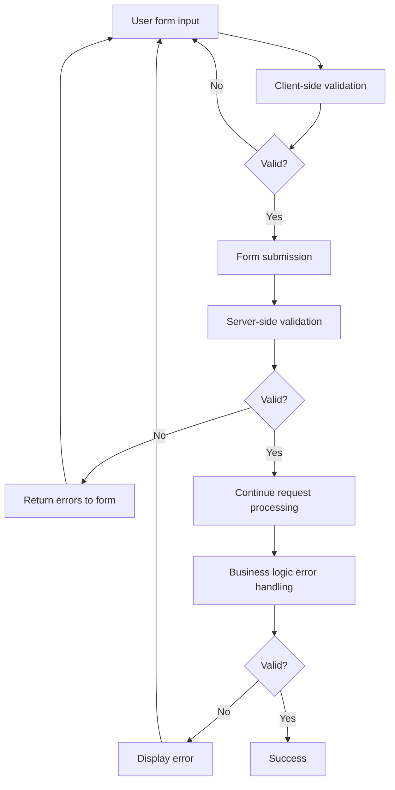

<div dir="rtl">

### הגדרת חוקי וולידציה במודל

המערכת משתמשת באנוטציות של Bean Validation (JSR-380) במחלקות ה-DTO להגדרת חוקי הוולידציה:
</div>

```java
@Data
@AllArgsConstructor
@NoArgsConstructor
public class UserDto {
    @NotBlank(message = "username required")
    @Size(min = 3, max = 50, message = "username must be between 3 and 30 characters")
    private String username;

    @NotBlank(message = "password is required")
    @Size(min = 3, max = 50, message = "password must be between 3 and 30 characters")
    private String password;

    private HashSet<String> roles;
}
```

<div dir="rtl">

ובדומה לכך, ב-RoleDto:
</div>

```java
@Data
@NoArgsConstructor
@AllArgsConstructor
public class RoleDto {
    @NotBlank(message = "role name required")
    @Size(min = 2, max = 50, message = "role name must be between 2 and 30 characters")
    private String roleName;
}
```

<div dir="rtl">

### טיפול בשגיאות וולידציה בבקר

בבקר, אנו משתמשים באנוטציית `@Valid` יחד עם `BindingResult` כדי לזהות שגיאות וולידציה:
</div>

```java
@PostMapping("/add-user")
public String addUser(@Valid @ModelAttribute UserDto userDto,
                      BindingResult bindingResult,
                      RedirectAttributes redirectAttributes,
                      Model model) {

    if (bindingResult.hasErrors()) {
        // Return the page with validation errors
        model.addAttribute("availableRoles", roleService.getAllRoles());
        return "add-user";
    }

    // Continue with logic if no validation errors...
}
```

<div dir="rtl">

### הצגת שגיאות וולידציה בדפי HTML

Thymeleaf מספק תמיכה מובנית להצגת שגיאות וולידציה בדפי HTML. ניתן להציג שגיאות בשתי דרכים עיקריות:


#### <div dir="rtl">1. הצגת שגיאות ספציפיות לשדה</div>


דוגמה להצגת שגיאת וולידציה עבור שדה סיסמה בטופס הוספת משתמש:
</div>

```html
<div class="form-group">
    <label for="password">Password:</label>
    <input type="password" id="password" name="password" th:field="*{password}" 
           required minlength="3" maxlength="50">
    <!-- Display specific error message for this field -->
    <div th:if="${#fields.hasErrors('password')}" class="error-message" 
         th:errors="*{password}">Password Error</div>
</div>
```

<div dir="rtl">

הדוגמה הזו מציגה:
- שימוש ב-`th:field` כדי לקשר את שדה הקלט למאפיין ב-model
- הוספת וולידציה בצד לקוח באמצעות התכונות `required` ו-`minlength`
- שימוש ב-`th:if="${#fields.hasErrors('password')}"` כדי לבדוק אם יש שגיאות
- שימוש ב-`th:errors="*{password}"` להצגת הודעת השגיאה המתאימה
</div>

#### <div dir="rtl">2. הצגת כל שגיאות הוולידציה</div>

<div dir="rtl">
ניתן גם להציג את כל שגיאות הוולידציה יחד בראש הטופס:
</div>

```html
<!-- Display all errors at the top of the form -->
<div th:if="${#fields.hasAnyErrors()}" class="error-summary">
    <ul>
        <li th:each="err : ${#fields.allErrors()}" th:text="${err}">Error</li>
    </ul>
</div>
```

<div dir="rtl">

### שילוב עם AdminExceptionHandler

כאשר יש שגיאות עסקיות (לא שגיאות וולידציה), הן מטופלות על ידי מנגנון ה-exception handling שתואר קודם:
</div>

```java
try {
    userService.registerUser(userDto);
    redirectAttributes.addFlashAttribute("success", "User created successfully");
    return "redirect:/admin/dashboard";
} catch (InvalidRequestException e) {
    model.addAttribute("error", e.getMessage());
    model.addAttribute("availableRoles", roleService.getAllRoles());
    return "add-user";
}
```

<div dir="rtl">

### תזרים וולידציה מלא

במקרה של הזנת סיסמה קצרה מדי, תזרים הוולידציה הוא:
</div>

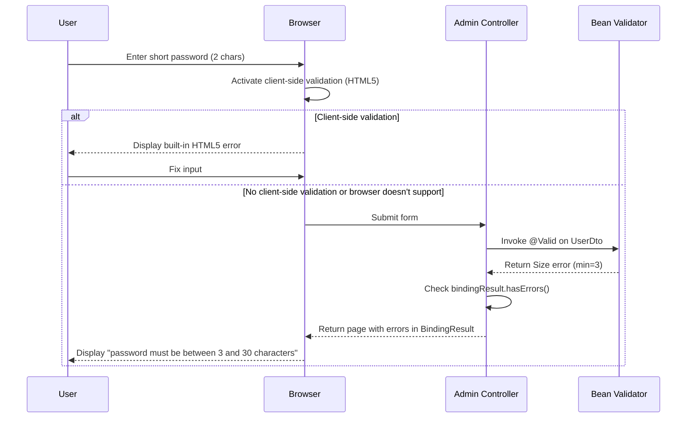

<div dir="rtl">

### שיפור חווית המשתמש

שילוב הוולידציה בצד לקוח ובצד שרת מספק מספר יתרונות:

1. **משוב מיידי למשתמש** - וולידציה בצד לקוח מספקת משוב ללא צורך בנסיעה לשרת
2. **אבטחה חזקה** - וולידציה בצד שרת מבטיחה שלא ניתן לעקוף את חוקי הוולידציה
3. **הודעות שגיאה מותאמות** - הודעות שגיאה ברורות ומפורטות עם אפשרות לתמיכה רב-לשונית
4. **שמירה על הקלט הקיים** - הטופס נשמר עם הערכים שהוזנו כך שהמשתמש יכול לתקן רק את השדות השגויים

### המלצות לשיפור נוסף

1. **עיצוב שגיאות משופר** - הוספת סגנון CSS ייעודי לשדות עם שגיאות:
</div>

```css
.error-message {
    color: #e74c3c;
    font-size: 0.9em;
    margin-top: 5px;
}

input.error {
    border-color: #e74c3c;
}
```

<div dir="rtl">

2. **וולידציה בזמן אמת** - הוספת JavaScript להצגת שגיאות בזמן הקלדה

3. **תרגום הודעות שגיאה** - שימוש בקבצי properties לתרגום הודעות שגיאה:
</div>

```java
@NotBlank(message = "{user.password.required}")
@Size(min = 3, max = 50, message = "{user.password.size}")
private String password;
```

<div dir="rtl">

עם קובץ `ValidationMessages_he.properties`:
</div>

```properties
user.password.required=Password is a required field
user.password.size=Password must contain between {min} and {max} characters
```

<div dir="rtl">

שילוב טכניקות אלו יצור מערכת וולידציה מקיפה שמספקת חווית משתמש מעולה תוך שמירה על אבטחה ותקינות הנתונים.

### יתרונות הארכיטקטורה החדשה

1. **הפרדת אחריות** - טיפול בחריגות אדמיניסטרטיביות נפרד מטיפול בחריגות כלליות

2. **תגובות מותאמות** - AdminExceptionHandler מספק תגובות מותאמות לפי סוג הבקשה

3. **חווית משתמש משופרת** - הודעות שגיאה ידידותיות יותר למשתמש בעת שגיאות בממשק המשתמש


## ממשק משתמש

המערכת מיישמת ממשק משתמש דו-כיווני (RTL/LTR) עם תמיכה בעברית ואנגלית:


### תמיכה בדו-כיווניות (RTL/LTR)

המערכת מיישמת תמיכה מלאה בדו-כיווניות:

1. **דפי HTML מותאמים לעברית** - מוגדרים עם כיווניות RTL
   ```html
   <html lang="he" dir="rtl">
   ```

2. **דפי HTML באנגלית** - מוגדרים עם כיווניות LTR
   ```html
   <html lang="en">
   ```

3. **סגנונות CSS מותאמים** - התחשבות בכיווניות עם מאפיינים כמו `text-align: right` בדפים בעברית

4. **עימוד מותאם לשפה** - יישור כפתורים ואלמנטים בהתאם לכיווניות השפה
</div>

<div dir="rtl">דפי המערכת העיקריים:</div>

1. <div dir="rtl">**דף התחברות** (login.html) - מאפשר למשתמשים להתחבר למערכת</div>
2. <div dir="rtl">**דף בית** (home.html) - דף ראשי לאחר התחברות</div>
3. <div dir="rtl">**לוח בקרה למנהל** (admin-home.html) - ניהול משתמשים ותפקידים</div>
4. <div dir="rtl">**דף הוספת משתמש** (add-user.html) - טופס להוספת משתמש חדש</div>
5. <div dir="rtl">**דף עריכת משתמש** (edit-user.html) - טופס לעריכת משתמש קיים</div>
6. <div dir="rtl">**דף הוספת תפקיד** (add-role.html) - טופס להוספת תפקיד חדש</div>
7. <div dir="rtl">**דף אישור מחיקה** (delete-confirmation.html) - אישור מחיקת משתמש או תפקיד</div>
8. <div dir="rtl">**דף התנתקות** (logout.html) - אישור יציאה מהמערכת</div>

<div dir="rtl">

תמונת זרימה של הניווט בין הדפים:

</div>

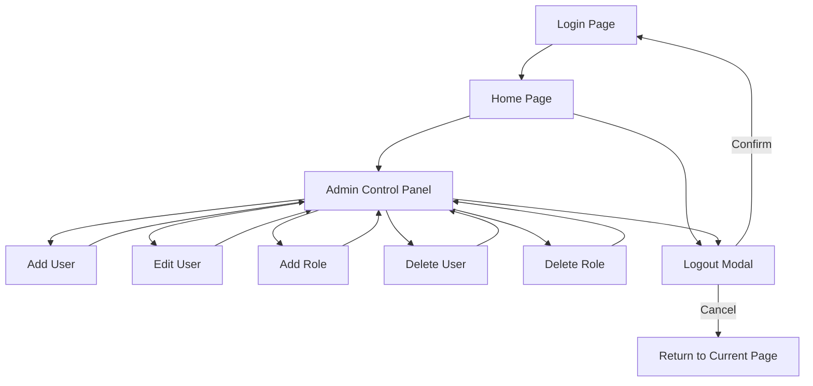

<div dir="rtl">

### חלוקת קבצי CSS

המערכת משתמשת במספר קבצי CSS לארגון וסדר:

1. **model.css** - סגנונות למודלים (חלונות קופצים)
2. **stylesheet.css** - סגנונות לדף ההתחברות
3. **home.css** - סגנונות לדף הבית
4. **admin-home.css** - סגנונות לדף הניהול
5. **forms.css** - סגנונות משותפים לכל הטפסים
6. **logout.css** - סגנונות לדף ההתנתקות

### שיפורים בממשק המשתמש

המערכת כוללת מספר שיפורים בממשק המשתמש:

1. **מודלים (modals)** - חלונות קופצים לאישור פעולות חשובות כמו התנתקות
2. **טפסים מקוננים** - אפשרות להוספת תפקיד ישירות מדף הניהול
3. **אינדיקטורים חזותיים** - צבעים שונים לכפתורי פעולה שונים (מחיקה באדום, עריכה בירוק)
4. **טיפול בהרשאות בצד לקוח** - הסתרת/הצגת אלמנטים בהתאם להרשאות המשתמש


## תהליכים עיקריים

### תהליך התחברות עם טיפול שגיאות משופר

</div>

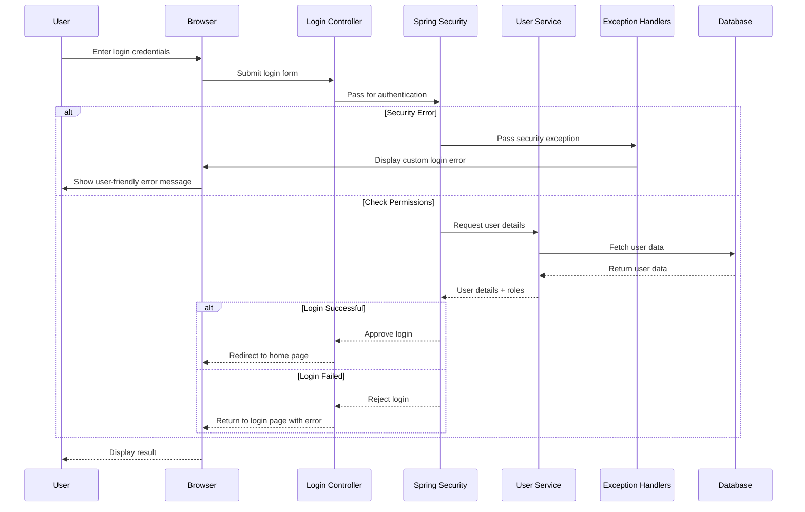
<div dir="rtl">

### תהליך הוספת משתמש עם טיפול שגיאות משופר
</div>

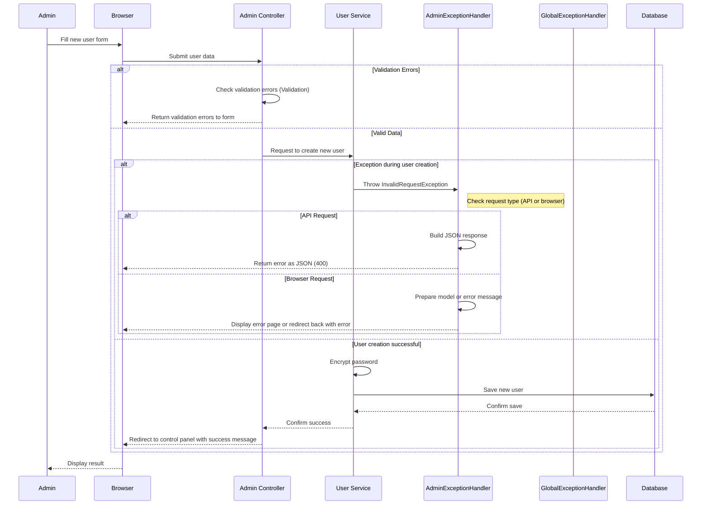
<div dir="rtl">

### תהליך הוספת/מחיקת תפקיד עם מטפלי חריגות מותאמים
</div>

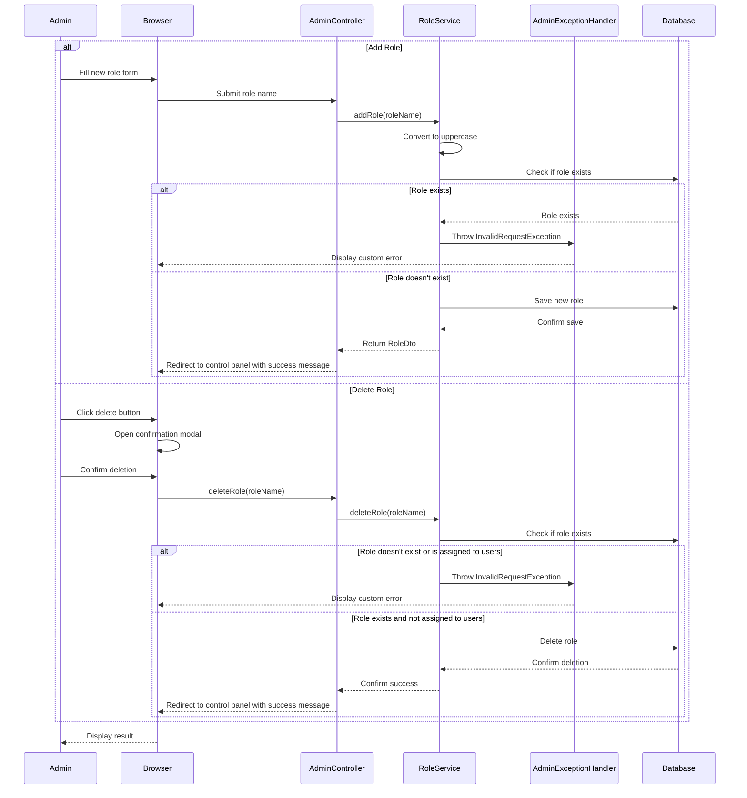
<div dir="rtl">

## התנהגות משופרת של טיפול בחריגות
</div>

<div dir="rtl">

### יחסי הגומלין בין שני מטפלי החריגות

הדיאגרמה הבאה מציגה את תהליך קבלת ההחלטות כאשר מתרחשת חריגה במערכת:
</div>

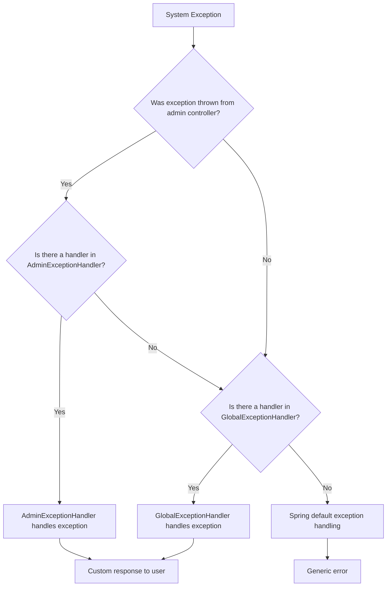

<div dir="rtl">

### שיפורים בחווית המשתמש

הטיפול החדש בחריגות מביא ליתרונות משמעותיים בחווית המשתמש:

1. **הודעות שגיאה מותאמות קונטקסט** - הודעות שגיאה ספציפיות למסך ולפעולה
2. **שימור נתוני קלט** - במקרה של שגיאה, המערכת שומרת את הנתונים שהוזנו
3. **הפרדה בין לוגיקה עסקית לבין הצגת שגיאות** - בקרים נקיים יותר ומתמקדים בפעולתם העיקרית
4. **תמיכה בסוגי תגובות שונים** - אותה חריגה יכולה להיות מוצגת באופן שונה לבקשות API ולבקשות דפדפן


## בדיקות


המערכת כוללת מספר סוגי בדיקות:

1. **בדיקות יחידה** - בדיקת פונקציונליות של שירותים וקונטרולרים בנפרד
2. **בדיקות אינטגרציה** - בדיקת עבודה משולבת של מרכיבים שונים
3. **בדיקות End-to-End** - בדיקת תהליכים שלמים מצד הלקוח

### תוספת: בדיקת ייעודית למטפלי חריגות

עם התוספת של מטפלי חריגות מותאמים, נוספו גם בדיקות ייעודיות:

</div>

```java
@SpringBootTest
@AutoConfigureMockMvc
public class ExceptionHandlersTest {

   @Autowired
   private MockMvc mockMvc;

   @Test
   public void testAdminExceptionHandler() throws Exception {
      // Test admin-specific exception handling
      mockMvc.perform(post("/admin/add-user")
                      .param("username", "existingUser")
                      .param("password", "password"))
              .andExpect(status().isOk())
              .andExpect(view().name("add-user"))
              .andExpect(model().attributeExists("error"));
   }

   @Test
   public void testGlobalExceptionHandler() throws Exception {
      // Test global exception handling
      mockMvc.perform(get("/api/users/nonexistent"))
              .andExpect(status().isNotFound())
              .andExpect(jsonPath("$.status").value("error"))
              .andExpect(jsonPath("$.details.type").value("Resource Not Found"));
   }
}
```

<div dir="rtl">

## התקנה והפעלה

הוראות להתקנה והפעלת המערכת:

</div>

```bash
# Clone the repository
git clone https://github.com/example/stage6.git

# Navigate to project directory
cd stage6

# Build the project
./mvnw clean package

# Run the project
./mvnw spring-boot:run
```

<div dir="rtl">

המערכת תהיה זמינה בכתובת: http://localhost:8080


## מודלי נתונים מרכזיים

### מודל User
</div>

```java
@Entity
@Data
@NoArgsConstructor
@AllArgsConstructor
public class User {
   @Id
   private String username;

   @Column(nullable = false)
   private String password;

   @ManyToMany(fetch = FetchType.EAGER)
   @JoinTable(
           name = "user_role",
           joinColumns = @JoinColumn(name = "username"),
           inverseJoinColumns = @JoinColumn(name = "role_id"),
           uniqueConstraints = @UniqueConstraint(
                   columnNames = {"username", "role_id"}
           )
   )
   @ToString.Exclude
   private List<Role> roles = new ArrayList<>();
}
```
<div dir="rtl">

### מודל Role
</div>

```java
@Entity
@Data
@NoArgsConstructor
@AllArgsConstructor
public class Role {
   @Id
   @GeneratedValue(strategy = GenerationType.IDENTITY)
   private Long id;

   @Column(unique = true, nullable = false, length = 20)
   private String name;

   @ManyToMany(mappedBy = "roles", fetch = FetchType.EAGER)
   @ToString.Exclude
   private List<User> users = new ArrayList<>();
}
```

<div dir="rtl">

## סיכום השינויים העיקריים


במסגרת העדכון האחרון למערכת, בוצעו השינויים הבאים:

1. **הוספת AdminExceptionHandler** - מטפל חריגות ייעודי עבור בקרי אדמין
   - מטפל בחריגות ברמת עדיפות גבוהה
   - מבחין בין סוגי בקשות שונים (API / דפדפן)
   - מספק חווית משתמש משופרת

2. **עדכון GlobalExceptionHandler** - התאמה לעבודה עם מטפל החריגות החדש
   - תיאום רמות עדיפות בין המטפלים
   - הבטחת טיפול בכל סוגי החריגות

3. **שיפורים בקונטרולרים** - התחשבות במטפלי החריגות החדשים
   - תיעוד מקיף יותר
   - אפשרות עתידית להסרת טיפול ידני בחריגות

4. **שיפורים בממשק המשתמש** - שימוש במודלים וחלונות אישור
   - אישור פעולות קריטיות
   - שיפור חווית המשתמש

5. **שיפור בבדיקות** - הרחבת כיסוי הבדיקות
   - בדיקות ייעודיות למטפלי החריגות החדשים


פרויקט Stage6 מהווה דוגמה טובה למערכת אבטחה מבוססת Spring Security עם ניהול משתמשים ותפקידים. המערכת תוכננה תוך הקפדה על הפרדת שכבות, תכנון מודולרי וניהול נכון של מערכת ההרשאות.

העדכון האחרון הציג שיפור משמעותי בטיפול בחריגות, עם הוספת `AdminExceptionHandler` שמתואם עם ה-`GlobalExceptionHandler` הקיים. גישה זו מאפשרת תגובות מותאמות לשגיאות בהתאם לסוג הבקשה ולקונטקסט, ומשפרת את חווית המשתמש.

המערכת כוללת ממשק משתמש ידידותי עם תמיכה מלאה בדו-כיווניות, המאפשרת עבודה הן בעברית והן באנגלית. השימוש ב-Thymeleaf מאפשר בניית דפים דינמיים בצד השרת תוך הקפדה על אבטחה.
</div>