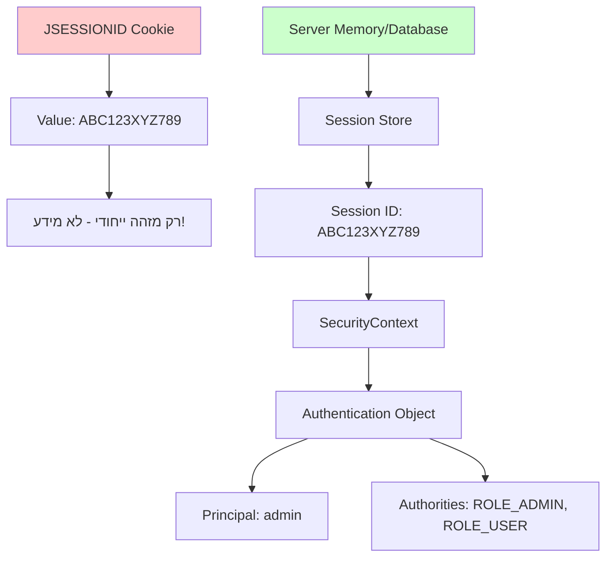
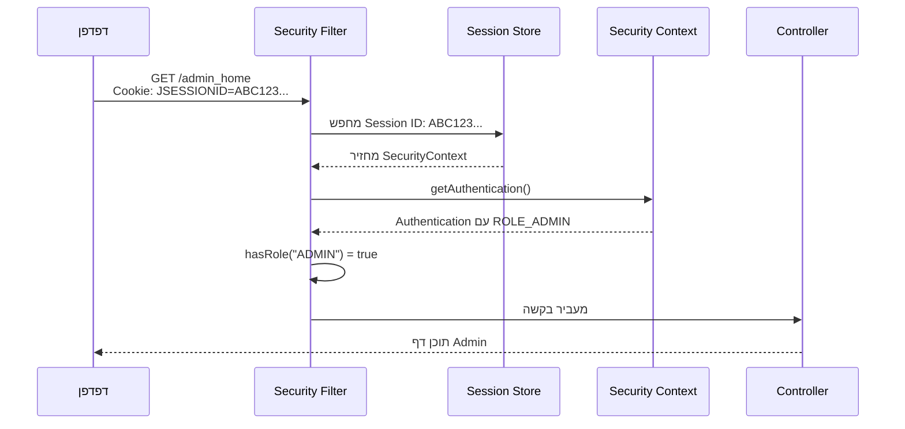

**תשובה קצרה: ה-Cookie עצמו לא מכיל את ה-ROLE!**

<div dir="rtl">

## איך באמת עובד שמירת התפקיד

### מה שהCookie מכיל vs מה שהשרת שומר

</div>



<div dir="rtl">

### זרימת בדיקת הרשאות

כשמשתמש מנסה לגשת ל-`/admin_home`:

</div>



<div dir="rtl">

### מה נשמר בפועל בזיכרון השרת

</div>

```java
// מה שנשמר בSession Store (זיכרון השרת):
Map<String, SecurityContext> sessionStore = {
    "ABC123XYZ789" -> SecurityContext {
        authentication: {
            principal: "admin",
            credentials: "[PROTECTED]",
            authorities: [
                SimpleGrantedAuthority("ROLE_ADMIN"),
                SimpleGrantedAuthority("ROLE_USER")
            ],
            authenticated: true
        }
    }
}
```

<div dir="rtl">

### איך זה נוצר בעת Login

</div>

```java
// CustomUserDetailsService.java
public UserDetails loadUserByUsername(String username) {
    User user = userRepository.findById(username).orElseThrow(...);
    
    // כאן נוצרים ה-Authorities
    Collection<GrantedAuthority> authorities = user.getRoles().stream()
        .map(role -> new SimpleGrantedAuthority("ROLE_" + role.getName()))
        .collect(Collectors.toList());
    
    // Spring Security שומר את זה ב-SecurityContext
    return new org.springframework.security.core.userdetails.User(
        user.getUsername(),
        user.getPassword(),
        authorities  // זה נשמר בשרת, לא בCookie!
    );
}
```

<div dir="rtl">

### הוכחה - נתח את ה-Cookie

</div>

```javascript
// בדפדפן - Console
document.cookie
// תוצאה: "JSESSIONID=1FBCDB2E8D6FCB9CAF503C712407921B"

// אין כאן ROLE_ADMIN או מידע נוסף!
// רק מזהה Session
```

<div dir="rtl">

### למה זה יותר בטוח?

**אם התפקידים היו בCookie:**

</div>

```javascript
// רע - אם היה ככה:
document.cookie = "roles=ROLE_ADMIN,ROLE_USER"; 

// משתמש יכול לשנות ב-Console:
document.cookie = "roles=ROLE_ADMIN,ROLE_SUPER_ADMIN";
// ואז לקבל הרשאות שלא מגיעות לו!
```

<div dir="rtl">

**עם Session-based (הטוב):**

</div>

```javascript
// טוב - מה שקורה בפועל:
document.cookie = "JSESSIONID=ABC123"; 

// משתמש יכול לנסות לשנות:
document.cookie = "JSESSIONID=XYZ789";
// אבל השרת פשוט לא ימצא session עם ID הזה
// ויחזיר 401 Unauthorized
```

<div dir="rtl">

### איפה בדיוק נשמר ה-SecurityContext?

**ב-Spring Boot (ברירת מחדל):**

</div>

```java
// בזיכרון השרת
ConcurrentHashMap<String, SecurityContext> sessions;

// כל Session ID מצביע על SecurityContext
sessions.put("ABC123XYZ789", securityContext);
```

<div dir="rtl">

**אם רוצים שמירה מתמשכת:**

</div>

```properties
# application.properties
spring.session.store-type=jdbc
# או
spring.session.store-type=redis
```

<div dir="rtl">

### בדיקה מעשית - איך לראות את זה

**1. הדפס Session Info:**

</div>

```java
@GetMapping("/debug-session")
public ResponseEntity<?> debugSession(HttpServletRequest request) {
    HttpSession session = request.getSession();
    SecurityContext context = SecurityContextHolder.getContext();
    
    Map<String, Object> info = new HashMap<>();
    info.put("sessionId", session.getId());
    info.put("principal", context.getAuthentication().getName());
    info.put("authorities", context.getAuthentication().getAuthorities());
    
    return ResponseEntity.ok(info);
}
```

<div dir="rtl">

**2. בדוק ב-Browser DevTools:**

</div>

```javascript
// Network tab:
// Request Headers:
Cookie: JSESSIONID=1FBCDB2E8D6FCB9CAF503C712407921B

// Response JSON:
{
  "sessionId": "1FBCDB2E8D6FCB9CAF503C712407921B",
  "principal": "admin", 
  "authorities": ["ROLE_ADMIN"]
}
```

<div dir="rtl">

## סיכום הפרדת האחריות

**Cookie (בדפדפן):**
- רק Session ID
- נשלח בכל בקשה
- לא מכיל מידע רגיש

**Server Memory (בשרת):**
- SecurityContext מלא
- תפקידים והרשאות
- מוגן מפני שינוי

**היתרון:**
- משתמש לא יכול לזייף הרשאות
- שרת שולט לחלוטין במי יכול מה
- אם Session נפרץ - רק Session ID חשוף, לא המידע

זה למה Session-based authentication נחשב בטוח - המידע הקריטי נשאר בשרת!

</div>