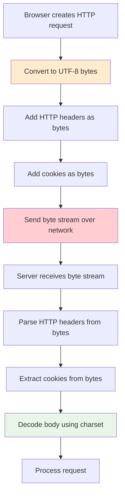
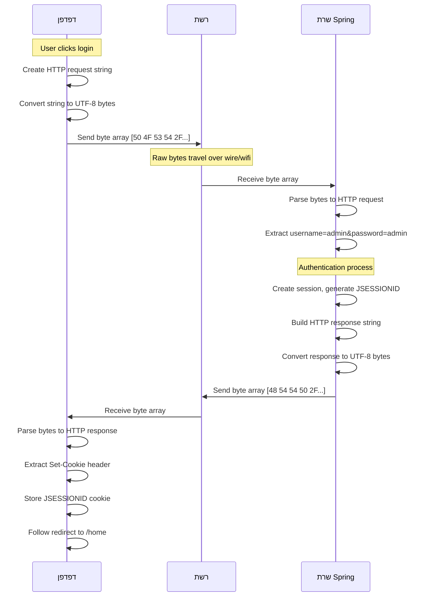
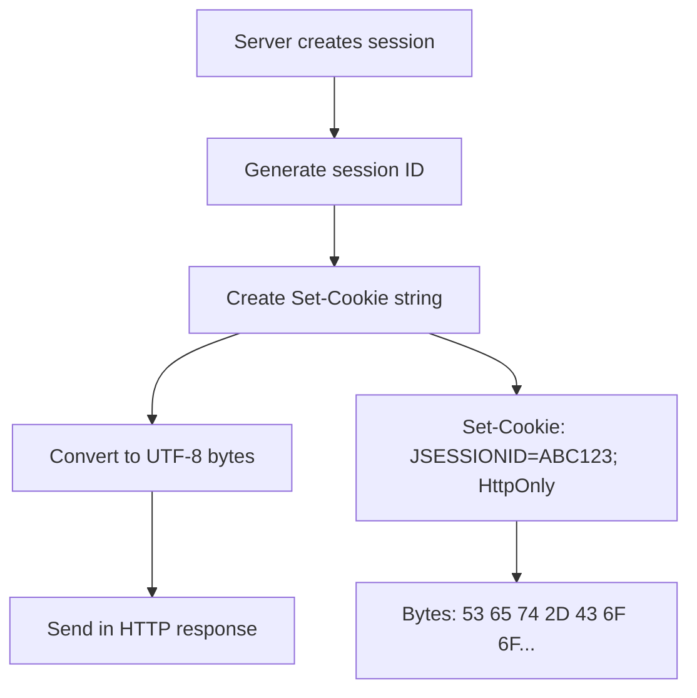
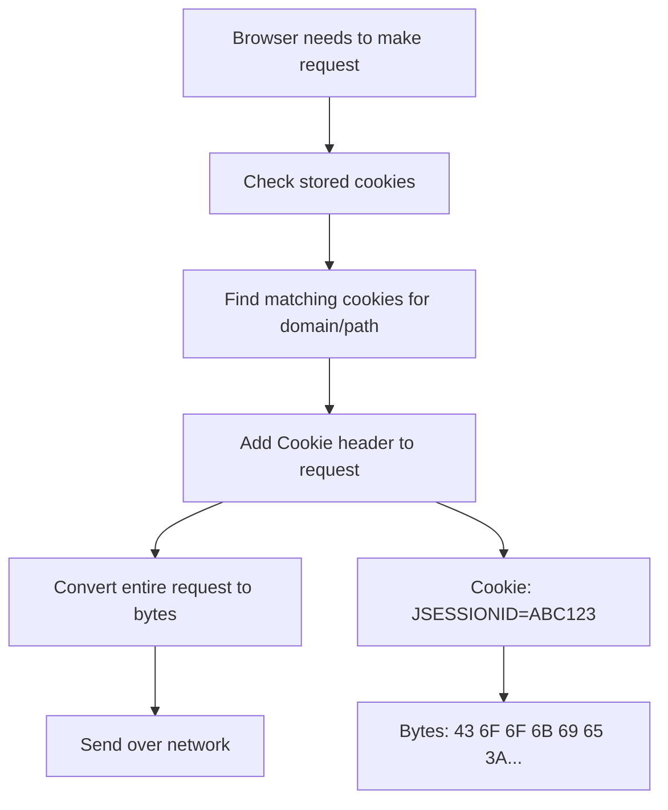
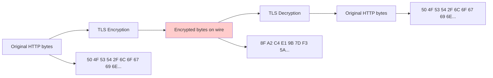
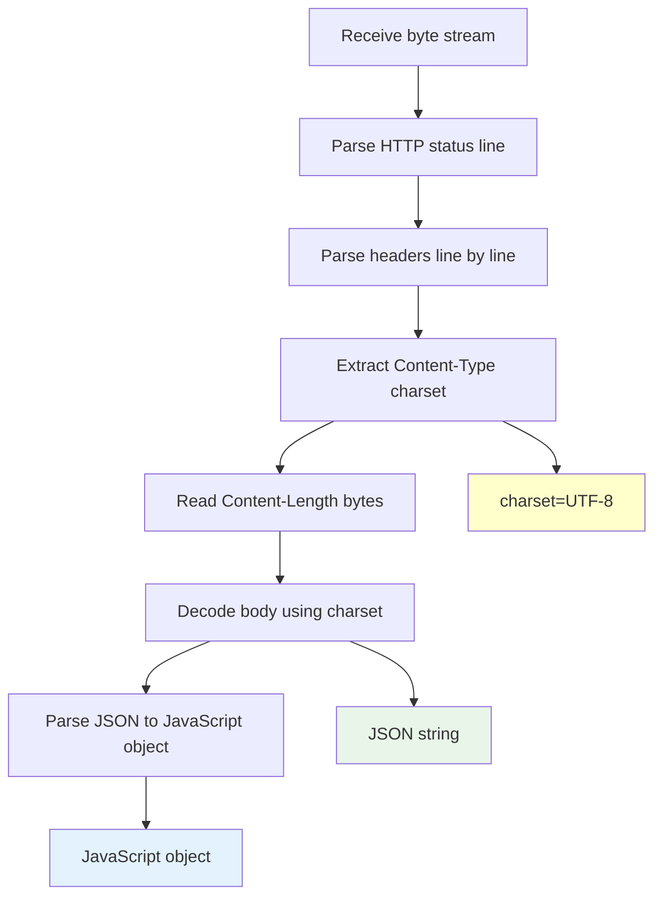
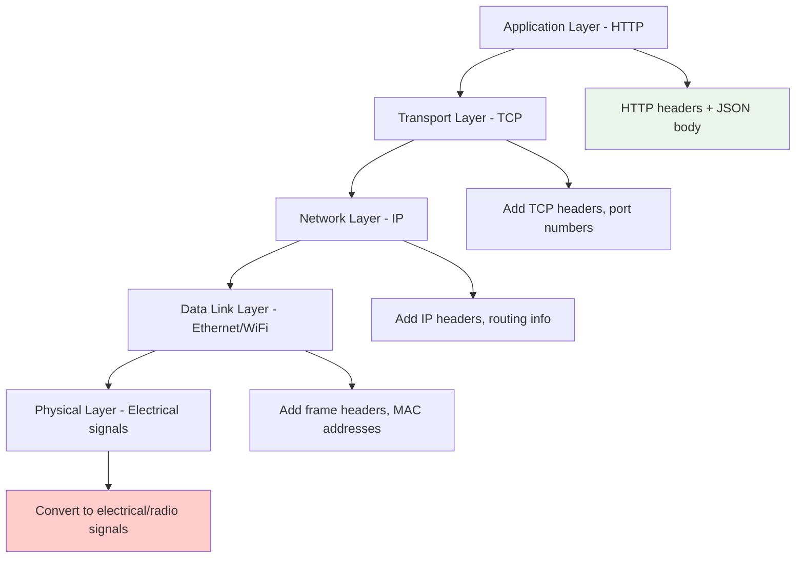

# תקשורת רשת - מה באמת עובר על הקו

<div dir="rtl">

## מה באמת נשלח על הקו ברשת?

כשמתקשרים בין דפדפן לשרת, **הכל הופך לbytes** - סדרה של מספרים בין 0-255 שעוברים דרך החוטים או האוויר. בואו נבין מה בדיוק קורה במערכת שלך.

## מבנה HTTP Request מלא ברמת הBytes

כשמשתמש מתחבר למערכת שלך, זה מה שבאמת עובר על הקו:

</div>



<div dir="rtl">

## דוגמה מעשית: התחברות למערכת

כשמשתמש מתחבר ב-`/login`, זה מה שבאמת עובר על הקו:

### 1. HTTP Request בBytes:

</div>

```
POST /login HTTP/1.1
Host: localhost:8080
Content-Type: application/x-www-form-urlencoded
Content-Length: 27
Connection: keep-alive
User-Agent: Mozilla/5.0 (Windows NT 10.0; Win64; x64)

username=admin&password=admin
```

<div dir="rtl">

### 2. המרה לBytes (UTF-8):

</div>

```
Bytes in hexadecimal:
50 4F 53 54 20 2F 6C 6F 67 69 6E 20 48 54 54 50  // POST /login HTTP
2F 31 2E 31 0D 0A                                 // /1.1\r\n
48 6F 73 74 3A 20 6C 6F 63 61 6C 68 6F 73 74 3A  // Host: localhost:
38 30 38 30 0D 0A                                 // 8080\r\n
43 6F 6E 74 65 6E 74 2D 54 79 70 65 3A 20 61 70  // Content-Type: ap
70 6C 69 63 61 74 69 6F 6E 2F 78 2D 77 77 77 2D  // plication/x-www-
66 6F 72 6D 2D 75 72 6C 65 6E 63 6F 64 65 64 0D  // form-urlencoded\r
0A                                                 // \n
43 6F 6E 74 65 6E 74 2D 4C 65 6E 67 74 68 3A 20  // Content-Length: 
32 37 0D 0A                                       // 27\r\n
0D 0A                                             // \r\n (empty line)
75 73 65 72 6E 61 6D 65 3D 61 64 6D 69 6E 26 70  // username=admin&p
61 73 73 77 6F 72 64 3D 61 64 6D 69 6E           // assword=admin
```

<div dir="rtl">

## HTTP Response עם Cookie - ברמת הBytes

כשהשרת מחזיר תשובה עם JSESSIONID:

### 1. HTTP Response כטקסט:

</div>

```
HTTP/1.1 302 Found
Location: /home
Set-Cookie: JSESSIONID=A1B2C3D4E5F6G7H8; Path=/; HttpOnly
Content-Length: 0
Date: Sat, 14 Jun 2025 10:30:00 GMT
```

<div dir="rtl">

### 2. Cookie כBytes:

</div>

```
Set-Cookie header as bytes:
53 65 74 2D 43 6F 6F 6B 69 65 3A 20        // "Set-Cookie: "
4A 53 45 53 53 49 4F 4E 49 44 3D           // "JSESSIONID="
41 31 42 32 43 33 44 34 45 35 46 36        // "A1B2C3D4E5F6"
47 37 48 38 3B 20                          // "G7H8; "
50 61 74 68 3D 2F 3B 20                    // "Path=/; "
48 74 74 70 4F 6E 6C 79                    // "HttpOnly"
0D 0A                                       // "\r\n"
```

<div dir="rtl">

## JSON Serialization ברמת הBytes

כשהשרת מחזיר JSON (למשל ב-`/status`):

### 1. Java Object:

</div>

```java
StandardResponse response = new StandardResponse(
    "success", 
    "You are logged in as User name: admin!", 
    null
);
```

<div dir="rtl">

### 2. Jackson Serialization לString:

</div>

```json
{
  "status": "success",
  "data": "You are logged in as User name: admin!",
  "error": null
}
```

<div dir="rtl">

### 3. JSON String כBytes (UTF-8):

</div>

```
JSON bytes in hexadecimal:
7B 0A 20 20 22 73 74 61 74 75 73 22 3A 20 22 73  // {"  "status": "s
75 63 63 65 73 73 22 2C 0A 20 20 22 64 61 74 61  // uccess",\n  "data
22 3A 20 22 59 6F 75 20 61 72 65 20 6C 6F 67 67  // ": "You are logg
65 64 20 69 6E 20 61 73 20 55 73 65 72 20 6E 61  // ed in as User na
6D 65 3A 20 61 64 6D 69 6E 21 22 2C 0A 20 20 22  // me: admin!",\n  "
65 72 72 6F 72 22 3A 20 6E 75 6C 6C 0A 7D        // error": null\n}
```

<div dir="rtl">

## זרימת תקשורת מלאה - רמת Bytes

</div>



<div dir="rtl">

## Character Encoding על הקו

### UTF-8 Encoding דוגמאות:

</div>

```
ASCII characters (1 byte each):
'a' = 0x61 = 97
'A' = 0x41 = 65
'1' = 0x31 = 49
' ' = 0x20 = 32

Hebrew characters (2-3 bytes each):
'א' = 0xD7 0x90 = [215, 144]
'ב' = 0xD7 0x91 = [215, 145]
'ג' = 0xD7 0x92 = [215, 146]

Special characters:
'\r' = 0x0D = 13 (carriage return)
'\n' = 0x0A = 10 (line feed)
'"' = 0x22 = 34 (double quote)
'{' = 0x7B = 123 (open brace)
'}' = 0x7D = 125 (close brace)
```

<div dir="rtl">

## Cookie Lifecycle ברמת Bytes

### יצירת Cookie:

</div>



<div dir="rtl">

### שליחת Cookie בבקשה הבאה:

</div>



<div dir="rtl">

## תקשורת HTTPS - הצפנה ברמת Bytes

כשהמערכת רצה על HTTPS, כל הbytes מוצפנים:

</div>



<div dir="rtl">

## דוגמה מלאה: רישום משתמש חדש

### 1. Browser POST Request:

</div>

```http
POST /register HTTP/1.1
Host: localhost:8080
Content-Type: application/json
Cookie: JSESSIONID=A1B2C3D4E5F6G7H8
Content-Length: 89

{
  "username": "newuser",
  "password": "password123",
  "roles": ["USER"]
}
```

<div dir="rtl">

### 2. Request כBytes (מקוצר):

</div>

```
Header bytes:
50 4F 53 54 20 2F 72 65 67 69 73 74 65 72 20 48  // POST /register H
54 54 50 2F 31 2E 31 0D 0A                       // TTP/1.1\r\n
48 6F 73 74 3A 20 6C 6F 63 61 6C 68 6F 73 74 3A  // Host: localhost:
38 30 38 30 0D 0A                                // 8080\r\n
43 6F 6E 74 65 6E 74 2D 54 79 70 65 3A 20 61 70  // Content-Type: ap
70 6C 69 63 61 74 69 6F 6E 2F 6A 73 6F 6E 0D 0A  // plication/json\r\n
43 6F 6F 6B 69 65 3A 20 4A 53 45 53 53 49 4F 4E  // Cookie: JSESSION
49 44 3D 41 31 42 32 43 33 44 34 45 35 46 36 47  // ID=A1B2C3D4E5F6G
37 48 38 0D 0A                                   // 7H8\r\n

Body bytes (JSON):
7B 0A 20 20 22 75 73 65 72 6E 61 6D 65 22 3A 20  // {\n  "username": 
22 6E 65 77 75 73 65 72 22 2C 0A 20 20 22 70 61  // "newuser",\n  "pa
73 73 77 6F 72 64 22 3A 20 22 70 61 73 73 77 6F  // ssword": "passwo
72 64 31 32 33 22 2C 0A 20 20 22 72 6F 6C 65 73  // rd123",\n  "roles
22 3A 20 5B 22 55 53 45 52 22 5D 0A 7D           // ": ["USER"]\n}
```

<div dir="rtl">

### 3. Server Response:

</div>

```http
HTTP/1.1 201 Created
Content-Type: application/json;charset=UTF-8
Content-Length: 156
Date: Sat, 14 Jun 2025 10:30:00 GMT

{
  "status": "success",
  "data": {
    "username": "newuser",
    "roles": ["USER"]
  },
  "error": null
}
```

<div dir="rtl">

## פענוח Bytes בדפדפן

כשהדפדפן מקבל bytes, זה התהליך:

</div>



<div dir="rtl">

## Network Layer פירוט

### TCP/IP Stack:

</div>



<div dir="rtl">

## HTTP Headers Analysis

### דיסקציה של Headers:

</div>

```
Content-Type: application/json;charset=UTF-8
├── Media Type: application/json (tells receiver it's JSON)
├── Parameter: charset=UTF-8 (tells receiver how to decode bytes)
└── Total bytes: [43 6F 6E 74 65 6E 74 2D 54 79 70 65...]

Cookie: JSESSIONID=A1B2C3D4E5F6G7H8
├── Cookie Name: JSESSIONID
├── Cookie Value: A1B2C3D4E5F6G7H8
└── Total bytes: [43 6F 6F 6B 69 65 3A 20 4A 53 45...]

Content-Length: 156
├── Purpose: Tell receiver how many body bytes to read
├── Value: 156 (decimal)
└── Bytes: [43 6F 6E 74 65 6E 74 2D 4C 65 6E 67 74 68...]
```

<div dir="rtl">

## מה קורה כשיש שגיאה ברמת Bytes?

### תרחיש: בעיה בencoding

</div>

```mermaid
graph TD
    A[Server sends JSON with UTF-8] --> B[Network transmits bytes]
    B --> C[Browser assumes wrong encoding]
    C --> D[Garbled text display]
    
    A --> A1["JSON: {\"username\":\"מנהל\"}"]
    A1 --> A2["UTF-8 bytes: 7B 22 75 73 65 72 6E 61 6D 65 22 3A 22 D7 9E D7 A0 D7 94 D7 9C 22 7D"]
    
    C --> C1[Browser decodes as ISO-8859-1]
    C1 --> D1["Display: {\"username\":\"מן×"ל\"}"]
    
    style D1 fill:#ffcccc
```

<div dir="rtl">

## דוגמאות Network Debugging

### בדיקה עם Browser DevTools:

</div>

```javascript
// In browser console, you can inspect actual bytes:
fetch('/status')
  .then(response => response.text())
  .then(text => {
    console.log('Response text:', text);
    // Convert to bytes for inspection:
    const bytes = new TextEncoder().encode(text);
    console.log('Response bytes:', Array.from(bytes));
  });

// Example output:
// Response text: {"status":"success","data":"Hello"}
// Response bytes: [123, 34, 115, 116, 97, 116, 117, 115, 34, 58, 34, 115, 117, 99, 99, 101, 115, 115, 34, ...]
```

<div dir="rtl">

### בדיקה עם Wireshark/tcpdump:

</div>

```
# Raw packet capture showing HTTP over TCP:
0000: 45 00 00 3c 1c 46 40 00 40 06 b1 e6 c0 a8 01 64  E..<.F@.@......d
0010: c0 a8 01 65 13 88 1f 90 38 af c2 3a 38 af c2 3b  ...e....8..:8..;
0020: 80 18 00 e5 a4 f4 00 00 01 01 08 0a 23 ab 48 d6  ............#.H.
0030: 23 ab 48 d6 47 45 54 20 2f 73 74 61 74 75 73 20  #.H.GET /status 
0040: 48 54 54 50 2f 31 2e 31 0d 0a                    HTTP/1.1..
```

<div dir="rtl">

## Session Storage ברמת הBytes

### איך Session נשמר בשרת:

</div>

```java
// In memory session storage (simplified):
Map<String, HttpSession> sessionStore = new HashMap<>();

// When session is created:
String sessionId = generateSessionId(); // "A1B2C3D4E5F6G7H8"
HttpSession session = new HttpSession();
session.setAttribute("user", userDetails);
sessionStore.put(sessionId, session);

// Session ID as bytes when sent in cookie:
byte[] sessionIdBytes = sessionId.getBytes(StandardCharsets.UTF_8);
// Result: [65, 49, 66, 50, 67, 51, 68, 52, 69, 53, 70, 54, 71, 55, 72, 56]
```

<div dir="rtl">

## Performance והשפעה על הרשת

### גודל הודעות בבytes:

</div>

```
Typical request sizes in your application:

Login request: ~200 bytes
├── Headers: ~150 bytes
└── Body: ~30 bytes ("username=admin&password=admin")

JSON API response: ~300-500 bytes  
├── Headers: ~200 bytes
└── Body: ~100-300 bytes (JSON data)

HTML page response: ~2000-10000 bytes
├── Headers: ~200 bytes  
└── Body: ~1800-9800 bytes (HTML content)

Static resource (CSS): ~5000-50000 bytes
├── Headers: ~150 bytes
└── Body: ~4850-49850 bytes (CSS content)
```

<div dir="rtl">

## סיכום - המסע של הבytes

כל אינטראקציה במערכת שלך עוברת את המחזור הזה:

1. **יצירה** - אובייקטים בJava/JavaScript הופכים למחרוזות
2. **Serialization** - מחרוזות הופכות לbytes עם encoding מסוים
3. **שליחה** - bytes עוברים על הרשת דרך TCP/IP
4. **קבלה** - bytes מתקבלים בצד השני
5. **Parsing** - bytes הופכים בחזרה למחרוזות עם הdecoding הנכון
6. **Deserialization** - מחרוזות הופכים בחזרה לאובייקטים

הבנת התהליך הזה חיונית לdebug בעיות רשת, אופטימיזציה של ביצועים, ופתרון בעיות encoding. במערכת שלך, זה קורה אלפי פעמים ביום - כל לחיצה, כל בקשה, כל תשובה.

</div>