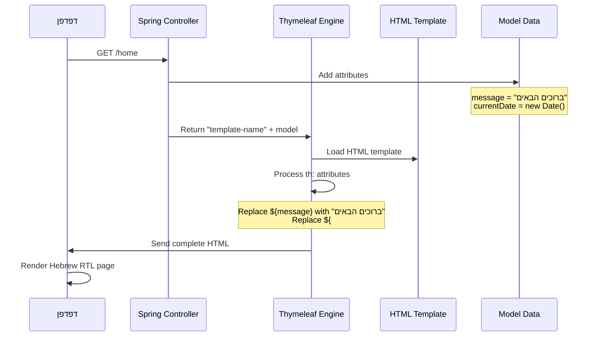
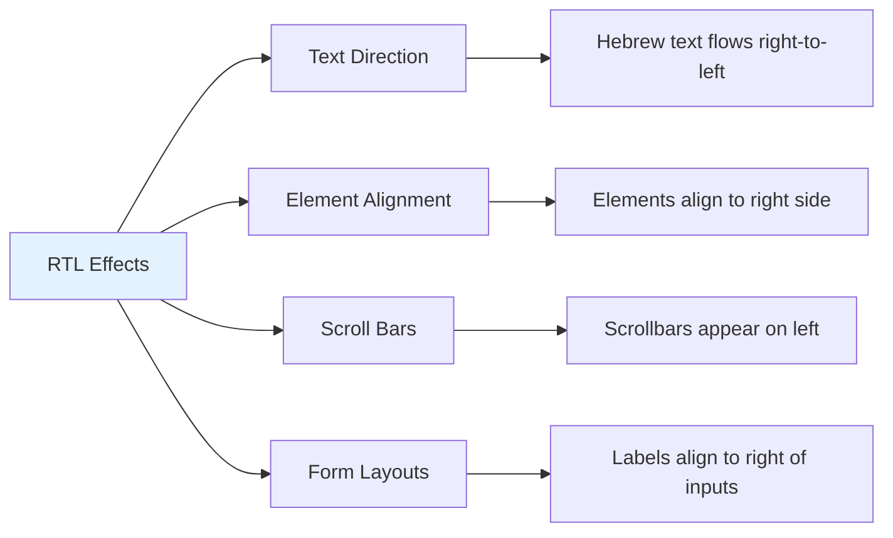

# הסבר מפורט - תבנית Thymeleaf עם עברית ו-RTL

<div dir="rtl">

## סקירה כללית של הקוד

הקוד הזה הוא תבנית HTML עם Thymeleaf - מנוע תבניות ב-Spring Boot שמאפשר לייצר דפי HTML דינמיים עם נתונים מהשרת.

## פירוק מפורט של כל שורה

### 1. DOCTYPE Declaration

</div>

```html
<!DOCTYPE html>
```

<div dir="rtl">

**מטרה:** מגדיר שזה מסמך HTML5 סטנדרטי
**פונקציה:** אומר לדפדפן איך לפרש את הקוד
**חשיבות:** ללא זה הדפדפן עלול להיכנס ל-"quirks mode" ולהתנהג בצורה לא צפויה

### 2. HTML Root Element עם הגדרות מיוחדות

</div>

```html
<html xmlns:th="http://www.thymeleaf.org" dir="rtl" lang="he">
```

<div dir="rtl">

#### פירוק האטריביוטים:

**`xmlns:th="http://www.thymeleaf.org"`**
- מגדיר namespace ל-Thymeleaf
- מאפשר שימוש באטריביוטים מיוחדים כמו `th:text`, `th:if` וכו'
- זה אומר לכלי הפיתוח שהתחילית `th:` שייכת ל-Thymeleaf

**`dir="rtl"`**
- מגדיר כיוון הטקסט מימין לשמאל (Right-To-Left)
- חיוני לשפות כמו עברית וערבית
- משפיע על סידור הטקסט, תפריטים, כפתורים וכל האלמנטים

**`lang="he"`**
- מגדיר שהשפה העיקרית של הדף היא עברית
- עוזר לדפדפנים ולכלי נגישות להבין את השפה
- משפיע על spell-checking, חיפוש וכלי תרגום

### 3. HEAD Section

</div>

```html
<head>
    <meta charset="UTF-8">
    <title>דוגמה בסיסית</title>
</head>
```

<div dir="rtl">

**`<meta charset="UTF-8">`**
- מגדיר קידוד תווים UTF-8
- חיוני לתמיכה בעברית ותווים מיוחדים
- חייב להיות בתחילת הhead כדי שהדפדפן יקרא נכון את השאר

**`<title>דוגמה בסיסית</title>`**
- כותרת הדף שמופיעה בטאב הדפדפן
- טקסט סטטי בעברית

### 4. BODY עם Thymeleaf Dynamic Content

#### כותרת דינמית:

</div>

```html
<h1 th:text="${message}">זוהי כותרת ברירת מחדל</h1>
```

<div dir="rtl">

**פירוק הרכיבים:**

**`th:text="${message}"`**
- אטריביוט Thymeleaf שמחליף את התוכן של האלמנט
- `${message}` זה Thymeleaf expression שמחפש משתנה בשם `message` מהmodel
- כשהדף מרונדר, Thymeleaf מחליף את כל התוכן הפנימי בערך של `message`

**`זוהי כותרת ברירת מחדל`**
- טקסט ברירת מחדל שמופיע רק כשפותחים את הHTML ישירות בדפדפן
- כשהדף עובר דרך Spring Boot, הטקסט הזה יוחלף לחלוטין

#### תאריך דינמי:

</div>

```html
<p>היום הוא: <span th:text="${#dates.format(currentDate, 'dd/MM/yyyy')}">01/01/2023</span></p>
```

<div dir="rtl">

**פירוק מפורט:**

**`היום הוא:`** - טקסט סטטי בעברית

**`th:text="${#dates.format(currentDate, 'dd/MM/yyyy')}"`**
- `#dates` זה Thymeleaf utility object לעיבוד תאריכים
- `format()` פונקציה לעיצוב תאריכים
- `currentDate` משתנה מהmodel שמכיל אובייקט Date
- `'dd/MM/yyyy'` פורמט התאריך: יום/חודש/שנה

**`01/01/2023`** - ברירת מחדל שמופיעה רק כשפותחים ישירות

## איך זה עובד עם Spring Boot

</div>



<div dir="rtl">

## דוגמה מהמערכת 

כך זה נראה ב-LoginController :

</div>

```java
@Controller
@RequiredArgsConstructor
public class LoginController {

    @GetMapping("/home")
    public String home(Model model) {
        // Add data to the model
        model.addAttribute("message", "ברוכים הבאים לדף הבית");
        model.addAttribute("currentDate", new Date());
        
        return "home";  // Returns home.html template
    }
}
```

<div dir="rtl">

## תהליך ה-Render המלא

```mermaid
graph TD
    A[Browser Request: GET /home] --> B[Spring Controller]
    B --> C[Create Model Object]
    C --> D[Add message attribute]
    C --> E[Add currentDate attribute]
    D --> F[Return template name: home]
    E --> F

    F --> G[Thymeleaf Engine]
    G --> H[Load home.html from templates/]
H --> I[Parse HTML + th: attributes]

I --> J[Process message variable]
J --> K[Replace with Hebrew welcome text]

I --> L[Process date formatting]
L --> M[Replace with 16/06/2025]

K --> N[Complete HTML Document]
M --> N
N --> O[Send to Browser]

style G fill:#023567
style N fill:#012345
```

</div>



<div dir="rtl">

## HTML הסופי שהדפדפן מקבל

לאחר עיבוד Thymeleaf, הדפדפן מקבל HTML נקי כזה:

</div>

```html
<!DOCTYPE html>
<html dir="rtl" lang="he">
<head>
    <meta charset="UTF-8">
    <title>דוגמה בסיסית</title>
</head>
<body>
    <h1>ברוכים הבאים לדף הבית</h1>
    <p>היום הוא: <span>16/06/2025</span></p>
</body>
</html>
```

<div dir="rtl">

**שים לב:** כל האטריביוטים `:th` נעלמו! Thymeleaf מעבד אותם ומחזיר HTML רגיל.

## Thymeleaf Expressions מפורט

### 1. Variable Expressions: `{...}$`

</div>

```html
<!-- Access model attributes -->
<span th:text="${message}">default text</span>
<span th:text="${user.name}">default name</span>
<span th:text="${user.getRoles()}">default roles</span>
```

<div dir="rtl">

### 2. Utility Objects: `...#

</div>

```html
<!-- Date utilities -->
<span th:text="${#dates.format(date, 'yyyy-MM-dd')}">2023-01-01</span>
<span th:text="${#dates.dayOfWeek(date)}">Monday</span>

<!-- String utilities -->
<span th:text="${#strings.toUpperCase(message)}">DEFAULT</span>
<span th:text="${#strings.length(message)}">0</span>

<!-- Number utilities -->
<span th:text="${#numbers.formatDecimal(price, 1, 2)}">0.00</span>
```

<div dir="rtl">

### 3. Selection Expressions: `{...}*`

</div>

```html
<!-- Used with th:object -->
<div th:object="${user}">
    <span th:text="*{name}">default name</span>
    <span th:text="*{email}">default email</span>
</div>
```

<div dir="rtl">

## RTL ו-Hebrew Support מפורט

### 1. כיוון הטקסט

</div>

```css
/* What dir="rtl" does automatically: */
html[dir="rtl"] {
    direction: rtl;
    text-align: start; /* right in RTL */
}

html[dir="rtl"] p {
    text-align: right;
}

html[dir="rtl"] ul {
    padding-right: 40px;
    padding-left: 0;
}
```

<div dir="rtl">

### 2. השפעה על Layout

</div>



<div dir="rtl">

## דוגמאות מתקדמות

### עם תנאים:

</div>

```html
<div th:if="${user.isAdmin()}">
    <h2>ברוכים הבאים, מנהל!</h2>
</div>

<div th:unless="${user.isAdmin()}">
    <h2>ברוכים הבאים, משתמש רגיל!</h2>
</div>
```

<div dir="rtl">

### עם לולאות:

</div>

```html
<ul>
    <li th:each="role : ${user.roles}" th:text="${role.name}">Default Role</li>
</ul>
```

<div dir="rtl">

### עם פורמטים מתקדמים:

</div>

```html
<!-- Hebrew month names -->
<span th:text="${#dates.format(date, 'dd בMMMM yyyy', new java.util.Locale('he', 'IL'))}">
    01 בינואר 2023
</span>

<!-- Currency in Hebrew -->
<span th:text="${#numbers.formatCurrency(price, new java.util.Locale('he', 'IL'))}">
    ₪0.00
</span>
```

<div dir="rtl">

## ביצועים ו-Caching

### איך Thymeleaf עובד ב-Production:

```mermaid
graph TD
    A[First Request] --> B[Parse Template]
    B --> C[Create AST]
    C --> D[Cache Template]
    D --> E[Render with Data]
    
    F[Subsequent Requests] --> G[Use Cached Template]
    G --> E
    
    style D fill:#012345
    style G fill:#345678
```

</div>



<div dir="rtl">

### הגדרות Production:

</div>

```properties
# application.properties for production
spring.thymeleaf.cache=true
spring.thymeleaf.prefix=classpath:/templates/
spring.thymeleaf.suffix=.html
spring.thymeleaf.encoding=UTF-8
spring.thymeleaf.servlet.content-type=text/html
```

<div dir="rtl">

## השוואה: Thymeleaf vs JSON API

| היבט | Thymeleaf Template | JSON API |
|------|-------------------|----------|
| **Output** | HTML מלא | JSON data |
| **Processing** | Server-side rendering | Client-side rendering |
| **SEO** | טוב - content בHTML | דורש server-side rendering נוסף |
| **Performance** | מהיר לעמוד ראשון | מהיר לאינטראקציות |
| **Complexity** | פשוט יותר | דורש JavaScript framework |

## Debug Tips ל-Thymeleaf

### 1. הצגת משתנים:

</div>

```html
<!-- Show all model attributes for debugging -->
<div th:each="entry : ${#ctx.variables}">
    <p th:text="${entry.key + ' = ' + entry.value}">variable = value</p>
</div>
```

<div dir="rtl">

### 2. תנאי debug:

</div>

```html
<!-- Show only in development -->
<div th:if="${#ctx.environment.acceptsProfiles('dev')}">
    <h3>Debug Info:</h3>
    <p th:text="${message}">debug message</p>
</div>
```

<div dir="rtl">

### 3. בדיקה בדפדפן:

</div>

```html
<!-- This will show in browser's view-source -->
<!-- th:text replaces content but preserves default for static viewing -->
<span th:text="${actualValue}">This shows when opening HTML directly</span>
```

<div dir="rtl">

## Best Practices לעברית ו-RTL

### 1. תמיד לציין:

</div>

```html
<html dir="rtl" lang="he">
<meta charset="UTF-8">
```

<div dir="rtl">

### 2. CSS RTL-friendly:

</div>

```css
/* Use logical properties instead of left/right */
.button {
    margin-inline-start: 10px; /* not margin-left */
    padding-inline: 15px;      /* not padding-left/right */
}
```

<div dir="rtl">

### 3. Forms בעברית:

</div>

```html
<form>
    <label for="username">שם משתמש:</label>
    <input type="text" id="username" name="username" dir="ltr">
    
    <label for="message">הודעה:</label>
    <textarea id="message" name="message" dir="rtl"></textarea>
</form>
```

<div dir="rtl">

## לסיכום

הקוד הוא דוגמה מושלמת לשימוש ב-Thymeleaf עם תמיכה מלאה בעברית:

1. **DOCTYPE** - מגדיר HTML5 תקני
2. **Thymeleaf namespace** - מאפשר שימוש ב-th: attributes
3. **RTL + Hebrew** - תמיכה מלאה בכיוון ושפה
4. **UTF-8** - קידוד תקני לעברית
5. **Dynamic content** - משתנים מהשרת
6. **Date formatting** - עיצוב תאריכים
7. **Fallback content** - ברירת מחדל לפיתוח

זה בסיס מצוין לבניית אפליקציות web בעברית עם Spring Boot!

</div>