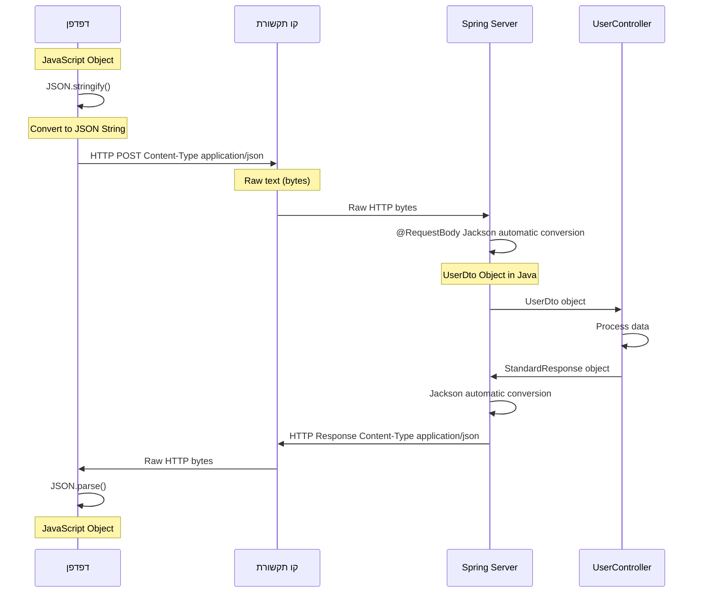
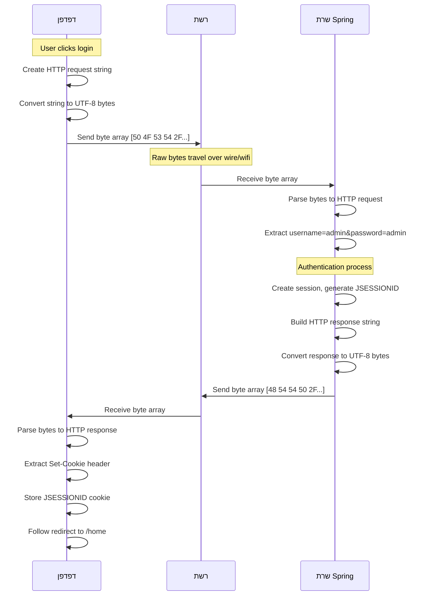
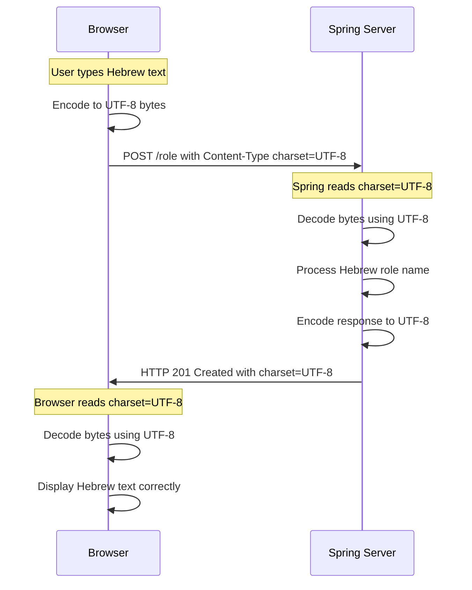
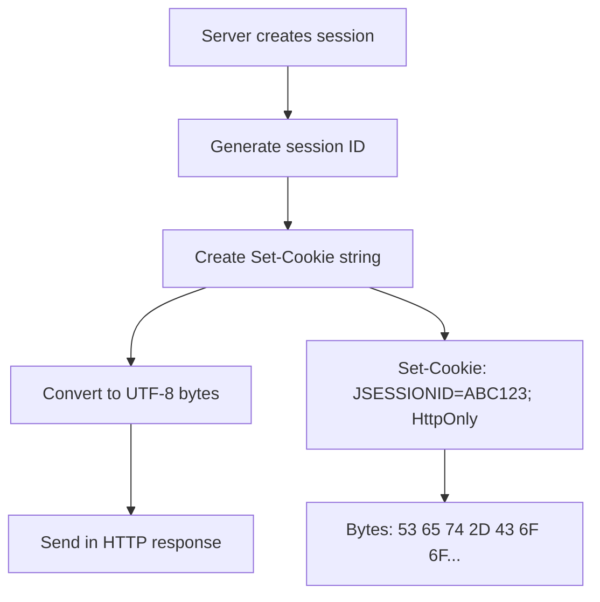
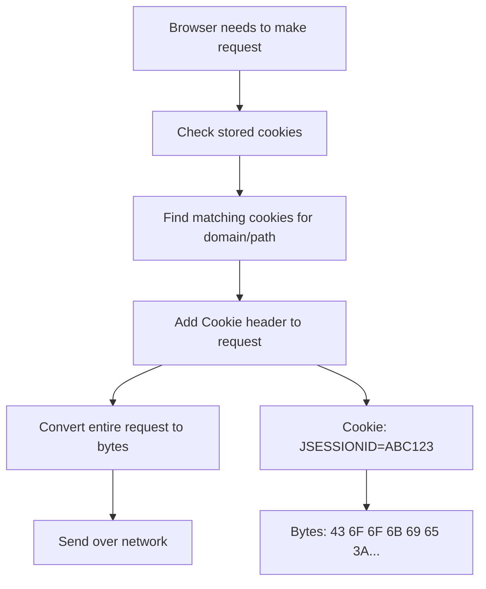

<div dir="rtl">

# מדריך מקיף - תקשורת רשת, HTTP ו-JSON

## מה באמת נשלח על הקו ברשת?

כשאנחנו שולחים נתונים בין דפדפן לשרת, **הכל נשלח כטקסט** (סדרה של bytes שמייצגים תווים). JSON אינו פורמט בינארי - זה פשוט **מחרוזת טקסט מובנית** שנראית כמו אובייקט JavaScript.

בואו נבין בדיוק מה קורה כשמתקשרים בין דפדפן לשרת - **`הכל הופך ל-bytes`** - סדרה של מספרים בין 0-255 שעוברים דרך החוטים או האוויר.

## דוגמה מהקוד - רישום משתמש חדש

בואו נראה מה קורה כשמרשמים משתמש חדש ב-`register/`:

</div>


```mermaid
sequenceDiagram
    participant Browser as דפדפן
    participant Network as קו תקשורת
    participant Spring as Spring Server
    participant Controller as UserController
    
    Note over Browser: JavaScript Object
    Browser->>Browser: JSON.stringify()
    Note over Browser: Convert to JSON String
    
    Browser->>Network: HTTP POST Content-Type application/json
    Note over Network: Raw text (bytes)
    
    Network->>Spring: Raw HTTP bytes
    Spring->>Spring: @RequestBody Jackson automatic conversion
    Note over Spring: UserDto Object in Java
    
    Spring->>Controller: UserDto object
    Controller->>Controller: Process data
    Controller->>Spring: StandardResponse object
    
    Spring->>Spring: Jackson automatic conversion
    Spring->>Network: HTTP Response Content-Type application/json
    
    Network->>Browser: Raw HTTP bytes
    Browser->>Browser: JSON.parse()
    Note over Browser: JavaScript Object
```

<div dir="rtl">

## מבנה HTTP Request מלא ברמת הBytes

כשמשתמש מתחבר למערכת , זה מה שבאמת עובר על הקו:

</div>


```mermaid
graph TD
    A[Browser creates HTTP request] --> B[Convert to UTF-8 bytes]
    B --> C[Add HTTP headers as bytes]
    C --> D[Add cookies as bytes]
    D --> E[Send byte stream over network]
    
    E --> F[Server receives byte stream]
    F --> G[Parse HTTP headers from bytes]
    G --> H[Extract cookies from bytes]
    H --> I[Decode body using charset]
    I --> J[Process request]
    
    style B fill:#012345
    style E fill:#012345
    style I fill:#012345
```

<div dir="rtl">

## מה באמת נשלח על הקו?

### כשהדפדפן שולח בקשה ל-`register/`:

</div>

```http
POST /register HTTP/1.1
Host: localhost:8080
Content-Type: application/json
Content-Length: 65

{"username":"newuser","password":"pass123","roles":["USER"]}
```

<div dir="rtl">

**זה מה שבאמת עובר על הקו** - טקסט גולמי! כל תו נשלח כ-byte אחד או יותר (תלוי בקידוד UTF-8).

### כשהשרת מחזיר תשובה:

</div>

```http
HTTP/1.1 201 Created
Content-Type: application/json;charset=UTF-8
Content-Length: 98
Date: Sat, 14 Jun 2025 10:30:00 GMT

{"status":"success","data":{"username":"newuser","roles":["USER"]},"error":null}
```

<div dir="rtl">

## דוגמה מעשית: התחברות למערכת ברמת Bytes

כשמשתמש מתחבר ב-`login/`, זה מה שבאמת עובר על הקו:

### 1. HTTP Request ב-Bytes:

</div>

```
POST /login HTTP/1.1
Host: localhost:8080
Content-Type: application/x-www-form-urlencoded
Content-Length: 27
Connection: keep-alive
User-Agent: Mozilla/5.0 (Windows NT 10.0; Win64; x64)

username=admin&password=admin
```

<div dir="rtl">

### 2. המרה לBytes (UTF-8):

</div>

```
Bytes in hexadecimal:
50 4F 53 54 20 2F 6C 6F 67 69 6E 20 48 54 54 50  // POST /login HTTP
2F 31 2E 31 0D 0A                                 // /1.1\r\n
48 6F 73 74 3A 20 6C 6F 63 61 6C 68 6F 73 74 3A  // Host: localhost:
38 30 38 30 0D 0A                                 // 8080\r\n
43 6F 6E 74 65 6E 74 2D 54 79 70 65 3A 20 61 70  // Content-Type: ap
70 6C 69 63 61 74 69 6F 6E 2F 78 2D 77 77 77 2D  // plication/x-www-
66 6F 72 6D 2D 75 72 6C 65 6E 63 6F 64 65 64 0D  // form-urlencoded\r
0A                                                 // \n
43 6F 6E 74 65 6E 74 2D 4C 65 6E 67 74 68 3A 20  // Content-Length: 
32 37 0D 0A                                       // 27\r\n
0D 0A                                             // \r\n (empty line)
75 73 65 72 6E 61 6D 65 3D 61 64 6D 69 6E 26 70  // username=admin&p
61 73 73 77 6F 72 64 3D 61 64 6D 69 6E           // assword=admin
```

<div dir="rtl">

## HTTP Response עם Cookie - ברמת הBytes

כשהשרת מחזיר תשובה עם JSESSIONID:

### 1. HTTP Response כטקסט:

</div>

```
HTTP/1.1 302 Found
Location: /home
Set-Cookie: JSESSIONID=A1B2C3D4E5F6G7H8; Path=/; HttpOnly
Content-Length: 0
Date: Sat, 14 Jun 2025 10:30:00 GMT
```

<div dir="rtl">

### 2. Cookie כBytes:

</div>

```
Set-Cookie header as bytes:
53 65 74 2D 43 6F 6F 6B 69 65 3A 20        // "Set-Cookie: "
4A 53 45 53 53 49 4F 4E 49 44 3D           // "JSESSIONID="
41 31 42 32 43 33 44 34 45 35 46 36        // "A1B2C3D4E5F6"
47 37 48 38 3B 20                          // "G7H8; "
50 61 74 68 3D 2F 3B 20                    // "Path=/; "
48 74 74 70 4F 6E 6C 79                    // "HttpOnly"
0D 0A                                       // "\r\n"
```

<div dir="rtl">

## JSON Serialization ברמת הBytes

כשהשרת מחזיר JSON (למשל ב-`status/`):

### 1. Java Object:

</div>

```java
StandardResponse response = new StandardResponse(
    "success", 
    "You are logged in as User name: admin!", 
    null
);
```

<div dir="rtl">

### 2. Jackson Serialization ל-String:

</div>

```json
{
  "status": "success",
  "data": "You are logged in as User name: admin!",
  "error": null
}
```

<div dir="rtl">

### 3. JSON String כBytes (UTF-8):

</div>

```
JSON bytes in hexadecimal:
7B 0A 20 20 22 73 74 61 74 75 73 22 3A 20 22 73  // {"  "status": "s
75 63 63 65 73 73 22 2C 0A 20 20 22 64 61 74 61  // uccess",\n  "data
22 3A 20 22 59 6F 75 20 61 72 65 20 6C 6F 67 67  // ": "You are logg
65 64 20 69 6E 20 61 73 20 55 73 65 72 20 6E 61  // ed in as User na
6D 65 3A 20 61 64 6D 69 6E 21 22 2C 0A 20 20 22  // me: admin!",\n  "
65 72 72 6F 72 22 3A 20 6E 75 6C 6C 0A 7D        // error": null\n}
```

<div dir="rtl">

## Character Encoding ב-HTTP - איך הצד המקבל יודע מה הקידוד?

### השאלה המרכזית

כשהשרת שולח bytes ברשת, איך הדפדפן יודע אם זה UTF-8, UTF-16, ASCII או קידוד אחר?

**התשובה:** דרך **HTTP Headers** שמציינים את סוג הקידוד!

## HTTP Headers - המפתח לפתרון

</div>


```mermaid
graph TD
    A[Spring Boot Server] --> B[HTTP Response]
    B --> C[Headers]
    B --> D[Body - bytes]
    
    C --> E["Content-Type: application/json<br/>charset=UTF-8"]
    C --> F["Content-Length: 156"]
    C --> G["Other headers..."]
    
    D --> H["Actual JSON bytes<br/>[0x7B, 0x22, 0x73, 0x74...]"]
    
    I[Browser] --> J[Read Headers First]
    J --> K[Parse charset=UTF-8]
    K --> L[Decode bytes using UTF-8]
    L --> M[Get JSON string]
    
    style E fill:#012345
    style K fill:#012345
```

<div dir="rtl">

**שימו לב ל:** `Content-Type: application/json;charset=UTF-8`

זה אומר לדפדפן: "הbytes האלה הם JSON שמקודד ב-UTF-8"

## סוגי Encoding עיקריים

</div>


```mermaid
graph LR
    A[Character Encodings] --> B[ASCII - 7 bit]
    A --> C[UTF-8 - Variable length]
    A --> D[UTF-16 - 16 bit units]
    A --> E[ISO-8859-1 - Latin-1]
    A --> F[Windows-1252]
    
    C --> G[Most common today]
    D --> H[Used in Java internally]
    E --> I[Legacy European]
    
    style C fill:#012345
    style G fill:#012345
```

<div dir="rtl">

### UTF-8 (הנפוץ ביותר):
- **גודל:** 1-4 bytes לכל תו
- **תואם ASCII:** התווים הראשונים זהים ל-ASCII
- **תומך בכל השפות:** אנגלית, עברית, אמוג'י, וכו'
- **ברירת מחדל ב-Spring Boot**

### UTF-16:
- **גודל:** 2-4 bytes לכל תו
- **משתמש ב-Java:** String פנימי ב-Java
- **פחות נפוץ ב-HTTP**

### ASCII:
- **גודל:** 1 byte לכל תו
- **רק אנגלית:** A-Z, 0-9, סימנים בסיסיים
- **מוגבל מאוד**

## Character Encoding על הקו

### UTF-8 Encoding דוגמאות:

</div>

```
ASCII characters (1 byte each):
'a' = 0x61 = 97
'A' = 0x41 = 65
'1' = 0x31 = 49
' ' = 0x20 = 32


Hebrew characters (2-3 bytes each):
```

<div dir="rtl">

`'א' = 0xD7 0x90 = [215, 144]`

`'ב' = 0xD7 0x91 = [215, 145]`

`'ג' = 0xD7 0x92 = [215, 146]`

</div>

```

Special characters:
'\r' = 0x0D = 13 (carriage return)
'\n' = 0x0A = 10 (line feed)
'"' = 0x22 = 34 (double quote)
'{' = 0x7B = 123 (open brace)
'}' = 0x7D = 125 (close brace)
```

<div dir="rtl">

## איך Spring Boot מגדיר את הencoding?

במערכת , Spring Boot אוטומטית מגדיר UTF-8:

</div>

```java
// Spring Boot automatically adds this header:
// Content-Type: application/json;charset=UTF-8

@PostMapping("/role")
public ResponseEntity<StandardResponse> createRole(@Valid @RequestBody RoleDto roleDto) {
    // When you return this object...
    StandardResponse response = new StandardResponse("success", createdRole, null);
    return ResponseEntity.created(location).body(response);
    
    // Spring adds UTF-8 charset automatically
}
```

<div dir="rtl">

## מה קורה אם אין charset header?

</div>


```mermaid
graph TD
    A[HTTP Response] --> B{charset specified?}
    B -->|Yes| C[Use specified charset]
    B -->|No| D[Browser guesses]
    
    D --> E[Check BOM]
    D --> F[Content analysis]
    D --> G[Default charset]
    
    E --> H{BOM found?}
    H -->|Yes| I[Use BOM charset]
    H -->|No| F
    
    F --> J[Analyze byte patterns]
    J --> K[Statistical guessing]
    
    G --> L[Usually UTF-8 or ISO-8859-1]
    
    style C fill:#012345
    style K fill:#012345
    style L fill:#012345
```

<div dir="rtl">

### BOM (Byte Order Mark):
מבין מיוחד בתחילת הקובץ שמציין encoding:

</div>

```
UTF-8 BOM:    EF BB BF
UTF-16 BE:    FE FF  
UTF-16 LE:    FF FE
UTF-32 BE:    00 00 FE FF
```

<div dir="rtl">

## דוגמה מעשית - תו עברית

בואו נראה מה קורה כשמשתמש רושם בעברית:

</div>

```java
// User creates role with Hebrew name
RoleDto roleDto = new RoleDto();
roleDto.setRoleName("מנהל");

// What happens in different encodings:
```

<div dir="rtl">

### אותו תו בencodings שונים:

</div>


```mermaid
graph TD
    A["תו: מ"] --> B[UTF-8]
    A --> C[UTF-16]
    A --> D[ISO-8859-8]
    
    B --> E["Bytes: D7 9E"]
    C --> F["Bytes: 05 DE"]  
    D --> G["Bytes: EE"]
    
    style B fill:#012345
    style E fill:#012345
```

<div dir="rtl">

**אם הדפדפן מנחש לא נכון:** התו יראה כמו שטויות!

## זרימת תקשורת מלאה - רמת Bytes

</div>


```mermaid
sequenceDiagram
    participant Browser as דפדפן
    participant Network as רשת
    participant Server as שרת Spring
    
    Note over Browser: User clicks login
    Browser->>Browser: Create HTTP request string
    Browser->>Browser: Convert string to UTF-8 bytes
    
    Browser->>Network: Send byte array [50 4F 53 54 2F...]
    Note over Network: Raw bytes travel over wire/wifi
    
    Network->>Server: Receive byte array
    Server->>Server: Parse bytes to HTTP request
    Server->>Server: Extract username=admin&password=admin
    
    Note over Server: Authentication process
    Server->>Server: Create session, generate JSESSIONID
    Server->>Server: Build HTTP response string
    Server->>Server: Convert response to UTF-8 bytes
    
    Server->>Network: Send byte array [48 54 54 50 2F...]
    Network->>Browser: Receive byte array
    
    Browser->>Browser: Parse bytes to HTTP response
    Browser->>Browser: Extract Set-Cookie header
    Browser->>Browser: Store JSESSIONID cookie
    Browser->>Browser: Follow redirect to /home
```

<div dir="rtl">

## HTTP Request ו-Response flow מלא

</div>


```mermaid
sequenceDiagram
    participant Browser as Browser
    participant Server as Spring Server

    Note over Browser: User types Hebrew text
    Browser->>Browser: Encode to UTF-8 bytes
    Browser->>Server: POST /role with Content-Type charset=UTF-8

    Note over Server: Spring reads charset=UTF-8
    Server->>Server: Decode bytes using UTF-8
    Server->>Server: Process Hebrew role name
    Server->>Server: Encode response to UTF-8

    Server->>Browser: HTTP 201 Created with charset=UTF-8

    Note over Browser: Browser reads charset=UTF-8
    Browser->>Browser: Decode bytes using UTF-8
    Browser->>Browser: Display Hebrew text correctly
```

<div dir="rtl">

## מה קורה אם יש אי-התאמה?

### תרחיש 1: שליחה ב-UTF-8, קריאה ב-ISO-8859-1

</div>

```
Original: מנהל
UTF-8 bytes: D7 9E D7 A0 D7 94 D7 9C
Interpreted as ISO-8859-1: מן×"ל
```

<div dir="rtl">

### תרחיש 2: שליחה ב-ISO-8859-8, קריאה ב-UTF-8

</div>

```
Original: מנהל  
ISO-8859-8 bytes: EE E0 E3 EC
Interpreted as UTF-8: îàãì (or error)
```

<div dir="rtl">

## Cookie Lifecycle ברמת Bytes

### יצירת Cookie:

</div>


```mermaid
graph TD
    A[Server creates session] --> B[Generate session ID]
    B --> C[Create Set-Cookie string]
    C --> D[Convert to UTF-8 bytes]
    D --> E[Send in HTTP response]
    
    C --> F["Set-Cookie: JSESSIONID=ABC123; HttpOnly"]
    F --> G[Bytes: 53 65 74 2D 43 6F 6F...]
```

<div dir="rtl">

### שליחת Cookie בבקשה הבאה:

</div>


```mermaid
graph TD
    A[Browser needs to make request] --> B[Check stored cookies]
    B --> C[Find matching cookies for domain/path]
    C --> D[Add Cookie header to request]
    D --> E[Convert entire request to bytes]
    E --> F[Send over network]
    
    D --> G["Cookie: JSESSIONID=ABC123"]
    G --> H[Bytes: 43 6F 6F 6B 69 65 3A...]
```

<div dir="rtl">

## תהליך ההמרות במערכת 

### בצד הדפדפן (JavaScript):

</div>

```javascript
// 1. JavaScript Object
const userData = {
    username: "newuser",
    password: "pass123", 
    roles: ["USER"]
};

// 2. Convert to JSON string for sending
const jsonString = JSON.stringify(userData);
// Result: '{"username":"newuser","password":"pass123","roles":["USER"]}'

// 3. Send via HTTP request
fetch('/register', {
    method: 'POST',
    headers: {
        'Content-Type': 'application/json'
    },
    body: jsonString  // This is what's sent over the wire!
});

// 4. Receive response and convert back
response.json().then(data => {
    // Browser runs JSON.parse() on the received text
    console.log(data); // Now it's a JavaScript object again
});
```

<div dir="rtl">

### בצד השרת (Spring Boot):

בקוד  ב-`UserController`:

</div>

```java
@PostMapping("/register")
public ResponseEntity<StandardResponse> register(@Valid @RequestBody UserDto userDto) {
    // Spring Jackson already converted the text to UserDto object
    // userDto is now a complete Java object
    
    UserResponseDto registeredUser = userService.registerUser(userDto);
    
    StandardResponse response = new StandardResponse("success", registeredUser, null);
    
    // When returning - Spring Jackson automatically converts the object to JSON string
    return ResponseEntity.created(location).body(response);
}
```

<div dir="rtl">

## Jackson - המנוע שמבצע את הקסם

Spring משתמש ב-Jackson library שמטפל בהמרות אוטומטית:

</div>


```mermaid
graph TD
    A["HTTP Request<br/>(טקסט JSON)"] --> B[Jackson ObjectMapper]
    B --> C["Java Object<br/>(UserDto)"]
    
    D["Java Object<br/>(StandardResponse)"] --> E[Jackson ObjectMapper]
    E --> F["HTTP Response<br/>(טקסט JSON)"]
    
    style B fill:#012345
    style E fill:#012345
```

<div dir="rtl">

## דוגמה קונקרטית מהקוד 

כשהדפדפן שולח בקשה ליצירת תפקיד חדש:

### 1. מה הדפדפן שולח על הקו:

</div>

```http
POST /role HTTP/1.1
Content-Type: application/json

{"roleName":"MANAGER"}
```

<div dir="rtl">

### 2. Spring מקבל וממיר:

</div>

```java
// RoleController.java
@PostMapping("/role")
public ResponseEntity<StandardResponse> createRole(@Valid @RequestBody RoleDto roleDto) {
    // roleDto.getRoleName() will return "MANAGER"
    RoleDto roleName = roleService.addRole(roleDto.getRoleName());
    // ...
}
```

<div dir="rtl">

### 3. השרת מחזיר על הקו:

</div>

```http
HTTP/1.1 201 Created
Content-Type: application/json

{"status":"success","data":{"roleName":"MANAGER"},"error":null}
```

<div dir="rtl">

## תקשורת HTTPS - הצפנה ברמת Bytes

כשהמערכת רצה על HTTPS, כל הbytes מוצפנים:

</div>


```mermaid
graph LR
    A[Original HTTP bytes] --> B[TLS Encryption]
    B --> C[Encrypted bytes on wire]
    C --> D[TLS Decryption]
    D --> E[Original HTTP bytes]
    
    A --> A1["50 4F 53 54 2F 6C 6F 67 69 6E..."]
    C --> C1["8F A2 C4 E1 9B 7D F3 5A..."]
    E --> E1["50 4F 53 54 2F 6C 6F 67 69 6E..."]
    
    style C fill:#012345
```

<div dir="rtl">

## דוגמה מלאה: רישום משתמש חדש

### 1. Browser POST Request:

</div>

```http
POST /register HTTP/1.1
Host: localhost:8080
Content-Type: application/json
Cookie: JSESSIONID=A1B2C3D4E5F6G7H8
Content-Length: 89

{
  "username": "newuser",
  "password": "password123",
  "roles": ["USER"]
}
```

<div dir="rtl">

### 2. Request כBytes (מקוצר):

</div>

```
Header bytes:
50 4F 53 54 20 2F 72 65 67 69 73 74 65 72 20 48  // POST /register H
54 54 50 2F 31 2E 31 0D 0A                       // TTP/1.1\r\n
48 6F 73 74 3A 20 6C 6F 63 61 6C 68 6F 73 74 3A  // Host: localhost:
38 30 38 30 0D 0A                                // 8080\r\n
43 6F 6E 74 65 6E 74 2D 54 79 70 65 3A 20 61 70  // Content-Type: ap
70 6C 69 63 61 74 69 6F 6E 2F 6A 73 6F 6E 0D 0A  // plication/json\r\n
43 6F 6F 6B 69 65 3A 20 4A 53 45 53 53 49 4F 4E  // Cookie: JSESSION
49 44 3D 41 31 42 32 43 33 44 34 45 35 46 36 47  // ID=A1B2C3D4E5F6G
37 48 38 0D 0A                                   // 7H8\r\n

Body bytes (JSON):
7B 0A 20 20 22 75 73 65 72 6E 61 6D 65 22 3A 20  // {\n  "username": 
22 6E 65 77 75 73 65 72 22 2C 0A 20 20 22 70 61  // "newuser",\n  "pa
73 73 77 6F 72 64 22 3A 20 22 70 61 73 73 77 6F  // ssword": "passwo
72 64 31 32 33 22 2C 0A 20 20 22 72 6F 6C 65 73  // rd123",\n  "roles
22 3A 20 5B 22 55 53 45 52 22 5D 0A 7D           // ": ["USER"]\n}
```

<div dir="rtl">

### 3. Server Response:

</div>

```http
HTTP/1.1 201 Created
Content-Type: application/json;charset=UTF-8
Content-Length: 156
Date: Sat, 14 Jun 2025 10:30:00 GMT

{
  "status": "success",
  "data": {
    "username": "newuser",
    "roles": ["USER"]
  },
  "error": null
}
```

<div dir="rtl">

## פענוח Bytes בדפדפן

כשהדפדפן מקבל bytes, זה התהליך:

</div>


```mermaid
graph TD
    A[Receive byte stream] --> B[Parse HTTP status line]
    B --> C[Parse headers line by line]
    C --> D[Extract Content-Type charset]
    D --> E[Read Content-Length bytes]
    E --> F[Decode body using charset]
    F --> G[Parse JSON to JavaScript object]
    
    D --> D1["charset=UTF-8"]
    F --> F1[JSON string]
    G --> G1[JavaScript object]
    
    style D1 fill:#012345
    style F1 fill:#012345
    style G1 fill:#012345
```

<div dir="rtl">

## Network Layer פירוט

### TCP/IP Stack:

</div>


```mermaid
graph TD
    A[Application Layer - HTTP] --> B[Transport Layer - TCP]
    B --> C[Network Layer - IP]
    C --> D[Data Link Layer - Ethernet/WiFi]
    D --> E[Physical Layer - Electrical signals]
    
    A --> A1[HTTP headers + JSON body]
    B --> B1[Add TCP headers, port numbers]
    C --> C1[Add IP headers, routing info]
    D --> D1[Add frame headers, MAC addresses]
    E --> E1[Convert to electrical/radio signals]
    
    style A1 fill:#012345
    style E1 fill:#012345
```

<div dir="rtl">

## HTTP Headers Analysis

### Headers:

</div>

```
Content-Type: application/json;charset=UTF-8
├── Media Type: application/json (tells receiver it's JSON)
├── Parameter: charset=UTF-8 (tells receiver how to decode bytes)
└── Total bytes: [43 6F 6E 74 65 6E 74 2D 54 79 70 65...]

Cookie: JSESSIONID=A1B2C3D4E5F6G7H8
├── Cookie Name: JSESSIONID
├── Cookie Value: A1B2C3D4E5F6G7H8
└── Total bytes: [43 6F 6F 6B 69 65 3A 20 4A 53 45...]

Content-Length: 156
├── Purpose: Tell receiver how many body bytes to read
├── Value: 156 (decimal)
└── Bytes: [43 6F 6E 74 65 6E 74 2D 4C 65 6E 67 74 68...]
```

<div dir="rtl">

## מה קורה כשיש שגיאה ברמת Bytes?

### תרחיש: בעיה ב-encoding

</div>


```mermaid
graph TD
    A[Server sends JSON with UTF-8] --> B[Network transmits bytes]
    B --> C[Browser assumes wrong encoding]
    C --> D[Garbled text display]

    A --> A1["JSON with Hebrew username"]
    A1 --> A2["UTF-8 bytes: 7B 22 75 73 65 72 6E 61 6D 65 22 3A 22 D7 9E D7 A0 D7 94 D7 9C 22 7D"]

    C --> C1[Browser decodes as ISO-8859-1]
    C1 --> D1["Display: username shows as gibberish"]

    style D1 fill:#012345
```

<div dir="rtl">

## איך להגדיר encoding במפורש ב-Spring?

אם רוצים לשלוט בencoding:

</div>

```java
// Option 1: In application.properties
// server.servlet.encoding.charset=UTF-8
// server.servlet.encoding.enabled=true
// server.servlet.encoding.force=true

// Option 2: Programmatically
@PostMapping(value = "/role", produces = "application/json;charset=UTF-8")
public ResponseEntity<StandardResponse> createRole(@Valid @RequestBody RoleDto roleDto) {
    // Explicitly specify UTF-8 in response
    return ResponseEntity.created(location)
        .contentType(MediaType.APPLICATION_JSON_UTF8) // Deprecated but explicit
        .body(response);
}

// Option 3: Global configuration
@Configuration
public class WebConfig implements WebMvcConfigurer {
    @Override
    public void configureMessageConverters(List<HttpMessageConverter<?>> converters) {
        converters.add(new MappingJackson2HttpMessageConverter());
    }
}
```

<div dir="rtl">

## Browser Detection - איך הדפדפן מנחש?

כשאין charset header, הדפדפן משתמש באלגוריתמים:

</div>


```mermaid
graph TD
    A[Received bytes] --> B[Check BOM]
    B --> C{BOM found?}
    C -->|Yes| D[Use BOM charset]
    C -->|No| E[Analyze byte patterns]
    
    E --> F[Statistical analysis]
    F --> G[High ASCII bytes?]
    G -->|Yes| H[Probably UTF-8]
    G -->|No| I[Probably ASCII/Latin-1]
    
    E --> J[Meta tags in HTML]
    J --> K[<meta charset= UTF-8>]
    
    style D fill:#012345
    style H fill:#012345
    style I fill:#012345
```

<div dir="rtl">

## debugging encoding problems

אם יש בעיות עם תווים מוזרים:

</div>

```java
// Debug: Print actual bytes being sent
@PostMapping("/role")  
public ResponseEntity<StandardResponse> createRole(@Valid @RequestBody RoleDto roleDto) {
    String roleName = roleDto.getRoleName();
    
    // Debug: Print bytes
    byte[] utf8Bytes = roleName.getBytes(StandardCharsets.UTF_8);
    System.out.println("UTF-8 bytes: " + Arrays.toString(utf8Bytes));
    
    byte[] isoBytes = roleName.getBytes(StandardCharsets.ISO_8859_1);
    System.out.println("ISO bytes: " + Arrays.toString(isoBytes));
    
    // Continue with normal processing...
}
```

<div dir="rtl">

## דוגמאות Network Debugging

### בדיקה עם Browser DevTools:

</div>

```javascript
// In browser console, you can inspect actual bytes:
fetch('/status')
  .then(response => response.text())
  .then(text => {
    console.log('Response text:', text);
    // Convert to bytes for inspection:
    const bytes = new TextEncoder().encode(text);
    console.log('Response bytes:', Array.from(bytes));
  });

// Example output:
// Response text: {"status":"success","data":"Hello"}
// Response bytes: [123, 34, 115, 116, 97, 116, 117, 115, 34, 58, 34, 115, 117, 99, 99, 101, 115, 115, 34, ...]
```

<div dir="rtl">

### בדיקה עם Wireshark/tcpdump:

</div>

```
# Raw packet capture showing HTTP over TCP:
0000: 45 00 00 3c 1c 46 40 00 40 06 b1 e6 c0 a8 01 64  E..<.F@.@......d
0010: c0 a8 01 65 13 88 1f 90 38 af c2 3a 38 af c2 3b  ...e....8..:8..;
0020: 80 18 00 e5 a4 f4 00 00 01 01 08 0a 23 ab 48 d6  ............#.H.
0030: 23 ab 48 d6 47 45 54 20 2f 73 74 61 74 75 73 20  #.H.GET /status 
0040: 48 54 54 50 2f 31 2e 31 0d 0a                    HTTP/1.1..
```

<div dir="rtl">

## Session Storage ברמת הBytes

### איך Session נשמר בשרת:

</div>

```java
// In memory session storage (simplified):
Map<String, HttpSession> sessionStore = new HashMap<>();

// When session is created:
String sessionId = generateSessionId(); // "A1B2C3D4E5F6G7H8"
HttpSession session = new HttpSession();
session.setAttribute("user", userDetails);
sessionStore.put(sessionId, session);

// Session ID as bytes when sent in cookie:
byte[] sessionIdBytes = sessionId.getBytes(StandardCharsets.UTF_8);
// Result: [65, 49, 66, 50, 67, 51, 68, 52, 69, 53, 70, 54, 71, 55, 72, 56]
```

<div dir="rtl">

## רשימת encodings נפוצים

| Encoding | תיאור | גודל לתו | שפות נתמכות |
|----------|--------|----------|--------------|
| ASCII | בסיסי | 1 byte | אנגלית בלבד |
| UTF-8 | נפוץ ביותר | 1-4 bytes | כל השפות |
| UTF-16 | Java פנימי | 2-4 bytes | כל השפות |  
| ISO-8859-1 | Latin-1 | 1 byte | מערב אירופה |
| ISO-8859-8 | עברית | 1 byte | עברית + לטינית |
| Windows-1255 | עברית Windows | 1 byte | עברית + לטינית |
| Windows-1252 | מערב אירופה | 1 byte | מערב אירופה |

## למה זה עובד ככה?

### יתרונות של JSON כטקסט:
1. **קריא לבני אדם** - אפשר לקרוא ולהבין
2. **עובר דרך firewalls וproxies** - זה סתם טקסט
3. **תואם לכל השפות** - כל שפה יודעת לעבד טקסט
4. **קל לdebugging** - אפשר לראות בדיוק מה נשלח

### תהליך ההמרה:

</div>


```mermaid
graph LR
    A[JavaScript Object] -->|JSON.stringify| B[JSON String]
    B -->|HTTP| C[Network Bytes]
    C -->|HTTP| D[JSON String] 
    D -->|Jackson Parse| E[Java Object]
    
    E -->|Jackson Serialize| F[JSON String]
    F -->|HTTP| G[Network Bytes]
    G -->|HTTP| H[JSON String]
    H -->|JSON.parse| I[JavaScript Object]
    
    style B fill:#012345
    style D fill:#012345
    style F fill:#012345
    style H fill:#012345
```

<div dir="rtl">

## Performance והשפעה על הרשת

### גודל הודעות :

</div>

```
Typical request sizes in your application:

Login request: ~200 bytes
├── Headers: ~150 bytes
└── Body: ~30 bytes ("username=admin&password=admin")

JSON API response: ~300-500 bytes  
├── Headers: ~200 bytes
└── Body: ~100-300 bytes (JSON data)

HTML page response: ~2000-10000 bytes
├── Headers: ~200 bytes  
└── Body: ~1800-9800 bytes (HTML content)

Static resource (CSS): ~5000-50000 bytes
├── Headers: ~150 bytes
└── Body: ~4850-49850 bytes (CSS content)
```

<div dir="rtl">

## שגיאות נפוצות והבנה מוטעית

### מה שלא נכון:
"JSON הוא פורמט בינארי מיוחד"
"הדפדפן שולח אובייקטים ישירות"
"השרת מבין JavaScript objects"

### מה שנכון:
JSON הוא **פורמט טקסט** בלבד
כל העברת נתונים היא **טקסט/bytes**
הדפדפן והשרת **ממירים** לפורמטים הפנימיים שלהם

## Best Practices

### תמיד כדאי:
1. **לציין charset בheaders** - `Content-Type: application/json;charset=UTF-8`
2. **להשתמש ב-UTF-8** - תומך בכל השפות
3. **לוודא consistency** - אותו encoding בשליחה ובקבלה
4. **לבדוק בbrowser dev tools** - מה באמת נשלח

### במערכת :
Spring Boot כבר עושה את כל זה אוטומטית! הוא מגדיר UTF-8 כברירת מחדל ומוסיף את הheaders הנכונים.

### אם יש בעיות עם תווים:
1. בדקו את הheaders ב-Network tab
2. וודאו שהמסד נתונים תומך ב-UTF-8
3. בדקו שהfront-end שולח UTF-8
4. השתמשו בtools לdebug הbytes הממשיים

## סיכום - המסע 

כל אינטראקציה במערכת עוברת את המחזור הזה:

1. **יצירה** - אובייקטים בJava/JavaScript הופכים למחרוזות
2. **Serialization** - מחרוזות הופכות לbytes עם encoding מסוים
3. **שליחה** - bytes עוברים על הרשת דרך TCP/IP
4. **קבלה** - bytes מתקבלים בצד השני
5. **Parsing** - bytes הופכים בחזרה למחרוזות עם הdecoding הנכון
6. **Deserialization** - מחרוזות הופכים בחזרה לאובייקטים

סיכום עבודה עם המערכת :

1. **הדפדפן** - עובד עם אובייקטי JavaScript, ממיר ל-JSON string לשליחה
2. **הקו** - עובר טקסט גולמי בפורמט JSON
3. **Spring** - מקבל טקסט, Jackson ממיר לאובייקטי Java
4. **התשובה** - Java objects → JSON string → דרך הקו → JavaScript objects

זה למה אנחנו צריכים הערות כמו `RequestBody@` ו-`ResponseBody@` ב-Spring - הן אומרות ל-framework לבצע המרות אוטומטיות בין אובייקטים לטקסט JSON.

הבנת התהליך הזה חיונית לdebug בעיות רשת, אופטימיזציה של ביצועים, ופתרון בעיות encoding. במערכת , זה קורה אלפי פעמים ביום - כל לחיצה, כל בקשה, כל תשובה.

</div>