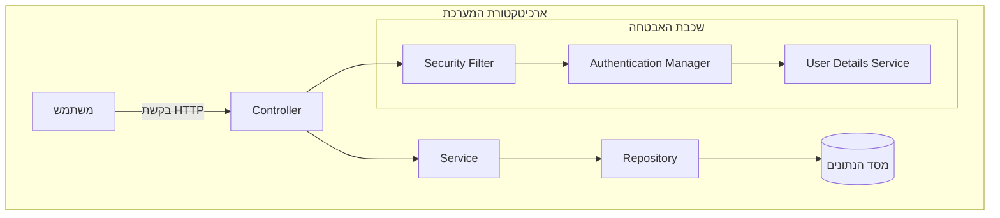
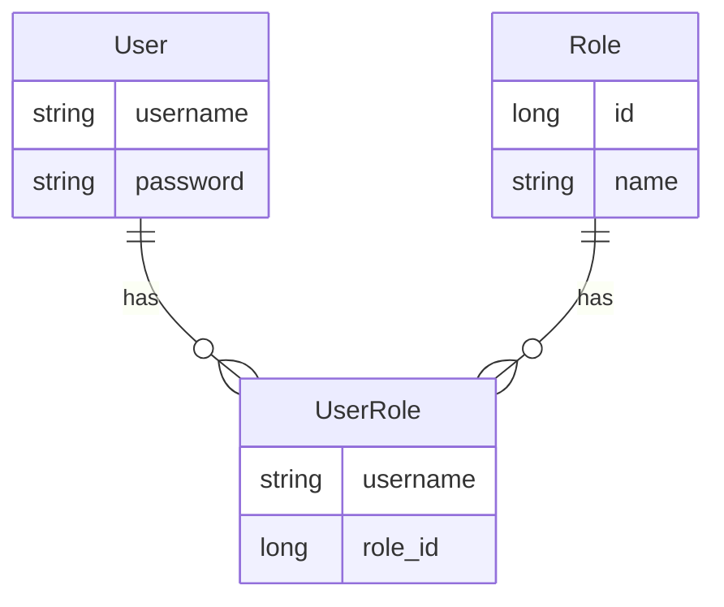
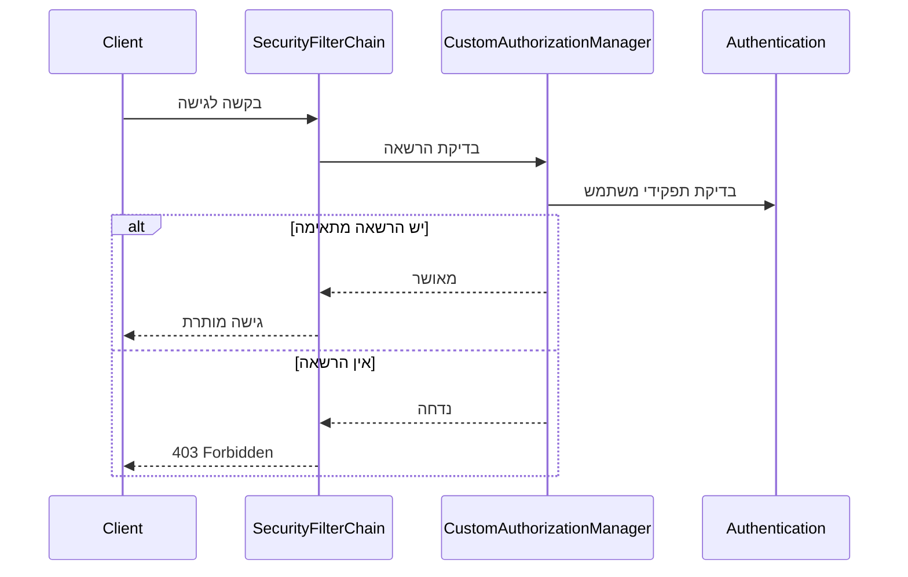
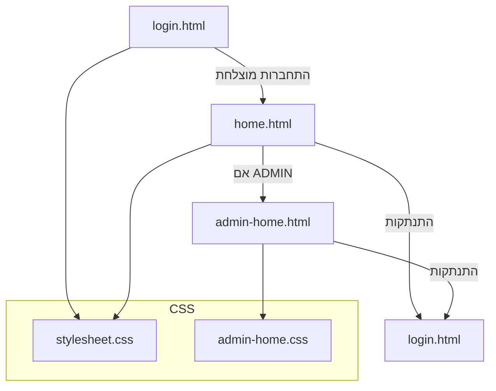
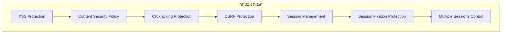
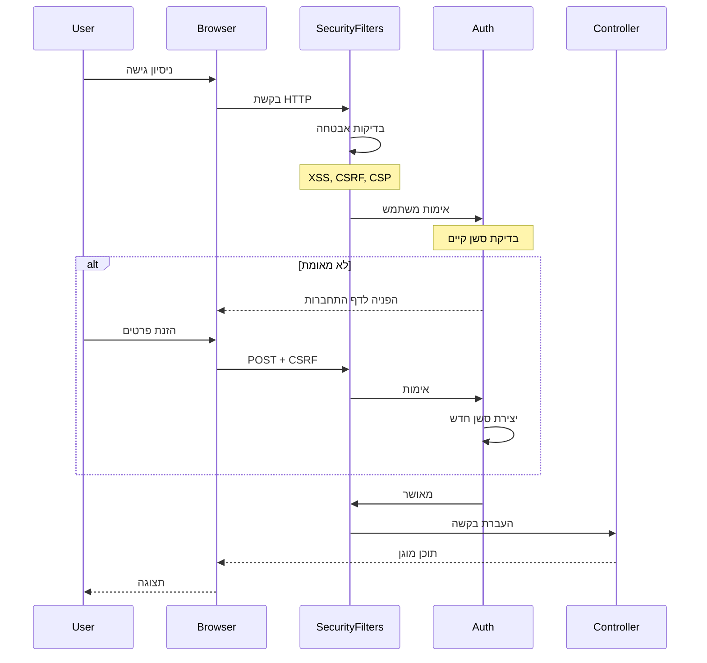

<div dir="rtl">

# מערכת אבטחה ב-Spring Security - שלבי הדרכה 3-6

## תוכן עניינים

- [סקירה כללית](#סקירה-כללית)
- [שלב 3 - מערכת אבטחה בסיסית](#שלב-3---מערכת-אבטחה-בסיסית)
- [שלב 4 - ניהול הרשאות מתקדם](#שלב-4---ניהול-הרשאות-מתקדם)
- [שלב 5 - ממשק משתמש מבוסס Web](#שלב-5---ממשק-משתמש-מבוסס-web)
- [שלב 6 - אבטחה מתקדמת](#שלב-6---אבטחה-מתקדמת)
- [סיכום ההתקדמות](#סיכום-ההתקדמות)

## סקירה כללית

הדרכה זו בנויה כסדרה של שלבים המדגימים את התפתחות מערכת אבטחה באמצעות Spring Security. כל שלב מוסיף פונקציונליות ותכונות אבטחה נוספות על קודמו.

### מבנה המערכת הבסיסי



## שלב 3 - מערכת אבטחה בסיסית

### תיאור
יצירת מערכת אבטחה בסיסית הכוללת אימות משתמשים ותפקידים.

### מרכיבים עיקריים
- מערכת לוגין בסיסית
- ניהול משתמשים ותפקידים
- הצפנת סיסמאות
- הגדרות אבטחה בסיסיות

### מבנה המודל



### תצורת האבטחה

</div>

```java
@Bean
public SecurityFilterChain filterChain(HttpSecurity http) throws Exception {
    http.csrf(AbstractHttpConfigurer::disable)
            .authorizeHttpRequests(auth -> auth
                    .requestMatchers("/login", "/role", "/register").permitAll()
                    .anyRequest().authenticated())
            .formLogin(form -> form
                    .loginProcessingUrl("/login")
                    .defaultSuccessUrl("/home", true)
                    .failureUrl("/login?error=true")
                    .permitAll());
    return http.build();
}
```

<div dir="rtl">

## שלב 4 - ניהול הרשאות מתקדם

### שינויים מרכזיים
- הוספת `CustomAuthorizationManager` לבקרת גישה מותאמת אישית
- הרחבת מערכת ההרשאות
- הוספת דף אדמין (admin_home)

### תהליך אימות הרשאות



### CustomAuthorizationManager

</div>

```java
public AuthorizationManager<RequestAuthorizationContext> hasRole(String role) {
    return (authenticationSupplier, context) -> {
        Authentication authentication = authenticationSupplier.get();
        if (authentication == null || !authentication.isAuthenticated()) {
            return new AuthorizationDecision(false);
        }
        
        boolean hasRole = authentication.getAuthorities().stream()
                .anyMatch(auth -> auth.getAuthority().equals(role));
        return new AuthorizationDecision(hasRole);
    };
}
```

<div dir="rtl">

### הגדרת הרשאות מתקדמות

</div>

```java
.authorizeHttpRequests(auth -> auth
    .requestMatchers("/login").permitAll()
    .requestMatchers("/role", "/register", "/admin_home")
        .access(customAuthorizationManager.hasRole("ROLE_ADMIN"))
    .requestMatchers("/home").hasAnyRole("USER", "ADMIN")
    .anyRequest().authenticated())
```

<div dir="rtl">

## שלב 5 - ממשק משתמש מבוסס Web

### שינויים מרכזיים
- הוספת דפי HTML סטטיים
- דפי התחברות ובית מותאמים אישית
- דף ניהול לאדמין
- CSS לעיצוב

### מבנה הדפים



### תצוגת המשתמש

</div>

```html
<!-- home.html -->
<h2 sec:authentication="name">Welcome, User!</h2>
<h3>Your roles are:
    <span th:each="auth, iterStat : ${#authentication.principal.authorities}"
          th:text="${#strings.replace(auth, 'ROLE_', '') + (!iterStat.last ? ', ' : '')}">
    </span>
</h3>
```

<div dir="rtl">

## שלב 6 - אבטחה מתקדמת

### שינויים מרכזיים
- הוספת הגנה מפני XSS
- הגנה מפני Clickjacking
- Content Security Policy (CSP)
- הגנה מפני Session Fixation
- הגבלת מספר סשנים
- טוקן CSRF

### מערכת האבטחה הכוללת



### תצורת אבטחה מתקדמת

</div>

```java
http
    .headers(headers -> headers
        .contentSecurityPolicy(policy ->
            policy.policyDirectives("default-src 'self'; script-src 'self'"))
        .frameOptions(HeadersConfigurer.FrameOptionsConfig::sameOrigin))
    .csrf(csrf -> csrf
        .csrfTokenRepository(CookieCsrfTokenRepository.withHttpOnlyFalse()))
    .sessionManagement(session -> session
        .sessionCreationPolicy(SessionCreationPolicy.IF_REQUIRED)
        .sessionFixation(SessionManagementConfigurer
            .SessionFixationConfigurer::migrateSession)
        .maximumSessions(1)
        .expiredSessionStrategy(event -> logger.warning(
            "Session expired for user: " + 
            event.getSessionInformation().getPrincipal())));
```

<div dir="rtl">

### חיבור CSRF ב-HTML

</div>

```html
<form th:action="@{/login}" method="post">
    <input type="hidden" name="_csrf" th:value="${_csrf.token}"/>
    <!-- שאר שדות הטופס -->
</form>
```

<div dir="rtl">

## סיכום ההתקדמות

### מטריצת פיצ'רים לפי שלבים

| תכונה | שלב 3 | שלב 4 | שלב 5 | שלב 6 |
|--------|--------|--------|--------|--------|
| אימות בסיסי | ✓ | ✓ | ✓ | ✓ |
| ניהול תפקידים | ✓ | ✓ | ✓ | ✓ |
| הרשאות מותאמות | | ✓ | ✓ | ✓ |
| דפי Web | | | ✓ | ✓ |
| הגנה מפני XSS | | | | ✓ |
| הגנה מפני CSRF | | | | ✓ |
| CSP | | | | ✓ |
| Session security | | | | ✓ |

### זרימת אבטחה המערכת הסופית



### השוואת ביצועי אבטחה

```mermaid
graph LR
    A[אבטחה בסיסית] -->|40%| B[אימות משתמשים]
    A -->|30%| C[הגנה מפני XSS]
    A -->|20%| D[הגנה מפני CSRF]
    A -->|10%| E[ניהול סשן]
    A -->|5%| F[הגנה כללית]

    G[אבטחה מתקדמת] -->|90%| B
    G -->|85%| C
    G -->|90%| D
    G -->|95%| E
    G -->|80%| F

    classDef basic fill:#200,stroke:#333,stroke-width:2px
    classDef advanced fill:#300,stroke:#333,stroke-width:2px
    class A basic
    class G advanced
```



### הערות סיום

מערכת אבטחה של Spring Security מתפתחת בארבעה שלבים מרכזיים:

1. **שלב 3**: הקמת בסיס עם אימות והרשאות בסיסיות
2. **שלב 4**: הרחבת יכולות הרשאה בעזרת `CustomAuthorizationManager`
3. **שלב 5**: מעבר מAPI ליישום web עם דפי HTML
4. **שלב 6**: הוספת שכבות אבטחה מתקדמות להגנה מפני התקפות נפוצות

המערכת הסופית מספקת הגנה מקיפה מפני מגוון רחב של איומי אבטחה תוך שמירה על חווית משתמש נוחה.

</div>