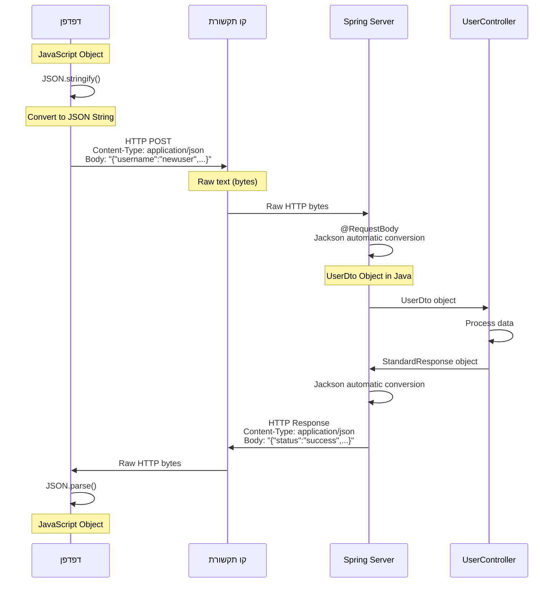
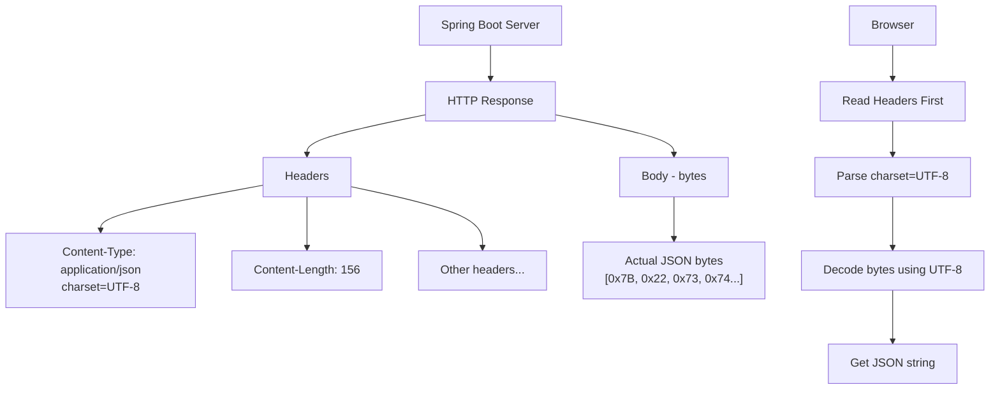
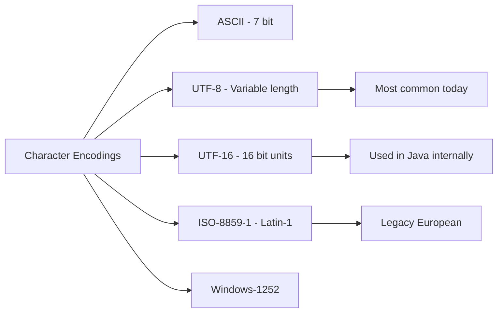
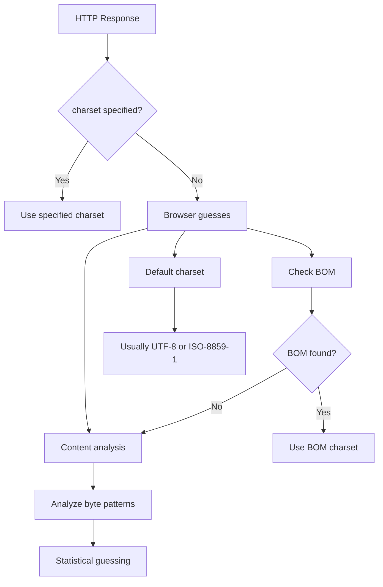
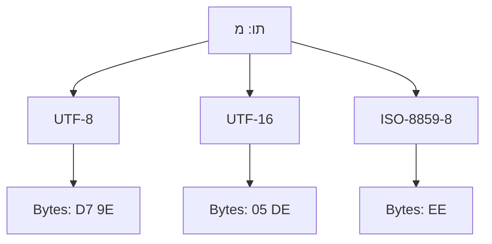
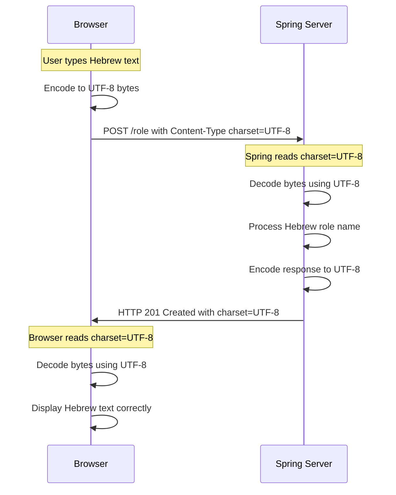
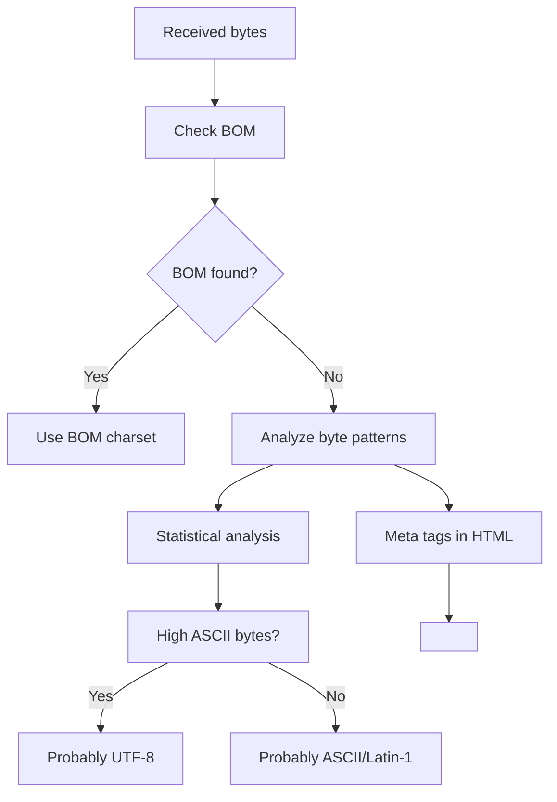
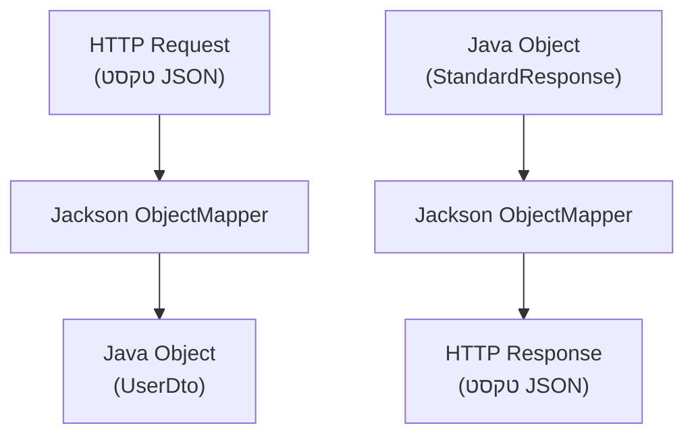

<div dir="rtl">

# תקשורת HTTP ו-JSON - מה באמת נשלח על הקו?

## מה באמת נשלח על הקו ברשת?

כשאנחנו שולחים נתונים בין דפדפן לשרת, **הכל נשלח כטקסט** (סדרה של bytes שמייצגים תווים). JSON אינו פורמט בינארי - זה פשוט **מחרוזת טקסט מובנית** שנראית כמו אובייקט JavaScript.

## דוגמה מהקוד 

 נראה מה קורה כשמרשמים משתמש חדש ב-`register/`:

</div>



<div dir="rtl">

## מה באמת נשלח על הקו?

### כשהדפדפן שולח בקשה ל-`register/`:

</div>

```http
POST /register HTTP/1.1
Host: localhost:8080
Content-Type: application/json
Content-Length: 65

{"username":"newuser","password":"pass123","roles":["USER"]}
```

<div dir="rtl">

**זה מה שבאמת עובר על הקו** - טקסט גולמי! כל תו נשלח כ-byte אחד או יותר (תלוי בקידוד UTF-8).

# Character Encoding ב-HTTP - איך הצד המקבל יודע מה הקידוד?


## השאלה המרכזית

כשהשרת שולח bytes ברשת, איך הדפדפן יודע אם זה UTF-8, UTF-16, ASCII או קידוד אחר?

**התשובה:** דרך **HTTP Headers** שמציינים את סוג הקידוד!

## HTTP Headers - המפתח לפתרון

</div>



<div dir="rtl">

## מה שקורה במערכת 

כשהשרת מחזיר תשובה מ-RoleController:

</div>

```http
HTTP/1.1 201 Created
Content-Type: application/json;charset=UTF-8
Content-Length: 98
Date: Sat, 14 Jun 2025 10:30:00 GMT

{"status":"success","data":{"roleName":"MANAGER"},"error":null}
```

<div dir="rtl">

**שימו לב ל:** `Content-Type: application/json;charset=UTF-8`

זה אומר לדפדפן: "הbytes האלה הם JSON שמקודד ב-UTF-8"

## סוגי Encoding עיקריים

</div>



<div dir="rtl">

### UTF-8 (הנפוץ ביותר):
- **גודל:** 1-4 bytes לכל תו
- **תואם ASCII:** התווים הראשונים זהים ל-ASCII
- **תומך בכל השפות:** אנגלית, עברית, אמוג'י, וכו'
- **ברירת מחדל ב-Spring Boot**

### UTF-16:
- **גודל:** 2-4 bytes לכל תו
- **משתמש ב-Java:** String פנימי ב-Java
- **פחות נפוץ ב-HTTP**

### ASCII:
- **גודל:** 1 byte לכל תו
- **רק אנגלית:** A-Z, 0-9, סימנים בסיסיים
- **מוגבל מאוד**

## איך Spring Boot מגדיר את הencoding?

במערכת , Spring Boot אוטומטית מגדיר UTF-8:

</div>

```java
// Spring Boot automatically adds this header:
// Content-Type: application/json;charset=UTF-8

@PostMapping("/role")
public ResponseEntity<StandardResponse> createRole(@Valid @RequestBody RoleDto roleDto) {
    // When you return this object...
    StandardResponse response = new StandardResponse("success", createdRole, null);
    return ResponseEntity.created(location).body(response);
    
    // Spring adds UTF-8 charset automatically
}
```

<div dir="rtl">

## מה קורה אם אין charset header?

</div>



<div dir="rtl">

### BOM (Byte Order Mark):
מבין מיוחד בתחילת הקובץ שמציין encoding:

</div>

```
UTF-8 BOM:    EF BB BF
UTF-16 BE:    FE FF  
UTF-16 LE:    FF FE
UTF-32 BE:    00 00 FE FF
```

<div dir="rtl">

## דוגמה מעשית - תו עברית

בואו נראה מה קורה כשמשתמש רושם בעברית:

</div>

```java
// User creates role with Hebrew name
RoleDto roleDto = new RoleDto();
roleDto.setRoleName("מנהל");

// What happens in different encodings:
```

<div dir="rtl">

### אותו תו בencodings שונים:

</div>



<div dir="rtl">

**אם הדפדפן מנחש לא נכון:** התו יראה כמו שטויות!

## HTTP Request ו-Response flow מלא

</div>



<div dir="rtl">

## מה קורה אם יש אי-התאמה?

### תרחיש 1: שליחה ב-UTF-8, קריאה ב-ISO-8859-1

</div>

```
Original: מנהל
UTF-8 bytes: D7 9E D7 A0 D7 94 D7 9C
Interpreted as ISO-8859-1: מן×"ל
```

<div dir="rtl">

### תרחיש 2: שליחה ב-ISO-8859-8, קריאה ב-UTF-8

</div>

```
Original: מנהל  
ISO-8859-8 bytes: EE E0 E3 EC
Interpreted as UTF-8: îàãì (or error)
```

<div dir="rtl">

## איך להגדיר encoding במפורש ב-Spring?

אם רוצים לשלוט בencoding:

</div>

```java
// Option 1: In application.properties
// server.servlet.encoding.charset=UTF-8
// server.servlet.encoding.enabled=true
// server.servlet.encoding.force=true

// Option 2: Programmatically
@PostMapping(value = "/role", produces = "application/json;charset=UTF-8")
public ResponseEntity<StandardResponse> createRole(@Valid @RequestBody RoleDto roleDto) {
    // Explicitly specify UTF-8 in response
    return ResponseEntity.created(location)
        .contentType(MediaType.APPLICATION_JSON_UTF8) // Deprecated but explicit
        .body(response);
}

// Option 3: Global configuration
@Configuration
public class WebConfig implements WebMvcConfigurer {
    @Override
    public void configureMessageConverters(List<HttpMessageConverter<?>> converters) {
        converters.add(new MappingJackson2HttpMessageConverter());
    }
}
```

<div dir="rtl">

## Browser Detection - איך הדפדפן מנחש?

כשאין charset header, הדפדפן משתמש באלגוריתמים:

</div>



<div dir="rtl">

## debugging encoding problems

אם יש בעיות עם תווים מוזרים:

</div>

```java
// Debug: Print actual bytes being sent
@PostMapping("/role")  
public ResponseEntity<StandardResponse> createRole(@Valid @RequestBody RoleDto roleDto) {
    String roleName = roleDto.getRoleName();
    
    // Debug: Print bytes
    byte[] utf8Bytes = roleName.getBytes(StandardCharsets.UTF_8);
    System.out.println("UTF-8 bytes: " + Arrays.toString(utf8Bytes));
    
    byte[] isoBytes = roleName.getBytes(StandardCharsets.ISO_8859_1);
    System.out.println("ISO bytes: " + Arrays.toString(isoBytes));
    
    // Continue with normal processing...
}
```

<div dir="rtl">

## רשימת encodings נפוצים

| Encoding | תיאור | גודל לתו | שפות נתמכות |
|----------|--------|----------|--------------|
| ASCII | בסיסי | 1 byte | אנגלית בלבד |
| UTF-8 | נפוץ ביותר | 1-4 bytes | כל השפות |
| UTF-16 | Java פנימי | 2-4 bytes | כל השפות |  
| ISO-8859-1 | Latin-1 | 1 byte | מערב אירופה |
| ISO-8859-8 | עברית | 1 byte | עברית + לטינית |
| Windows-1255 | עברית Windows | 1 byte | עברית + לטינית |
| Windows-1252 | מערב אירופה | 1 byte | מערב אירופה |

## Best Practices

### תמיד כדאי:
1. **לציין charset בheaders** - `Content-Type: application/json;charset=UTF-8`
2. **להשתמש ב-UTF-8** - תומך בכל השפות
3. **לוודא consistency** - אותו encoding בשליחה ובקבלה
4. **לבדוק בbrowser dev tools** - מה באמת נשלח

### במערכת :
Spring Boot כבר עושה את כל זה אוטומטית! הוא מגדיר UTF-8 כברירת מחדל ומוסיף את הheaders הנכונים.

### אם יש בעיות עם תווים:
1. בדקו את הheaders ב-Network tab
2. וודאו שהמסד נתונים תומך ב-UTF-8
3. בדקו שהfront-end שולח UTF-8
4. השתמשו בtools לdebug הbytes הממשיים


### כשהשרת מחזיר תשובה:

</div>

```http
HTTP/1.1 201 Created
Content-Type: application/json
Content-Length: 98

{"status":"success","data":{"username":"newuser","roles":["USER"]},"error":null}
```

<div dir="rtl">

## תהליך ההמרות במערכת 

### בצד הדפדפן (JavaScript):

</div>

```javascript
// 1. JavaScript Object
const userData = {
    username: "newuser",
    password: "pass123", 
    roles: ["USER"]
};

// 2. Convert to JSON string for sending
const jsonString = JSON.stringify(userData);
// Result: '{"username":"newuser","password":"pass123","roles":["USER"]}'

// 3. Send via HTTP request
fetch('/register', {
    method: 'POST',
    headers: {
        'Content-Type': 'application/json'
    },
    body: jsonString  // This is what's sent over the wire!
});

// 4. Receive response and convert back
response.json().then(data => {
    // Browser runs JSON.parse() on the received text
    console.log(data); // Now it's a JavaScript object again
});
```

<div dir="rtl">

### בצד השרת (Spring Boot):

בקוד  ב-`UserController`:

</div>

```java
@PostMapping("/register")
public ResponseEntity<StandardResponse> register(@Valid @RequestBody UserDto userDto) {
    // Spring Jackson already converted the text to UserDto object
    // userDto is now a complete Java object
    
    UserResponseDto registeredUser = userService.registerUser(userDto);
    
    StandardResponse response = new StandardResponse("success", registeredUser, null);
    
    // When returning - Spring Jackson automatically converts the object to JSON string
    return ResponseEntity.created(location).body(response);
}
```

<div dir="rtl">

## Jackson - המנוע שמבצע את הקסם

Spring משתמש ב-Jackson library שמטפל בהמרות אוטומטית:

</div>



<div dir="rtl">

## דוגמה קונקרטית מהקוד 

כשהדפדפן שולח בקשה ליצירת תפקיד חדש:

### 1. מה הדפדפן שולח על הקו:

</div>

```http
POST /role HTTP/1.1
Content-Type: application/json

{"roleName":"MANAGER"}
```

<div dir="rtl">

### 2. Spring מקבל וממיר:

</div>

```java
// RoleController.java
@PostMapping("/role")
public ResponseEntity<StandardResponse> createRole(@Valid @RequestBody RoleDto roleDto) {
    // roleDto.getRoleName() will return "MANAGER"
    RoleDto roleName = roleService.addRole(roleDto.getRoleName());
    // ...
}
```

<div dir="rtl">

### 3. השרת מחזיר על הקו:

</div>

```http
HTTP/1.1 201 Created
Content-Type: application/json

{"status":"success","data":{"roleName":"MANAGER"},"error":null}
```

<div dir="rtl">

## למה זה עובד ככה?

### יתרונות של JSON כטקסט:
1. **קריא לבני אדם** - אפשר לקרוא ולהבין
2. **עובר דרך firewalls וproxies** - זה סתם טקסט
3. **תואם לכל השפות** - כל שפה יודעת לעבד טקסט
4. **קל לdebugging** - אפשר לראות בדיוק מה נשלח

### תהליך ההמרה:

```mermaid
graph LR
    A[JavaScript Object] -->|JSON.stringify| B[JSON String]
    B -->|HTTP| C[Network Bytes]
    C -->|HTTP| D[JSON String] 
    D -->|Jackson Parse| E[Java Object]
    
    E -->|Jackson Serialize| F[JSON String]
    F -->|HTTP| G[Network Bytes]
    G -->|HTTP| H[JSON String]
    H -->|JSON.parse| I[JavaScript Object]
    
%%    style B fill:#ffe0b3
%%    style D fill:#ffe0b3
%%    style F fill:#ffe0b3
%%    style H fill:#ffe0b3
```

</div>



<div dir="rtl">

## שגיאות נפוצות והבנה מוטעית

### מה שלא נכון:
"JSON הוא פורמט בינארי מיוחד"
"הדפדפן שולח אובייקטים ישירות"
"השרת מבין JavaScript objects"

### מה שנכון:
JSON הוא **פורמט טקסט** בלבד
כל העברת נתונים היא **טקסט/bytes**
הדפדפן והשרת **ממירים** לפורמטים הפנימיים שלהם


  עם המערכת :

1. **הדפדפן** - עובד עם אובייקטי JavaScript, ממיר ל-JSON string לשליחה
2. **הקו** - עובר טקסט גולמי בפורמט JSON
3. **Spring** - מקבל טקסט, Jackson ממיר לאובייקטי Java
4. **התשובה** - Java objects → JSON string → דרך הקו → JavaScript objects

זה למה אנחנו צריכים הערות כמו `@RequestBody` ו-`@ResponseBody` ב-Spring - הן אומרות ל-framework לבצע המרות אוטומטיות בין אובייקטים לטקסט JSON.

</div>